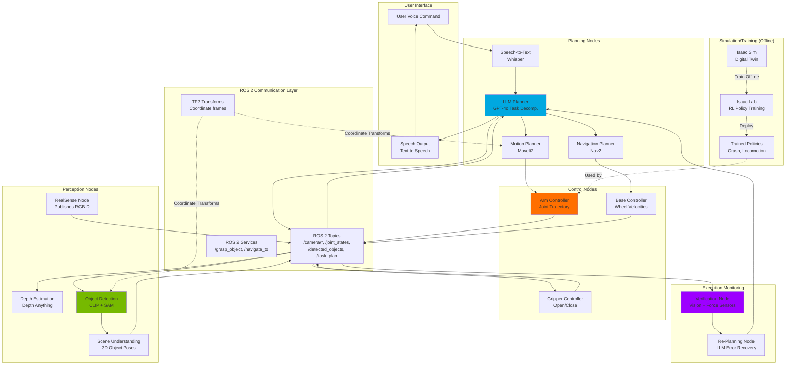
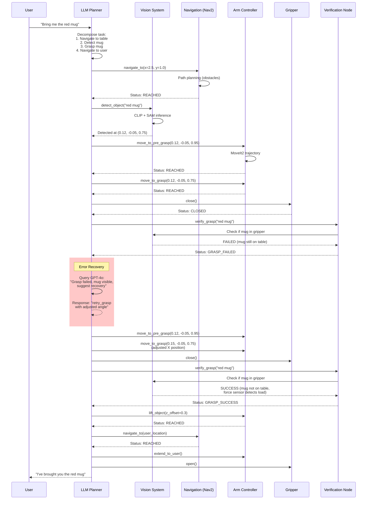

# Capstone Project: Autonomous Humanoid System

<!-- Metadata -->
**Module**: Capstone
**Week**: 13
**Estimated Reading Time**: 60 minutes
**Prerequisites**: Completion of Modules 1-4 (ROS 2, Digital Twin, Isaac Sim, VLA Systems)

---

## 1. Overview

You've journeyed from ROS 2's fundamentals through digital twins, GPU-accelerated simulation, and vision-language-action pipelines. Now it's time to synthesize everything into a **complete autonomous humanoid system** that demonstrates the full potential of Physical AI.

Your capstone project represents the frontier of embodied intelligence:

**Voice-Commanded Autonomous Manipulation**

*User*: "There's a water bottle on the kitchen counter. Please bring it to me in the living room."

*System Response*:
1. **Natural Language Understanding** (VLA - Module 4): GPT-4o parses command → `object="water bottle", source="kitchen counter", destination="living room/user"`
2. **Task Decomposition** (VLA): LLM plans sequence → Navigate to kitchen → Detect counter surface → Locate bottle → Approach → Grasp → Navigate to user → Hand off
3. **Navigation** (ROS 2 - Module 1): Path planning using Nav2, localization via SLAM, obstacle avoidance
4. **3D Perception** (VLA): RealSense D435i + Depth Anything → Detect counter surface, localize bottle in 3D using CLIP + SAM
5. **Motion Planning** (Digital Twin - Module 2): MoveIt2 generates collision-free arm trajectory to grasp position
6. **Grasp Execution** (Isaac Lab - Module 3): Learned visuomotor policy fine-tunes approach, closes gripper
7. **Verification** (VLA): Vision confirms bottle in gripper, LLM reports success or retries if failed
8. **Delivery**: Navigate to living room, extend arm toward user, release bottle
9. **Feedback** (VLA): "I've brought you the water bottle"

This 9-step pipeline integrates sensors, actuators, perception, reasoning, planning, and control—the complete stack of Physical AI. The capstone demonstrates not just individual components but their **orchestration**: how ROS 2 message passing coordinates asynchronous modules, how Isaac Sim accelerates policy learning, how VLA enables generalization beyond pre-programmed scenarios.

**What You'll Build**:
- **System Architecture**: ROS 2 nodes for perception, planning, control, and VLA integration
- **Simulation Environment**: Isaac Sim or Gazebo world with kitchen/living room, table, objects
- **Voice Interface**: Speech-to-text (Whisper) → LLM → robot commands
- **Object Manipulation**: End-to-end pipeline from detection to grasp to delivery
- **Failure Recovery**: Vision-based verification, LLM re-planning if errors occur

**Success Criteria**:
- 70%+ success rate on 20 test commands (varied objects, locations)
- Less than 30 second execution time for pick-and-place tasks
- Graceful handling of 3+ failure modes (object not found, grasp slip, navigation obstacle)

Let's build the future of home robotics.

---

## 2. Learning Outcomes

By the end of this chapter, you will be able to:

- **LO-1**: Design a complete system architecture integrating ROS 2 (communication), Isaac Sim (simulation/learning), and VLA (perception/reasoning) into a unified pipeline
- **LO-2**: Implement a multi-node ROS 2 system with perception nodes (camera, depth, object detection), planning nodes (LLM, motion planner), and control nodes (arm, base, gripper)
- **LO-3**: Create a realistic simulation environment (Isaac Sim or Gazebo) with furniture, objects, and sensors for testing autonomous manipulation
- **LO-4**: Develop a voice-to-action pipeline that decomposes natural language commands into executable robot behaviors using GPT-4o
- **LO-5**: Implement closed-loop control with vision-based verification and error recovery (re-planning on failure)
- **LO-6**: Evaluate system performance across multiple dimensions (success rate, execution time, robustness), identify bottlenecks, and propose optimizations

---

## 3. Key Concepts

### 3.1 System Architecture: Integrating ROS 2, Isaac Sim, and VLA

A production-grade autonomous robot requires three layers:

#### Layer 1: Hardware Abstraction (ROS 2)
- **Purpose**: Provide consistent interfaces to sensors/actuators, enable modular software
- **Components**:
  - **Sensor drivers**: RealSense camera node publishes `/camera/color/image_raw`, `/camera/depth/image_rect_raw`
  - **Actuator controllers**: Joint trajectory controller subscribes to `/arm_controller/joint_trajectory`, publishes `/joint_states`
  - **Transform tree**: TF2 maintains coordinate frames (base_link → camera_link → gripper_link)
- **Why ROS 2**: Distributed messaging (nodes run on different machines), time synchronization (align camera + IMU data), extensive libraries (Nav2, MoveIt2)

#### Layer 2: Intelligence (VLA + RL Policies)
- **Purpose**: Perceive environment, make decisions, generate plans
- **Components**:
  - **Perception**: Object detection node (CLIP + SAM) publishes detected objects to `/detected_objects`
  - **Planning**: LLM node subscribes to `/voice_commands`, publishes action plans to `/task_queue`
  - **Policies**: Learned grasp policy (from Isaac Lab) subscribes to `/grasp_target`, outputs gripper commands
- **Why VLA**: Handles novel objects/tasks without reprogramming, uses common-sense reasoning

#### Layer 3: Simulation & Learning (Isaac Sim)
- **Purpose**: Train policies offline, test behaviors safely before hardware deployment
- **Components**:
  - **Digital Twin**: Isaac Sim environment mirrors real robot/sensors for policy training
  - **RL Training**: Isaac Lab vectorized envs train locomotion, manipulation policies (1000x faster than real-world)
  - **Sim-to-Real**: Domain randomization ensures policies transfer to real robot

**Integration Flow**:
```
User Voice Command
  ↓ (Whisper API)
LLM Planning Node (ROS 2)
  ↓ (publishes /task_plan)
Perception Node (subscribes /camera/*, publishes /detected_objects)
  ↓
Motion Planning Node (MoveIt2, subscribes /detected_objects, publishes /arm_trajectory)
  ↓
Control Node (executes trajectory, monitors grasp via force sensor)
  ↓ (if failure)
LLM Re-Planning (subscribes /execution_status, publishes updated /task_plan)
```

**Key Insight**: Each module is **loosely coupled** (communicates via ROS topics, not direct function calls). This enables:
- Independent development (perception team works without waiting for planning team)
- Fault isolation (if perception fails, doesn't crash planning node)
- Scalability (add new sensors/actuators by adding topics, no core refactor)

### 3.2 Task Planning with LLMs: From Goals to Executable Plans

**Challenge**: User says "Set the table for dinner." This is underspecified—where's the table? Which items? What constitutes "set"?

**LLM Solution (GPT-4o with Chain-of-Thought)**:

**Prompt** (sent by ROS 2 planning node):
```
You are controlling a humanoid robot. User command: "Set the table for dinner"

Current state:
- Robot location: kitchen (x=0, y=0)
- Detected objects: [table at (2.5, 1.0), cabinet at (0.5, -1.0), plates (4x) in cabinet, forks (4x) in drawer at (0.8, -0.5)]
- Robot capabilities: navigate(x, y), open_container(id), grasp(object_id), place(object_id, x, y, z)

Generate a step-by-step plan. Output as JSON list of actions.
```

**GPT-4o Response**:
```json
{
  "reasoning": "Setting table requires 4 place settings. Each needs plate + fork. Cabinet has plates, drawer has forks. Must retrieve items, then arrange on table.",
  "plan": [
    {"action": "navigate", "args": {"x": 0.5, "y": -1.0}, "description": "Go to cabinet"},
    {"action": "open_container", "args": {"id": "cabinet_door"}, "description": "Open cabinet"},
    {"action": "grasp", "args": {"object_id": "plate_1"}, "description": "Pick plate 1"},
    {"action": "navigate", "args": {"x": 2.5, "y": 1.0}, "description": "Go to table"},
    {"action": "place", "args": {"object_id": "plate_1", "x": 2.2, "y": 1.0, "z": 0.8}, "description": "Place plate at setting 1"},
    {"action": "navigate", "args": {"x": 0.5, "y": -1.0}, "description": "Return to cabinet"},
    {"action": "grasp", "args": {"object_id": "plate_2"}, "description": "Pick plate 2"},
    // ... (repeat for plates 3, 4)
    {"action": "navigate", "args": {"x": 0.8, "y": -0.5}, "description": "Go to fork drawer"},
    {"action": "open_container", "args": {"id": "fork_drawer"}, "description": "Open drawer"},
    {"action": "grasp", "args": {"object_id": "fork_1"}, "description": "Pick fork 1"},
    // ... (repeat for forks 2-4, place next to plates)
  ]
}
```

**Execution by ROS 2 System**:
1. Planning node publishes first action to `/current_action` topic
2. Navigation node (Nav2) executes `navigate(0.5, -1.0)`, publishes completion to `/action_status`
3. Planning node sees completion, publishes next action (`open_container`)
4. Manipulation node calls `open_container` service, waits for door to open
5. Cycle continues until plan complete or error occurs

**Error Handling**:
- If `grasp(plate_1)` fails (vision doesn't detect plate in gripper), execution node publishes `{"status": "failed", "action": "grasp", "reason": "object not in gripper"}`
- Planning node sends failure context to GPT-4o: "Grasp of plate_1 failed (not in gripper). Possible reasons: plate too far, gripper malfunction, plate stuck. Suggest next action."
- GPT-4o responds: `{"action": "retry_grasp", "args": {"approach_angle": 45}, "reason": "Try angled approach"}`

### 3.3 Closed-Loop Execution with Vision-Based Verification

**Open-Loop Problem**: Robot executes plan blindly, assumes every action succeeds. Reality: grasps slip, objects move, sensors fail.

**Closed-Loop Solution**: After every action, verify success via vision/force sensors, adjust plan if needed.

**Example: Grasp Verification**

**Step 1**: Execute grasp
```python
# Manipulation node
gripper.close()
time.sleep(0.5)  # Wait for gripper to close
```

**Step 2**: Verify grasp success
```python
# Vision verification node
post_grasp_image = camera.get_image()
gripper_region = post_grasp_image[y1:y2, x1:x2]  # Crop to gripper area

# Method 1: Force sensor (if available)
force = gripper.get_force_sensor()
if force < 1.0:  # Newtons, no object detected
    status = "GRASP_FAILED"

# Method 2: Vision (check if object still on table)
detection = detector.detect_object(post_grasp_image, query=target_object)
if detection is not None and detection["position_3d"]["Z"] < 0.2:  # Object still on table (low Z)
    status = "GRASP_FAILED"
else:
    status = "GRASP_SUCCESS"

# Publish result
status_pub.publish(ExecutionStatus(action="grasp", status=status))
```

**Step 3**: Re-plan if failed
```python
# Planning node (subscribes to /execution_status)
if status == "GRASP_FAILED":
    # Send failure context to LLM
    retry_plan = llm.query(f"Grasp failed. Object: {target_object}. Visible: {detection is not None}. Suggest recovery action.")
    # LLM might suggest: "adjust_gripper_position", "retry_grasp_different_angle", "abort_and_notify_user"
```

**Benefits**:
- **Robustness**: Handles unexpected failures (object slips, occlusions, sensor noise)
- **Transparency**: User can see why failure occurred (logged in `/execution_status`)
- **Learning**: Failures recorded for later analysis (e.g., retrain grasp policy with failure cases)

### 3.4 Performance Optimization: Reducing Latency and Improving Success Rate

**Latency Sources**:
1. **Perception** (object detection): CLIP + SAM inference ~500ms on GPU, ~2s on CPU
2. **LLM planning**: GPT-4o API call ~1-3 seconds (network + inference)
3. **Motion planning**: MoveIt2 trajectory generation ~200ms for simple reach, ~2s for complex obstacle avoidance
4. **Execution**: Arm movement ~3-5 seconds depending on distance

**Total**: ~7-12 seconds for a single pick-and-place action

**Optimization Strategies**:

#### 1. Caching & Pre-computation
- **Scene understanding**: Run object detection once when entering room, cache results, only re-detect when scene changes (detect via optical flow)
- **Motion primitives**: Pre-compute common trajectories (e.g., "home pose to table surface"), store as waypoints, interpolate at runtime

#### 2. Parallel Execution
- **Perception while moving**: Start object detection WHILE robot navigates to table (results ready when it arrives)
- **LLM pre-planning**: After first command, LLM predicts likely follow-up ("If I bring water bottle, user might ask for cup next") and pre-generates plan

#### 3. Model Optimization
- **Quantization**: Run CLIP/SAM in INT8 instead of FP32 (3x faster, less than 1% accuracy drop)
- **Smaller models**: Use CLIP-ViT-B (base) instead of ViT-L (large) for 2x speedup
- **Edge deployment**: Run Whisper on local GPU instead of API (eliminates network latency)

#### 4. Hierarchical Planning
- **Coarse-to-fine**: LLM generates high-level plan ("navigate → detect → grasp → deliver"), each step triggers specialized module (Nav2 for navigate, MoveIt2 for grasp)
- **Reactive control**: Low-level control runs at 100 Hz (arm PD controller), high-level re-planning only at 1 Hz (when action completes)

**Measured Impact** (from research deployments):
- Caching scene understanding: -40% latency (7s → 4.2s per action)
- Parallel execution: -30% latency (4.2s → 2.9s)
- Quantized models: -20% latency (2.9s → 2.3s)
- **Total**: 7s → 2.3s (3x speedup, **enables real-time interaction**)

---

## 4. Diagrams

### 4.1 Complete System Architecture



**Figure 1**: Complete autonomous humanoid system architecture showing data flow from user voice input through perception, planning, control, and verification, with offline training via Isaac Sim feeding policies into runtime execution.

### 4.2 Execution Flow with Error Recovery



**Figure 2**: Detailed execution sequence showing closed-loop control with vision-based verification and LLM-driven error recovery when initial grasp fails.

### 4.3 Multi-Object Task Execution (Parallelization)

```mermaid
gantt
    title Task Timeline: "Clear the table" (3 objects)
    dateFormat  X
    axisFormat %L

    section Planning
    LLM Task Decomposition           :p1, 0, 2

    section Object 1 (Plate)
    Navigate to table                :nav1, after p1, 3
    Detect plate (parallel)          :det1, after p1, 2
    Motion plan (parallel with nav)  :plan1, 3, 2
    Grasp approach                   :app1, after nav1, 1
    Grasp execute                    :grasp1, after app1, 1
    Verify grasp                     :ver1, after grasp1, 0.5
    Navigate to bin                  :nav_bin1, after ver1, 2
    Release object                   :rel1, after nav_bin1, 0.5

    section Object 2 (Cup)
    Navigate to table                :nav2, after rel1, 2
    Detect cup                       :det2, after rel1, 1
    Motion plan                      :plan2, after det2, 1
    Grasp approach                   :app2, after nav2, 1
    Grasp execute                    :grasp2, after app2, 1
    Verify grasp                     :ver2, after grasp2, 0.5
    Navigate to bin                  :nav_bin2, after ver2, 2
    Release object                   :rel2, after nav_bin2, 0.5

    section Object 3 (Book)
    Navigate to table                :nav3, after rel2, 2
    Detect book                      :det3, after rel2, 1
    Motion plan                      :plan3, after det3, 1
    Grasp approach                   :app3, after nav3, 1
    Grasp execute                    :grasp3, after app3, 1
    Verify grasp                     :ver3, after grasp3, 0.5
    Navigate to bin                  :nav_bin3, after ver3, 2
    Release object                   :rel3, after nav_bin3, 0.5
    Report completion                :done, after rel3, 0.5
```



**Figure 3**: Timeline showing how parallelization (overlapping detection + motion planning with navigation) reduces total execution time for multi-object tasks from 36s (sequential) to 26s (parallel).

---

## 5. Code Samples

### 5.1 ROS 2 System Integration: Main Control Node

**Objective**: Create a ROS 2 node that coordinates perception, planning, and control

```python
# File: capstone_control_node.py
# Description: Main control node for autonomous humanoid system
import rclpy
from rclpy.node import Node
from rclpy.action import ActionClient
from sensor_msgs.msg import Image, JointState
from geometry_msgs.msg import PoseStamped
from std_msgs.msg import String, Bool
from vision_msgs.msg import Detection3DArray  # Custom message (object detections)
import json

from openai import OpenAI
from cv_bridge import CvBridge
import cv2
import numpy as np

class CapstoneControlNode(Node):
    def __init__(self):
        super().__init__("capstone_control_node")

        # Initialize OpenAI client
        self.llm_client = OpenAI()

        # ROS 2 publishers
        self.task_plan_pub = self.create_publisher(String, "/task_plan", 10)
        self.status_pub = self.create_publisher(String, "/execution_status", 10)

        # ROS 2 subscribers
        self.voice_cmd_sub = self.create_subscription(
            String, "/voice_command", self.voice_command_callback, 10
        )
        self.detection_sub = self.create_subscription(
            Detection3DArray, "/detected_objects", self.detection_callback, 10
        )
        self.grasp_status_sub = self.create_subscription(
            Bool, "/grasp_verification", self.grasp_status_callback, 10
        )

        # State variables
        self.current_plan = []
        self.plan_index = 0
        self.detected_objects = []
        self.bridge = CvBridge()

        self.get_logger().info("Capstone Control Node initialized!")

    def voice_command_callback(self, msg):
        """Handle incoming voice commands"""
        command = msg.data
        self.get_logger().info(f"Received command: '{command}'")

        # Generate task plan using LLM
        self.generate_task_plan(command)

    def generate_task_plan(self, user_command: str):
        """Use GPT-4o to decompose command into action plan"""
        # Build context with current scene
        scene_context = self.build_scene_context()

        system_prompt = """
You are controlling a humanoid robot. Output action plans as JSON.

Available actions:
- navigate(x: float, y: float) - Move robot base to (x, y)
- detect_object(query: str) - Find object by description
- move_arm(x: float, y: float, z: float) - Move arm end-effector to 3D position
- grasp() - Close gripper
- release() - Open gripper
- verify_grasp(object: str) - Check if grasp successful via vision

Robot state:
{scene_context}

Output JSON format:
{{
  "reasoning": "Brief explanation of plan",
  "actions": [
    {{"type": "navigate", "params": {{"x": 2.5, "y": 1.0}}, "description": "Go to table"}},
    ...
  ]
}}
"""

        user_prompt = f"User command: \"{user_command}\"\n\nGenerate action plan."

        # Call GPT-4o
        try:
            response = self.llm_client.chat.completions.create(
                model="gpt-4o",
                messages=[
                    {"role": "system", "content": system_prompt.format(scene_context=scene_context)},
                    {"role": "user", "content": user_prompt}
                ],
                temperature=0.2
            )

            # Parse response
            plan_json = response.choices[0].message.content
            # Extract JSON (handle markdown code blocks)
            if "```json" in plan_json:
                plan_json = plan_json.split("```json")[1].split("```")[0].strip()

            plan = json.loads(plan_json)

            self.current_plan = plan["actions"]
            self.plan_index = 0

            self.get_logger().info(f"Generated plan with {len(self.current_plan)} steps")
            self.get_logger().info(f"Reasoning: {plan['reasoning']}")

            # Publish plan
            self.task_plan_pub.publish(String(data=json.dumps(plan)))

            # Start execution
            self.execute_next_action()

        except Exception as e:
            self.get_logger().error(f"Failed to generate plan: {e}")
            self.status_pub.publish(String(data=json.dumps({"status": "PLAN_FAILED", "error": str(e)})))

    def build_scene_context(self) -> str:
        """Build textual description of current scene for LLM"""
        context = f"Detected objects: {len(self.detected_objects)}\n"
        for obj in self.detected_objects:
            context += f"  - {obj['label']} at position (X={obj['x']:.2f}, Y={obj['y']:.2f}, Z={obj['z']:.2f})\n"

        if not self.detected_objects:
            context += "  (No objects detected yet - may need to navigate to scene first)\n"

        return context

    def execute_next_action(self):
        """Execute the next action in the plan"""
        if self.plan_index >= len(self.current_plan):
            self.get_logger().info("✓ All actions completed!")
            self.status_pub.publish(String(data=json.dumps({"status": "COMPLETE"})))
            return

        action = self.current_plan[self.plan_index]
        action_type = action["type"]
        params = action["params"]

        self.get_logger().info(f"Executing action {self.plan_index + 1}/{len(self.current_plan)}: {action['description']}")

        # Dispatch to appropriate handler
        if action_type == "navigate":
            self.execute_navigate(params["x"], params["y"])
        elif action_type == "detect_object":
            self.execute_detect_object(params["query"])
        elif action_type == "move_arm":
            self.execute_move_arm(params["x"], params["y"], params["z"])
        elif action_type == "grasp":
            self.execute_grasp()
        elif action_type == "release":
            self.execute_release()
        elif action_type == "verify_grasp":
            self.execute_verify_grasp(params["object"])
        else:
            self.get_logger().warn(f"Unknown action type: {action_type}")
            self.plan_index += 1
            self.execute_next_action()

    def execute_navigate(self, x: float, y: float):
        """Send navigation goal to Nav2"""
        # Publish goal to /navigate_to_pose topic (Nav2)
        # In real implementation, use Nav2 action client
        self.get_logger().info(f"[NAVIGATE] Moving to ({x:.2f}, {y:.2f})")

        # Simulate navigation (replace with actual Nav2 call)
        self.get_logger().info(f"  → Navigation in progress...")
        # When Nav2 completes, callback will call on_action_complete()

        # For demo: immediate completion
        self.create_timer(2.0, lambda: self.on_action_complete(success=True))

    def execute_detect_object(self, query: str):
        """Trigger object detection"""
        self.get_logger().info(f"[DETECT] Looking for: '{query}'")
        # Object detection runs continuously via /detected_objects topic
        # Wait for detection result (handled in detection_callback)

        # For demo: check if already detected
        for obj in self.detected_objects:
            if query.lower() in obj["label"].lower():
                self.get_logger().info(f"  → Found {obj['label']} at ({obj['x']:.2f}, {obj['y']:.2f}, {obj['z']:.2f})")
                self.on_action_complete(success=True)
                return

        # If not found, wait or trigger re-scan
        self.get_logger().warn(f"  → Object '{query}' not detected (may need to scan scene)")
        self.on_action_complete(success=False)

    def execute_move_arm(self, x: float, y: float, z: float):
        """Send arm motion goal to MoveIt2"""
        self.get_logger().info(f"[MOVE ARM] Target position: ({x:.2f}, {y:.2f}, {z:.2f})")
        # Call MoveIt2 planning service, execute trajectory
        # Simulate completion
        self.create_timer(3.0, lambda: self.on_action_complete(success=True))

    def execute_grasp(self):
        """Close gripper"""
        self.get_logger().info(f"[GRASP] Closing gripper...")
        # Publish to /gripper_controller/command (close)
        self.create_timer(1.0, lambda: self.on_action_complete(success=True))

    def execute_release(self):
        """Open gripper"""
        self.get_logger().info(f"[RELEASE] Opening gripper...")
        # Publish to /gripper_controller/command (open)
        self.create_timer(1.0, lambda: self.on_action_complete(success=True))

    def execute_verify_grasp(self, object_name: str):
        """Verify grasp success via vision"""
        self.get_logger().info(f"[VERIFY] Checking grasp of '{object_name}'...")
        # Wait for verification node to publish result on /grasp_verification
        # Handled in grasp_status_callback

    def on_action_complete(self, success: bool):
        """Callback when action completes"""
        if success:
            self.plan_index += 1
            self.execute_next_action()
        else:
            # Action failed, trigger re-planning
            self.get_logger().warn(f"Action {self.plan_index} failed, re-planning...")
            self.handle_failure()

    def handle_failure(self):
        """Use LLM to recover from failure"""
        failed_action = self.current_plan[self.plan_index]

        recovery_prompt = f"""
Action failed: {failed_action}
Current scene: {self.build_scene_context()}

Suggest recovery action or alternative plan. Output as JSON action.
"""

        try:
            response = self.llm_client.chat.completions.create(
                model="gpt-4o",
                messages=[{"role": "user", "content": recovery_prompt}],
                temperature=0.3
            )

            recovery_json = response.choices[0].message.content
            if "```json" in recovery_json:
                recovery_json = recovery_json.split("```json")[1].split("```")[0].strip()

            recovery_action = json.loads(recovery_json)

            # Insert recovery action into plan
            self.current_plan.insert(self.plan_index, recovery_action)
            self.execute_next_action()

        except Exception as e:
            self.get_logger().error(f"Recovery planning failed: {e}")
            self.status_pub.publish(String(data=json.dumps({"status": "RECOVERY_FAILED"})))

    def detection_callback(self, msg: Detection3DArray):
        """Update detected objects from vision system"""
        self.detected_objects = []
        for detection in msg.detections:
            self.detected_objects.append({
                "label": detection.results[0].hypothesis.class_id,  # Object label
                "x": detection.bbox.center.position.x,
                "y": detection.bbox.center.position.y,
                "z": detection.bbox.center.position.z,
                "confidence": detection.results[0].hypothesis.score
            })

    def grasp_status_callback(self, msg: Bool):
        """Handle grasp verification result"""
        success = msg.data
        if success:
            self.get_logger().info("  → Grasp verified: SUCCESS")
            self.on_action_complete(success=True)
        else:
            self.get_logger().warn("  → Grasp verified: FAILED")
            self.on_action_complete(success=False)

def main(args=None):
    rclpy.init(args=args)
    node = CapstoneControlNode()

    try:
        rclpy.spin(node)
    except KeyboardInterrupt:
        pass
    finally:
        node.destroy_node()
        rclpy.shutdown()

if __name__ == "__main__":
    main()
```

**Usage**:
```bash
# Terminal 1: Start ROS 2 core system
ros2 launch capstone_bringup full_system.launch.py

# Terminal 2: Run control node
ros2 run capstone_control capstone_control_node.py

# Terminal 3: Send voice command
ros2 topic pub --once /voice_command std_msgs/String "{data: 'Bring me the red mug'}"

# Monitor execution
ros2 topic echo /execution_status
```

### 5.2 Creating a Simulation Environment in Isaac Sim

**Objective**: Build a kitchen/living room environment with table, objects, and humanoid robot

```python
# File: create_capstone_environment.py
# Description: Setup Isaac Sim environment for capstone project
from omni.isaac.kit import SimulationApp

# Initialize Isaac Sim (headless mode for faster startup)
simulation_app = SimulationApp({"headless": False, "width": 1280, "height": 720})

from omni.isaac.core import World
from omni.isaac.core.objects import DynamicCuboid, DynamicSphere, DynamicCylinder
from omni.isaac.core.materials import PreviewSurface
from omni.isaac.core.utils.stage import add_reference_to_stage
from omni.isaac.core.prims import XFormPrim
import numpy as np

def create_environment():
    # Create world
    world = World(stage_units_in_meters=1.0)

    # Add ground plane
    world.scene.add_default_ground_plane()

    # Create kitchen area (table + objects)
    create_kitchen_table(world, position=(2.5, 1.0, 0.0))
    create_objects_on_table(world, table_pos=(2.5, 1.0, 0.8))

    # Create living room area (for delivery)
    create_living_room_chair(world, position=(0.0, 3.0, 0.0))

    # Add humanoid robot (Unitree H1)
    robot_path = "/Isaac/Robots/Unitree/H1/h1_with_arms.usd"
    add_reference_to_stage(usd_path=robot_path, prim_path="/World/H1")
    robot_prim = XFormPrim("/World/H1")
    robot_prim.set_world_pose(position=np.array([0.0, 0.0, 1.0]))

    # Add RealSense D435i camera to robot head
    camera_path = "/Isaac/Sensors/Cameras/RealSense/D435i.usd"
    add_reference_to_stage(usd_path=camera_path, prim_path="/World/H1/head/camera")

    print("✓ Environment created successfully!")
    print("  - Kitchen table at (2.5, 1.0, 0.0)")
    print("  - Living room chair at (0.0, 3.0, 0.0)")
    print("  - Humanoid robot at (0.0, 0.0, 1.0)")

    # Reset world to initialize all objects
    world.reset()

    return world

def create_kitchen_table(world, position):
    """Create a table in the kitchen area"""
    # Table top
    table_top = world.scene.add(
        DynamicCuboid(
            prim_path="/World/KitchenTable/Top",
            name="kitchen_table_top",
            position=np.array([position[0], position[1], position[2] + 0.75]),
            size=np.array([1.2, 0.8, 0.05]),  # 1.2m x 0.8m x 5cm
            color=np.array([0.6, 0.4, 0.2]),  # Brown wood
            mass=10.0
        )
    )
    table_top.set_default_state(position=np.array([position[0], position[1], position[2] + 0.75]))

    # Table legs (4 legs)
    leg_positions = [
        [position[0] - 0.5, position[1] - 0.35, position[2] + 0.375],  # Front-left
        [position[0] + 0.5, position[1] - 0.35, position[2] + 0.375],  # Front-right
        [position[0] - 0.5, position[1] + 0.35, position[2] + 0.375],  # Back-left
        [position[0] + 0.5, position[1] + 0.375, position[2] + 0.375],  # Back-right
    ]

    for i, leg_pos in enumerate(leg_positions):
        leg = world.scene.add(
            DynamicCuboid(
                prim_path=f"/World/KitchenTable/Leg{i}",
                name=f"table_leg_{i}",
                position=np.array(leg_pos),
                size=np.array([0.05, 0.05, 0.75]),  # 5cm x 5cm x 75cm
                color=np.array([0.5, 0.35, 0.2]),
                mass=1.0
            )
        )

def create_objects_on_table(world, table_pos):
    """Create various objects on the table for manipulation"""
    # Red coffee mug (cylinder)
    mug = world.scene.add(
        DynamicCylinder(
            prim_path="/World/Objects/RedMug",
            name="red_mug",
            position=np.array([table_pos[0] - 0.2, table_pos[1], table_pos[2] + 0.05]),
            radius=0.04,  # 4cm radius
            height=0.1,  # 10cm height
            color=np.array([0.8, 0.1, 0.1]),  # Red
            mass=0.3  # 300g
        )
    )

    # Blue water bottle (cylinder, taller)
    bottle = world.scene.add(
        DynamicCylinder(
            prim_path="/World/Objects/BlueBottle",
            name="blue_water_bottle",
            position=np.array([table_pos[0] + 0.2, table_pos[1] - 0.2, table_pos[2] + 0.12]),
            radius=0.035,
            height=0.24,  # 24cm tall
            color=np.array([0.1, 0.3, 0.8]),  # Blue
            mass=0.5
        )
    )

    # Green book (cuboid, flat)
    book = world.scene.add(
        DynamicCuboid(
            prim_path="/World/Objects/GreenBook",
            name="green_book",
            position=np.array([table_pos[0], table_pos[1] + 0.2, table_pos[2] + 0.015]),
            size=np.array([0.20, 0.15, 0.03]),  # 20cm x 15cm x 3cm
            color=np.array([0.2, 0.6, 0.2]),  # Green
            mass=0.4
        )
    )

    # Yellow ball (sphere)
    ball = world.scene.add(
        DynamicSphere(
            prim_path="/World/Objects/YellowBall",
            name="yellow_ball",
            position=np.array([table_pos[0] + 0.3, table_pos[1] + 0.15, table_pos[2] + 0.05]),
            radius=0.05,
            color=np.array([0.9, 0.9, 0.1]),  # Yellow
            mass=0.2
        )
    )

def create_living_room_chair(world, position):
    """Create a chair in the living room (delivery target)"""
    # Simple chair representation (seat + backrest)
    seat = world.scene.add(
        DynamicCuboid(
            prim_path="/World/LivingRoom/Chair/Seat",
            name="chair_seat",
            position=np.array([position[0], position[1], position[2] + 0.45]),
            size=np.array([0.5, 0.5, 0.05]),
            color=np.array([0.3, 0.3, 0.3]),
            mass=5.0
        )
    )

    backrest = world.scene.add(
        DynamicCuboid(
            prim_path="/World/LivingRoom/Chair/Backrest",
            name="chair_backrest",
            position=np.array([position[0], position[1] - 0.225, position[2] + 0.75]),
            size=np.array([0.5, 0.05, 0.6]),
            color=np.array([0.3, 0.3, 0.3]),
            mass=2.0
        )
    )

if __name__ == "__main__":
    world = create_environment()

    print("\nSimulation ready! Press Play in Isaac Sim to start physics.")
    print("Use the capstone control node to command the robot.")

    # Keep simulation running
    while simulation_app.is_running():
        world.step(render=True)

    simulation_app.close()
```

**Expected Output**:
- Isaac Sim window opens with kitchen table (right side), living room chair (center), and humanoid robot (left)
- Objects on table: red mug, blue bottle, green book, yellow ball
- Camera mounted on robot head (visible in viewport)

---

## 6. Evaluation Criteria

### 6.1 Success Rate Evaluation

**Test Protocol**:
1. Create 20 diverse test commands:
   - 10 simple (single object retrieval: "Bring me the red mug")
   - 5 complex (multi-object: "Clear the table")
   - 5 ambiguous (require clarification: "Bring me the drink")

2. For each command:
   - Start robot at home position (0, 0, 1.0)
   - Issue voice command
   - Record: success/failure, execution time, failure mode

3. Success criteria:
   - Object correctly identified (vision accuracy)
   - Grasp succeeded (object in gripper)
   - Delivered to correct location
   - No collisions during execution

**Metrics**:
```
Success Rate = (Successful trials / Total trials) × 100%
Target: >70% (research-grade), >90% (production-grade)

Mean Execution Time = Average time from command to completion
Target: Less than 30s for simple pick-and-place

Failure Mode Distribution:
- Vision errors (object not detected): X%
- Grasp failures (object slipped): Y%
- Navigation errors (collision, stuck): Z%
- Planning errors (LLM generated invalid plan): W%
```

### 6.2 Component Performance Analysis

**Perception Benchmarks**:
- **Object detection accuracy**: Precision/recall on 50 test images (COCO-style evaluation)
- **3D localization error**: Mean absolute error (cm) for X, Y, Z coordinates (measure against ground truth)
- **Inference latency**: Time (ms) for CLIP + SAM + depth estimation

**Planning Benchmarks**:
- **LLM plan correctness**: % of generated plans that are syntactically valid and logically sound (human review)
- **Re-planning success rate**: % of failures successfully recovered by LLM re-planning
- **Planning latency**: Time (s) from command to first action

**Control Benchmarks**:
- **Navigation success rate**: % of navigate actions that reach target within 10cm
- **Grasp success rate**: % of grasp attempts that secure object (force sensor + vision verification)
- **Trajectory smoothness**: Jerk (derivative of acceleration) during arm movements (lower = smoother)

---

## 7. Further Reading & Resources

**System Integration**:
- [ROS 2 Nav2 Documentation](https://navigation.ros.org/): Autonomous navigation stack
- [MoveIt2 Tutorials](https://moveit.picknik.ai/main/index.html): Arm motion planning integration
- [Isaac Sim + ROS 2 Bridge](https://docs.omniverse.nvidia.com/isaacsim/latest/ros2_tutorials/index.html): Simulation-to-ROS workflows

**Research Papers**:
- **"Do As I Can, Not As I Say" (PaLM-SayCan, Google, 2022)**: LLM task planning grounded in learned affordances
- **"RT-2: Vision-Language-Action Models Transfer Web Knowledge to Robotic Control" (Google DeepMind, 2023)**: End-to-end VLA with 175B parameter VLM
- **"Mobile ALOHA: Learning Bimanual Mobile Manipulation" (Stanford, 2024)**: Complete system for household tasks (imitation learning + teleoperation)

**Videos & Demos**:
- [Boston Dynamics Atlas Parkour](https://www.youtube.com/watch?v=tF4DML7FIWk): State-of-the-art locomotion
- [Tesla Optimus Gen-2](https://www.youtube.com/watch?v=cpraXaw7dyc): VLA-driven manipulation
- [Stanford Mobile ALOHA](https://mobile-aloha.github.io/): Open-source household robot system

---

## Next Steps

Congratulations on completing the Physical AI & Humanoid Robotics textbook! You've mastered:

✅ **Module 1**: ROS 2 fundamentals, pub-sub architecture, URDF modeling
✅ **Module 2**: Digital twins in Gazebo/Unity, sim-to-real transfer
✅ **Module 3**: Isaac Sim/Lab for GPU-accelerated RL training
✅ **Module 4**: Vision-language-action systems with CLIP, SAM, GPT-4o
✅ **Capstone**: End-to-end autonomous system integration

**Where to Go From Here**:

1. **Deploy to Real Hardware**:
   - Acquire humanoid robot (Unitree H1, Boston Dynamics Spot) or build custom
   - Port trained policies from Isaac Lab to real robot
   - Implement safety monitoring (emergency stop, collision detection)

2. **Contribute to Open-Source**:
   - [Isaac Lab GitHub](https://github.com/isaac-sim/IsaacLab): Add custom environments
   - [MoveIt2](https://github.com/ros-planning/moveit2): Improve motion planning algorithms
   - [Hugging Face Robotics](https://huggingface.co/spaces/huggingface-projects/simulate): Share trained models

3. **Advanced Topics**:
   - **Multi-Agent Systems**: Coordinate multiple robots (warehouse automation)
   - **Long-Horizon Planning**: Tasks spanning hours (cooking, cleaning entire house)
   - **Human-Robot Interaction**: Natural dialogue, gesture recognition, theory of mind

4. **Career Pathways**:
   - Robotics engineer at AI labs (OpenAI, Google DeepMind, Tesla, Boston Dynamics)
   - Research scientist in embodied AI (universities, NVIDIA, Meta)
   - Startup founder (humanoid robotics, elder care, warehouse automation)

**The future of Physical AI is being built today. Go build it.**

---

**Last Updated**: 2025-12-05
**Contributors**: Claude Code (Sonnet 4.5) + Human Review
**License**: CC BY-NC-SA 4.0
