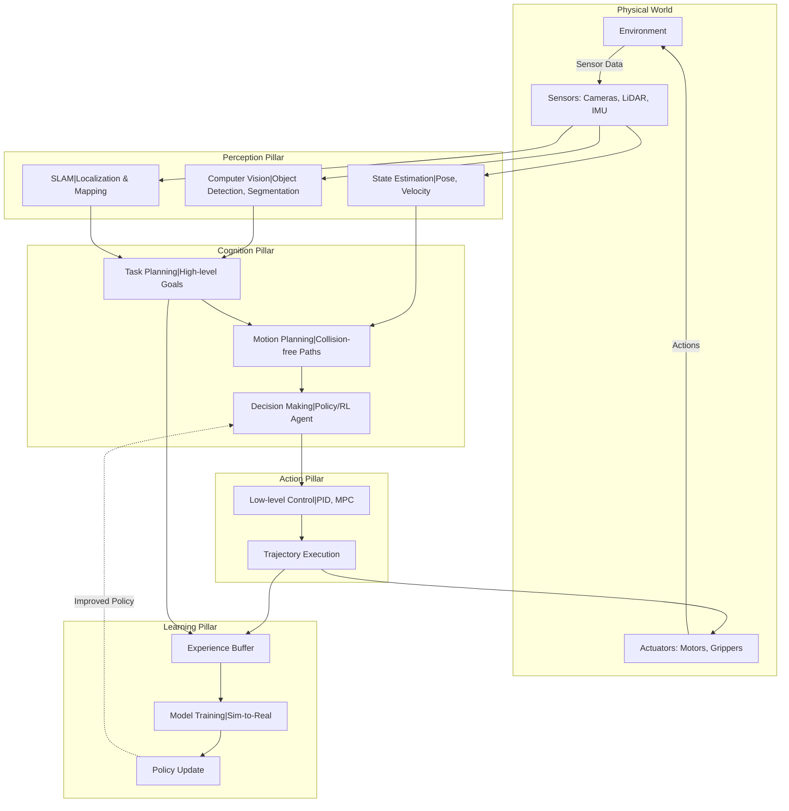
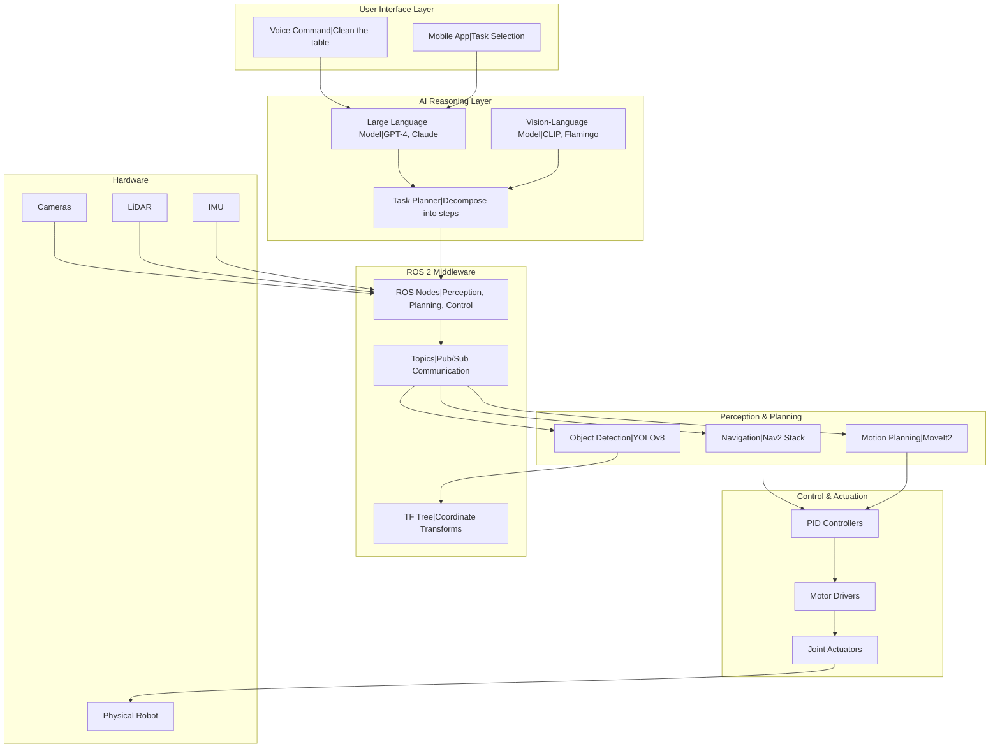

# Introduction to Physical AI: From Robots to Embodied Intelligence

<!-- Metadata -->
**Module**: 1 - ROS 2 Nervous System
**Week**: 1
**Estimated Reading Time**: 35 minutes
**Prerequisites**: Basic programming knowledge (Python or C++), familiarity with Linux command line

---

## 1. Overview

The field of robotics is undergoing a fundamental transformation. For decades, robots followed pre-programmed instructions, executing precise but rigid sequences of movements in controlled factory environments. Today, we're witnessing the emergence of **Physical AI**—robots that perceive their surroundings, reason about tasks, and adapt their actions in real-time using artificial intelligence.

Physical AI represents the convergence of three technological revolutions: (1) **computer vision** that enables machines to see and understand the world, (2) **large language models (LLMs)** that process natural language commands and reason about tasks, and (3) **advanced robotics frameworks** like ROS 2 that coordinate sensors, actuators, and decision-making systems. This fusion creates machines that don't just execute commands—they understand intent, navigate uncertainty, and learn from experience.

Imagine telling a humanoid robot: "Please clean up the living room and put the books back on the shelf." A traditional robot would fail immediately—it can't parse natural language, doesn't know what a "living room" looks like, can't identify "books," and has no concept of "cleaning up." A Physical AI system, however, uses vision-language models to understand the command, perceives the environment through cameras and depth sensors, plans a sequence of actions, and executes them while adapting to obstacles and unexpected situations.

This textbook will guide you through building such systems from the ground up. You'll start with ROS 2 (Robot Operating System 2)—the nervous system that connects sensors, processors, and actuators. You'll learn to create **Digital Twins** in Gazebo and Unity for safe simulation before deploying to real hardware. You'll leverage **NVIDIA Isaac Sim** for photorealistic training environments and physics simulation. Finally, you'll implement **Vision-Language-Action (VLA)** models that translate human commands into robot behaviors. By the end, you'll build a capstone project: an autonomous humanoid that responds to voice commands and manipulates objects in unstructured environments.

Welcome to the era of Physical AI. Let's build the future together.

---

## 2. Learning Outcomes

By the end of this chapter, you will be able to:

- **LO-1**: Define Physical AI and explain how it differs from traditional robotics and software-only AI systems
- **LO-2**: Identify the four core pillars of Physical AI systems: perception, cognition, action, and learning
- **LO-3**: Describe the architecture of a modern humanoid robot system, from sensors to actuators
- **LO-4**: Explain the role of ROS 2 in orchestrating distributed robot systems
- **LO-5**: Analyze real-world Physical AI applications in healthcare, logistics, and domestic assistance
- **LO-6**: Articulate the technical challenges and ethical considerations of deploying embodied AI in human environments

---

## 3. Key Concepts

### 3.1 What is Physical AI?

**Physical AI** (also called **Embodied AI**) refers to artificial intelligence systems that interact with the physical world through sensors and actuators. Unlike software-only AI that operates in digital environments (e.g., ChatGPT answering questions, image classifiers labeling photos), Physical AI must:

1. **Perceive** the real world through sensors (cameras, LiDAR, IMUs, force sensors)
2. **Reason** about physical tasks, spatial relationships, and object properties
3. **Act** in the world through motors, grippers, and actuators
4. **Learn** from physical interactions and adapt to new environments

**Key Distinction**: A chess-playing AI like Deep Blue is not Physical AI—it operates in a perfect information, rule-based digital environment. A robot arm that learns to stack blocks through trial-and-error *is* Physical AI—it must handle sensor noise, uncertain object positions, and the consequences of physical mistakes (e.g., dropping a block).

**Why "Physical" Matters**:
- **Uncertainty**: Sensors are noisy; objects move unpredictably
- **Consequences**: Errors can damage equipment or harm humans
- **Latency**: Real-time control loops run at 100-1000 Hz (millisecond precision)
- **Generalization**: Robots encounter infinite variations of scenes and objects

### 3.2 The Four Pillars of Physical AI

Every Physical AI system is built on four interconnected pillars:

#### Pillar 1: Perception
- **Input**: Raw sensor data (RGB images, depth maps, point clouds, IMU readings, joint encoders)
- **Processing**: Computer vision, 3D reconstruction, object detection, scene understanding
- **Output**: Structured representations (object poses, occupancy grids, semantic maps)
- **Example**: A robot uses a RealSense D435 depth camera to detect a coffee mug's 3D position and orientation

#### Pillar 2: Cognition (Decision-Making)
- **Input**: Perceived state + task goal (e.g., "grasp the mug")
- **Processing**: Path planning, motion planning, task sequencing, reasoning
- **Output**: Action plans and control commands
- **Example**: A planner generates a collision-free trajectory for the robot arm to reach the mug

#### Pillar 3: Action (Actuation & Control)
- **Input**: Desired joint positions/velocities from cognition
- **Processing**: Low-level motor control, PID loops, torque control
- **Output**: Motor commands sent to actuators
- **Example**: Servo motors execute the planned trajectory while maintaining stability

#### Pillar 4: Learning (Adaptation)
- **Input**: Past experiences, successes/failures, human feedback
- **Processing**: Reinforcement learning, imitation learning, sim-to-real transfer
- **Output**: Updated models, policies, or behaviors
- **Example**: After dropping the mug 10 times, the robot learns to adjust grip force based on object weight

**The Integration Challenge**: These pillars don't operate in isolation. Perception failures (e.g., failing to detect an obstacle) cascade into planning failures. Slow planning algorithms delay actions. Poor control causes jerky movements that degrade perception. Physical AI engineering is about making these systems work harmoniously in real-time.

### 3.3 From Traditional Robotics to Physical AI

**Traditional Robotics (Pre-2015)**:
- **Programming**: Hard-coded rules and trajectories (e.g., "Move arm to coordinate X=0.5, Y=0.3, Z=0.8")
- **Environment**: Structured, controlled (factory floors with fixed lighting and object positions)
- **Perception**: Template matching, fiducial markers (like QR codes)
- **Adaptation**: Minimal—requires reprogramming for new tasks
- **Example**: Industrial robot arms welding car frames on an assembly line

**Modern Physical AI (2015-Present)**:
- **Programming**: Task-level commands (e.g., "Pick up the red block") learned from data
- **Environment**: Unstructured, dynamic (homes, hospitals, outdoor spaces)
- **Perception**: Deep learning for object detection, semantic segmentation, 6D pose estimation
- **Adaptation**: Continuous learning from interactions, sim-to-real transfer
- **Example**: Boston Dynamics Spot robot navigating construction sites autonomously

**What Changed?**
1. **Deep Learning Breakthrough (2012-2015)**: CNNs achieved human-level performance on ImageNet, unlocking robust vision
2. **Sim-to-Real Transfer (2017-2020)**: Training robots in simulation (Gazebo, Isaac Sim) with domain randomization enabled zero-shot real-world deployment
3. **Large Language Models (2020-2023)**: GPT-3/4 and successors enabled natural language interfaces for robot task specification
4. **Vision-Language Models (2021-Present)**: CLIP, Flamingo, and VLA models bridge pixel data and semantic understanding

### 3.4 Architecture of a Humanoid Robot System

A modern humanoid robot is a distributed system with layers of abstraction:

**Hardware Layer** (Physical Components):
- **Sensors**: Cameras (RGB, depth), LiDAR, IMUs (gyroscopes + accelerometers), force/torque sensors, microphones
- **Actuators**: Brushless DC motors, servo motors, pneumatic actuators, linear actuators
- **Compute**: Edge devices (NVIDIA Jetson Orin, Raspberry Pi) + Cloud GPUs (for heavy inference)
- **Power**: Lithium-polymer batteries, power management systems

**Middleware Layer** (ROS 2):
- **Communication**: DDS (Data Distribution Service) for pub/sub messaging between nodes
- **Abstractions**: Nodes (modular programs), Topics (data streams), Services (request-reply), Actions (long-running tasks)
- **Tools**: RViz (visualization), rqt (debugging), rosbag (data logging)

**Application Layer** (AI & Control):
- **Perception Nodes**: YOLOv8 for object detection, SegFormer for segmentation, ORB-SLAM for localization
- **Planning Nodes**: MoveIt2 for motion planning, Nav2 for navigation
- **Control Nodes**: PID controllers, Model Predictive Control (MPC)
- **AI Inference Nodes**: TensorRT-optimized models for real-time inference on Jetson

**Simulation Layer** (Digital Twin):
- **Gazebo/Isaac Sim**: Physics-accurate simulation environments
- **Unity/Unreal**: High-fidelity rendering for photorealistic training
- **Sim-to-Real Tools**: Domain randomization, system identification

**Example Data Flow**:
1. RGB-D camera publishes point cloud to `/camera/depth/points` topic (30 Hz)
2. Perception node subscribes, runs object detection, publishes bounding boxes to `/detections` (10 Hz)
3. Planning node receives detections, computes grasp pose, sends action goal to `/move_group` (1 Hz)
4. MoveIt2 plans trajectory, sends joint commands to `/joint_trajectory_controller` (100 Hz)
5. Motor controllers execute commands, publish joint states back to `/joint_states` (1000 Hz)

---

## 4. Diagrams

### 4.1 Physical AI System Architecture



**Figure 1**: The Four Pillars of Physical AI. Sensors perceive the environment, cognition plans actions, actuators execute commands, and learning improves performance over time. All components communicate through ROS 2 middleware.

### 4.2 Humanoid Robot System Layers



**Figure 2**: Layered architecture of a humanoid robot system. Voice commands are processed by LLMs, decomposed into tasks, executed by ROS 2 nodes, and controlled by low-level motor drivers.

### 4.3 Traditional Robotics vs Physical AI Comparison

```mermaid
graph LR
    subgraph "Traditional Robotics (Pre-2015)"
        T1["Hard-Coded|Trajectories"]
        T2["Structured|Environments"]
        T3["Template|Matching"]
        T4["No Learning"]

        T1 --> T2 --> T3 --> T4
    end

    subgraph "Modern Physical AI (2023+)"
        M1["Task-Level|Commands"]
        M2["Unstructured|Environments"]
        M3["Deep Learning|Perception"]
        M4["Continuous|Learning"]

        M1 --> M2 --> M3 --> M4
    end

    T4 -.->|Evolution| M1

    style M1 fill:#0066FF,color:#fff
    style M2 fill:#0066FF,color:#fff
    style M3 fill:#0066FF,color:#fff
    style M4 fill:#0066FF,color:#fff
```



**Figure 3**: Evolution from traditional robotics (rigid, structured) to Physical AI (adaptive, intelligent). The key shift is from programming *how* to execute tasks to specifying *what* tasks to achieve.

---

## 5. Code Samples

### 5.1 Minimal ROS 2 Node in Python (Publisher Example)

**Objective**: Create a basic ROS 2 node that publishes sensor data to a topic

```python
# Language: Python
# Description: A minimal ROS 2 publisher that simulates IMU sensor readings

import rclpy
from rclpy.node import Node
from sensor_msgs.msg import Imu
from std_msgs.msg import Header
import math
import time

class ImuPublisher(Node):
    """Publishes simulated IMU data at 100 Hz"""

    def __init__(self):
        super().__init__('imu_publisher')  # Node name

        # Create publisher for IMU messages
        self.publisher = self.create_publisher(
            Imu,              # Message type
            '/imu/data',      # Topic name
            10                # Queue size
        )

        # Create timer that calls publish_imu() every 0.01 seconds (100 Hz)
        self.timer = self.create_timer(0.01, self.publish_imu)
        self.counter = 0

        self.get_logger().info('IMU Publisher node started')

    def publish_imu(self):
        """Generate and publish simulated IMU reading"""
        msg = Imu()

        # Fill header with timestamp and frame ID
        msg.header = Header()
        msg.header.stamp = self.get_clock().now().to_msg()
        msg.header.frame_id = 'imu_link'

        # Simulate angular velocity (gyroscope) - rotating around Z-axis
        msg.angular_velocity.x = 0.0
        msg.angular_velocity.y = 0.0
        msg.angular_velocity.z = 0.5 * math.sin(self.counter * 0.01)

        # Simulate linear acceleration (accelerometer) - gravity + small noise
        msg.linear_acceleration.x = 0.1 * math.sin(self.counter * 0.05)
        msg.linear_acceleration.y = 0.1 * math.cos(self.counter * 0.05)
        msg.linear_acceleration.z = 9.81  # Gravity

        # Publish the message
        self.publisher.publish(msg)
        self.counter += 1

def main(args=None):
    rclpy.init(args=args)              # Initialize ROS 2
    node = ImuPublisher()              # Create node instance
    rclpy.spin(node)                   # Keep node running
    node.destroy_node()                # Cleanup
    rclpy.shutdown()                   # Shutdown ROS 2

if __name__ == '__main__':
    main()

# Expected Output (when running in terminal):
# [INFO] [imu_publisher]: IMU Publisher node started
# (Node continues running, publishing IMU data at 100 Hz)
```

**Explanation**:
- **Line 10-12**: Inherit from `Node` base class, which provides ROS 2 functionality
- **Line 17-21**: Create a publisher that sends `Imu` messages to the `/imu/data` topic
- **Line 24**: Set up a timer that triggers `publish_imu()` at 100 Hz (critical for real-time control)
- **Line 31-33**: Every ROS message needs a header with timestamp and coordinate frame
- **Line 36-43**: Fill in sensor readings (simulated with sine waves for demonstration)
- **Line 46**: Publish the message to all subscribers on the `/imu/data` topic

**Try It Yourself**:
1. Save this file as `imu_publisher.py`
2. Run: `python3 imu_publisher.py`
3. In another terminal, echo the topic to see messages: `ros2 topic echo /imu/data`
4. Check the publishing rate: `ros2 topic hz /imu/data` (should show ~100 Hz)

### 5.2 Simple Object Detection Integration (Perception Node)

**Objective**: Subscribe to camera images and run YOLOv8 object detection

```python
# Language: Python
# Description: ROS 2 node that performs object detection on camera images

import rclpy
from rclpy.node import Node
from sensor_msgs.msg import Image
from vision_msgs.msg import Detection2DArray, Detection2D, ObjectHypothesisWithPose
from cv_bridge import CvBridge
import cv2
from ultralytics import YOLO  # YOLOv8 library

class ObjectDetectionNode(Node):
    """Subscribes to camera images and publishes detected objects"""

    def __init__(self):
        super().__init__('object_detection_node')

        # Load YOLOv8 model (nano version for speed)
        self.model = YOLO('yolov8n.pt')  # Download automatically on first run
        self.bridge = CvBridge()  # Converts between ROS Image and OpenCV format

        # Subscribe to camera topic
        self.subscription = self.create_subscription(
            Image,
            '/camera/color/image_raw',  # Topic from RealSense camera
            self.image_callback,
            10
        )

        # Publish detected objects
        self.detection_pub = self.create_publisher(
            Detection2DArray,
            '/detections',
            10
        )

        self.get_logger().info('Object Detection node started')

    def image_callback(self, msg):
        """Process each incoming camera frame"""

        # Convert ROS Image message to OpenCV format (BGR)
        cv_image = self.bridge.imgmsg_to_cv2(msg, desired_encoding='bgr8')

        # Run YOLOv8 inference
        results = self.model(cv_image, conf=0.5, verbose=False)  # 50% confidence threshold

        # Create detection array message
        detection_array = Detection2DArray()
        detection_array.header = msg.header  # Use same timestamp as input image

        # Process each detected object
        for result in results:
            for box in result.boxes:
                detection = Detection2D()

                # Bounding box coordinates
                x1, y1, x2, y2 = box.xyxy[0].cpu().numpy()
                detection.bbox.center.x = float((x1 + x2) / 2)
                detection.bbox.center.y = float((y1 + y2) / 2)
                detection.bbox.size_x = float(x2 - x1)
                detection.bbox.size_y = float(y2 - y1)

                # Class label and confidence
                hypothesis = ObjectHypothesisWithPose()
                hypothesis.id = str(int(box.cls[0]))  # Class ID (e.g., 0 = person)
                hypothesis.score = float(box.conf[0])  # Confidence score
                detection.results.append(hypothesis)

                detection_array.detections.append(detection)

        # Publish detections
        self.detection_pub.publish(detection_array)

        # Log detected objects
        if len(detection_array.detections) > 0:
            class_names = [self.model.names[int(d.results[0].id)] for d in detection_array.detections]
            self.get_logger().info(f'Detected: {class_names}')

def main(args=None):
    rclpy.init(args=args)
    node = ObjectDetectionNode()
    rclpy.spin(node)
    node.destroy_node()
    rclpy.shutdown()

if __name__ == '__main__':
    main()

# Expected Output (when camera sees a person and a cup):
# [INFO] [object_detection_node]: Object Detection node started
# [INFO] [object_detection_node]: Detected: ['person', 'cup']
# [INFO] [object_detection_node]: Detected: ['person', 'cup']
# ...
```

**Explanation**:
- **Line 19**: Load pre-trained YOLOv8 nano model (fast inference, ~5ms on GPU)
- **Line 20**: CvBridge converts between ROS Image messages and OpenCV numpy arrays
- **Line 41**: Convert ROS message format to OpenCV format for processing
- **Line 44**: Run object detection with 50% confidence threshold (filters weak detections)
- **Line 55-68**: Extract bounding box coordinates and class labels, format as ROS Detection2D messages
- **Line 71**: Publish all detections to the `/detections` topic for downstream nodes (e.g., grasping planner)

**Try It Yourself**:
1. Install YOLOv8: `pip install ultralytics`
2. Make sure you have a camera publishing to `/camera/color/image_raw` (or change topic name)
3. Run: `python3 object_detection_node.py`
4. Visualize detections: `ros2 topic echo /detections` or use RViz with a Detection2DArray display

### 5.3 Basic Motion Planning with MoveIt2 (Action Example)

**Objective**: Send a goal pose to MoveIt2 to move a robot arm

```python
# Language: Python
# Description: Client that sends arm movement goals to MoveIt2

import rclpy
from rclpy.node import Node
from rclpy.action import ActionClient
from moveit_msgs.action import MoveGroup
from geometry_msgs.msg import PoseStamped, Pose, Point, Quaternion

class ArmControllerClient(Node):
    """Sends target poses to MoveIt2 for robot arm control"""

    def __init__(self):
        super().__init__('arm_controller_client')

        # Create action client for MoveIt2
        self._action_client = ActionClient(
            self,
            MoveGroup,
            '/move_action'  # MoveIt2 action server
        )

        self.get_logger().info('Waiting for MoveIt2 action server...')
        self._action_client.wait_for_server()
        self.get_logger().info('Connected to MoveIt2!')

    def send_arm_goal(self, x, y, z, roll=0.0, pitch=0.0, yaw=0.0):
        """
        Move the robot arm end-effector to target position

        Args:
            x, y, z: Target position in meters (base_link frame)
            roll, pitch, yaw: Target orientation in radians
        """

        # Create goal message
        goal_msg = MoveGroup.Goal()
        goal_msg.request.group_name = 'arm'  # Planning group name
        goal_msg.request.num_planning_attempts = 10
        goal_msg.request.allowed_planning_time = 5.0
        goal_msg.request.max_velocity_scaling_factor = 0.5  # 50% max speed
        goal_msg.request.max_acceleration_scaling_factor = 0.5

        # Define target pose
        target_pose = PoseStamped()
        target_pose.header.frame_id = 'base_link'  # Reference frame
        target_pose.pose.position = Point(x=x, y=y, z=z)

        # Convert roll-pitch-yaw to quaternion (simplified for brevity)
        target_pose.pose.orientation = Quaternion(x=0.0, y=0.0, z=0.0, w=1.0)

        goal_msg.request.goal_constraints.append(
            self._create_pose_constraint(target_pose)
        )

        # Send goal asynchronously
        self.get_logger().info(f'Sending goal: x={x}, y={y}, z={z}')
        send_goal_future = self._action_client.send_goal_async(
            goal_msg,
            feedback_callback=self.feedback_callback
        )
        send_goal_future.add_done_callback(self.goal_response_callback)

    def _create_pose_constraint(self, pose_stamped):
        """Create position constraint for MoveIt2 (helper function)"""
        from moveit_msgs.msg import Constraints, PositionConstraint

        constraint = Constraints()
        position_constraint = PositionConstraint()
        position_constraint.header = pose_stamped.header
        position_constraint.link_name = 'end_effector'  # End-effector link
        position_constraint.target_point_offset.x = 0.0
        position_constraint.target_point_offset.y = 0.0
        position_constraint.target_point_offset.z = 0.0

        constraint.position_constraints.append(position_constraint)
        return constraint

    def feedback_callback(self, feedback_msg):
        """Called periodically while action is executing"""
        feedback = feedback_msg.feedback
        self.get_logger().info(f'Execution progress: {feedback.state}')

    def goal_response_callback(self, future):
        """Called when action server accepts/rejects the goal"""
        goal_handle = future.result()
        if not goal_handle.accepted:
            self.get_logger().error('Goal rejected by MoveIt2!')
            return

        self.get_logger().info('Goal accepted, waiting for result...')
        get_result_future = goal_handle.get_result_async()
        get_result_future.add_done_callback(self.result_callback)

    def result_callback(self, future):
        """Called when action completes"""
        result = future.result().result
        status = future.result().status

        if status == 4:  # SUCCEEDED
            self.get_logger().info('Arm reached target pose!')
        else:
            self.get_logger().error(f'Motion planning failed with status: {status}')

def main(args=None):
    rclpy.init(args=args)
    client = ArmControllerClient()

    # Example: Move arm to position (0.3, 0.2, 0.5) meters
    client.send_arm_goal(x=0.3, y=0.2, z=0.5)

    rclpy.spin(client)
    client.destroy_node()
    rclpy.shutdown()

if __name__ == '__main__':
    main()

# Expected Output:
# [INFO] [arm_controller_client]: Waiting for MoveIt2 action server...
# [INFO] [arm_controller_client]: Connected to MoveIt2!
# [INFO] [arm_controller_client]: Sending goal: x=0.3, y=0.2, z=0.5
# [INFO] [arm_controller_client]: Goal accepted, waiting for result...
# [INFO] [arm_controller_client]: Execution progress: PLANNING
# [INFO] [arm_controller_client]: Execution progress: EXECUTING
# [INFO] [arm_controller_client]: Arm reached target pose!
```

**Explanation**:
- **Line 17-20**: Action clients handle long-running tasks (unlike topics/services). MoveIt2 uses actions for motion planning.
- **Line 38-42**: Set planning parameters: planning group (which joints to move), time limit, velocity/acceleration scaling
- **Line 45-48**: Define target pose in Cartesian space (x, y, z position in meters)
- **Line 58-61**: Send goal asynchronously—program continues running while arm moves
- **Line 80-86**: Callbacks handle action lifecycle: accepted → executing → succeeded/failed

**Try It Yourself**:
1. Set up MoveIt2 for your robot (see Chapter 2)
2. Launch MoveIt2: `ros2 launch my_robot_moveit_config demo.launch.py`
3. Run this client: `python3 arm_controller_client.py`
4. Watch the arm move in RViz to the target pose

---

## 6. Simulation Workflows

### 6.1 Setting Up a Basic ROS 2 Workspace

**Prerequisites**:
- Ubuntu 22.04 LTS (or Windows 11 with WSL2)
- ROS 2 Humble installed (see [official installation guide](https://docs.ros.org/en/humble/Installation.html))

**Steps**:

1. **Create Workspace Directory**
   ```bash
   mkdir -p ~/ros2_ws/src
   cd ~/ros2_ws
   ```
   Expected output:
   ```
   (Directory created successfully, no output)
   ```

2. **Initialize Workspace**
   ```bash
   colcon build
   source install/setup.bash
   ```
   Expected output:
   ```
   Starting >>> [your_package]
   Finished <<< [your_package] [0.5s]
   Summary: 1 package finished
   ```

3. **Verify ROS 2 Installation**
   ```bash
   ros2 topic list
   ```
   Expected output:
   ```
   /parameter_events
   /rosout
   ```

4. **Create Your First Package**
   ```bash
   cd ~/ros2_ws/src
   ros2 pkg create --build-type ament_python --node-name my_node my_robot_package
   ```
   Expected output:
   ```
   going to create a new package
   package name: my_robot_package
   ...
   Successfully created package my_robot_package
   ```

5. **Build and Source the Package**
   ```bash
   cd ~/ros2_ws
   colcon build --packages-select my_robot_package
   source install/setup.bash
   ```

6. **Run Your Node**
   ```bash
   ros2 run my_robot_package my_node
   ```
   Expected output:
   ```
   [INFO] [my_node]: Hello from ROS 2!
   ```

**Validation**:
- [ ] Workspace builds without errors
- [ ] `ros2 pkg list` shows `my_robot_package`
- [ ] Node runs and prints message

### 6.2 Visualizing Robot Model in RViz

**Prerequisites**:
- Completed Workflow 6.1
- Robot URDF file (example: `my_robot.urdf`)

**Steps**:

1. **Install RViz**
   ```bash
   sudo apt install ros-humble-rviz2
   ```

2. **Launch RViz**
   ```bash
   rviz2
   ```
   (RViz window opens)

3. **Add Robot Model Display**
   - In RViz, click "Add" button (bottom left)
   - Select "RobotModel"
   - Set "Description Topic" to `/robot_description`

4. **Publish Robot URDF**
   ```bash
   ros2 run robot_state_publisher robot_state_publisher --ros-args -p robot_description:="$(cat my_robot.urdf)"
   ```

5. **Add TF Display**
   - Click "Add" → "TF"
   - You should see coordinate frames for each link

6. **Add Sensor Visualizations** (optional)
   - For camera: Add "Camera"
   - For LiDAR: Add "LaserScan"
   - For point cloud: Add "PointCloud2"

**Validation**:
- [ ] RViz shows 3D robot model
- [ ] TF frames are visible
- [ ] Can rotate/zoom to inspect robot structure

---

## 7. Recap Questions

Test your understanding with these conceptual questions:

1. **What is Physical AI? How does it differ from traditional robotics and software-only AI?**
   <details>
   <summary>Answer</summary>

   **Physical AI** is artificial intelligence that interacts with the physical world through sensors and actuators. It differs from traditional robotics in three key ways:

   - **Traditional Robotics**: Pre-programmed, rigid trajectories in controlled environments (e.g., factory robots). No learning or adaptation.
   - **Software-only AI**: Operates in digital environments without physical embodiment (e.g., ChatGPT, image classifiers). No sensors/actuators.
   - **Physical AI**: Combines perception (sensors), cognition (AI reasoning), action (actuators), and learning (adaptation). Handles unstructured, dynamic environments.

   Example: A factory robot arm that always welds at coordinate (0.5, 0.3, 0.8) is traditional robotics. An AI that generates text is software-only AI. A robot that sees a dirty table, reasons about cleaning tasks, and adapts its motions to different table heights is Physical AI.
   </details>

2. **Explain the Four Pillars of Physical AI. Why must all four work together?**
   <details>
   <summary>Answer</summary>

   The **Four Pillars** are:
   1. **Perception**: Sensors (cameras, LiDAR) gather data about the environment
   2. **Cognition**: AI systems plan tasks and make decisions
   3. **Action**: Actuators (motors) execute planned movements
   4. **Learning**: Systems improve from experience (reinforcement learning, sim-to-real)

   **Why integration matters**: These pillars are interdependent:
   - Poor perception → wrong decisions (e.g., robot doesn't see obstacle → crashes)
   - Slow planning → delayed actions (e.g., planning takes 5 seconds → robot can't react in time)
   - Jerky control → degraded perception (e.g., shaky camera → blurry images → failed object detection)
   - No learning → can't adapt to new environments (e.g., robot trained in simulation fails in real world)

   Physical AI engineering is about making these systems work harmoniously in real-time (often at 100+ Hz control loops).
   </details>

3. **Describe the role of ROS 2 in a humanoid robot system. What problems does it solve?**
   <details>
   <summary>Answer</summary>

   **ROS 2** (Robot Operating System 2) is middleware that connects sensors, AI algorithms, and actuators in a distributed system. It solves several critical problems:

   1. **Communication**: Provides pub/sub messaging (topics), request-reply (services), and long-running tasks (actions). Sensors publish data, planners subscribe, without tight coupling.

   2. **Modularity**: Each capability (vision, planning, control) runs as a separate **node**. Nodes can be written in Python, C++, or other languages and run on different computers.

   3. **Real-time Support**: DDS (Data Distribution Service) middleware enables low-latency, high-frequency communication (e.g., 1000 Hz control loops).

   4. **Coordinate Transforms**: TF2 library manages transformations between coordinate frames (e.g., "Where is the detected object relative to the robot's hand?").

   5. **Tooling**: RViz for visualization, rosbag for data logging, rqt for debugging.

   Without ROS 2, you'd need to manually write networking code, synchronize timestamps, manage coordinate frames—reinventing the wheel for every robot project.
   </details>

4. **What are the three key technological breakthroughs that enabled modern Physical AI (post-2015)?**
   <details>
   <summary>Answer</summary>

   1. **Deep Learning for Perception (2012-2015)**: CNNs (Convolutional Neural Networks) achieved human-level performance on ImageNet, enabling robust object detection, semantic segmentation, and 6D pose estimation. Before this, robots relied on brittle template matching.

   2. **Sim-to-Real Transfer (2017-2020)**: Training robots in simulation (Gazebo, NVIDIA Isaac Sim) with **domain randomization** (varying lighting, textures, physics) allowed policies learned in simulation to work in the real world without further training. This solved the "reality gap" problem.

   3. **Large Language and Vision-Language Models (2020-2023)**: GPT-3/4, CLIP, and Flamingo enabled robots to understand natural language commands ("clean the table") and bridge the gap between pixel data and semantic understanding. This eliminated the need for hard-coded task specifications.

   Together, these breakthroughs shifted robotics from programming *how* to execute tasks to specifying *what* tasks to achieve.
   </details>

5. **Why is latency critical in Physical AI systems? Give an example where high latency causes failure.****
   <details>
   <summary>Answer</summary>

   **Latency** (delay between sensing and acting) is critical because the physical world changes rapidly. High latency causes:

   - **Missed opportunities**: Object moves before robot reacts
   - **Safety hazards**: Robot can't stop in time to avoid collision
   - **Instability**: Control loops become unstable (like trying to balance a broomstick with a 1-second delay in feedback)

   **Example Failure Scenario**:
   - **Task**: Robot catches a ball thrown at it
   - **Perception latency**: Camera processing takes 200ms (0.2 seconds)
   - **Planning latency**: Motion planning takes 500ms
   - **Total delay**: 700ms from seeing ball to moving arm
   - **Result**: Ball travels 2-3 meters in 700ms → robot arm moves too late, misses catch

   **Real-time requirements**:
   - Vision: 30-60 FPS (16-33ms per frame)
   - Planning: Less than 100ms for reactive tasks
   - Control: 100-1000 Hz (1-10ms loops)

   This is why Physical AI uses GPUs for fast inference (TensorRT), optimized algorithms (MoveIt2), and real-time operating systems.
   </details>

---

## 8. Multiple Choice Questions (MCQs)

**Q1**: Which of the following is **NOT** a characteristic of Physical AI systems?

A) They perceive the world through sensors like cameras and LiDAR
B) They operate exclusively in controlled, structured environments
C) They adapt and learn from physical interactions
D) They use actuators to interact with the physical world

<details>
<summary>Correct Answer</summary>

**B** - Physical AI systems are designed to handle **unstructured, dynamic environments** (homes, outdoor spaces, hospitals), not just structured factory floors. That's what distinguishes them from traditional industrial robots.

- A is correct: Perception is one of the four pillars
- C is correct: Learning and adaptation are key
- D is correct: Actuation is required for physical interaction
</details>

---

**Q2**: In the Four Pillars of Physical AI, which pillar is responsible for deciding *what* action to take next?

A) Perception
B) Cognition
C) Action
D) Learning

<details>
<summary>Correct Answer</summary>

**B** - The **Cognition** pillar handles decision-making, task planning, and motion planning. It receives the perceived state from the Perception pillar and outputs action plans for the Action pillar.

- A (Perception) gathers sensor data and understands the environment
- C (Action) executes the planned motions
- D (Learning) improves the system over time
</details>

---

**Q3**: What is the primary role of ROS 2 middleware in a robot system?

A) It replaces the need for sensors and actuators
B) It provides communication infrastructure between distributed nodes
C) It performs all AI inference and deep learning
D) It eliminates the need for real-time control

<details>
<summary>Correct Answer</summary>

**B** - ROS 2 is **middleware** that provides communication infrastructure (topics, services, actions) between modular nodes. It connects perception nodes, planning nodes, and control nodes without tight coupling.

- A is wrong: ROS 2 doesn't replace hardware, it connects it
- C is wrong: AI inference runs in separate nodes; ROS 2 just routes messages
- D is wrong: ROS 2 *enables* real-time control with DDS, not eliminates it
</details>

---

**Q4**: Which breakthrough technology enabled robots to understand natural language commands like "Pick up the red block"?

A) PID controllers
B) Large Language Models (LLMs)
C) LIDAR sensors
D) Brushless DC motors

<details>
<summary>Correct Answer</summary>

**B** - **Large Language Models** (GPT-3/4, Claude) can parse natural language, understand intent, and decompose high-level commands into actionable subtasks.

- A (PID controllers) are for low-level motor control, not language understanding
- C (LiDAR) is for 3D perception, not language
- D (motors) are actuators, not related to language processing
</details>

---

**Q5**: In a Physical AI system, what happens if the Perception pillar fails (e.g., camera stops working)?

A) The robot continues operating normally using pre-programmed trajectories
B) The Learning pillar compensates by generating synthetic sensor data
C) The Cognition and Action pillars cannot make informed decisions, leading to failure
D) The system automatically switches to manual control mode

<details>
<summary>Correct Answer</summary>

**C** - The four pillars are **interdependent**. If Perception fails, the Cognition pillar has no environmental data to reason about, and the Action pillar would execute blind commands (causing collisions, task failures, or safety hazards).

- A is wrong: Physical AI doesn't rely on pre-programmed trajectories (that's traditional robotics)
- B is wrong: Learning can't create real-time sensor data from nothing
- D is wrong: There's no automatic manual mode; the system would need to gracefully degrade or stop
</details>

---

**Q6**: Which simulation environment is specifically designed for photorealistic training and NVIDIA GPU acceleration?

A) Gazebo Classic
B) MATLAB Simulink
C) NVIDIA Isaac Sim
D) Microsoft Flight Simulator

<details>
<summary>Correct Answer</summary>

**C** - **NVIDIA Isaac Sim** is built on NVIDIA Omniverse, providing photorealistic rendering (RTX ray tracing), GPU-accelerated physics (PhysX), and domain randomization for sim-to-real transfer.

- A (Gazebo) is ROS-native but less photorealistic
- B (MATLAB) is for control systems, not robot simulation
- D (Flight Simulator) is for aviation, not robotics
</details>

---

## 9. Hands-On Assignment

### Assignment Title: Build Your First ROS 2 Sensor Publisher

**Difficulty**: Beginner
**Estimated Time**: 2 hours
**Type**: Individual

**Objective**:
Create a ROS 2 node that simulates a temperature sensor, publishes readings to a topic, and logs warnings when temperature exceeds a threshold. This assignment introduces you to ROS 2 publishers, timers, and logging.

**Problem Statement**:
You're building a humanoid robot that operates in various environments. The robot's onboard computer needs temperature monitoring to prevent overheating. Your task is to create a simulated temperature sensor node that:

1. Publishes temperature readings every second (1 Hz)
2. Simulates realistic temperature fluctuations (20°C - 45°C range)
3. Logs a WARNING message if temperature exceeds 40°C
4. Publishes to the `/robot/temperature` topic using `std_msgs/Float32` message type

**Requirements**:
- **R1**: Node name must be `temperature_sensor_node`
- **R2**: Publish temperature as `std_msgs/Float32` message to `/robot/temperature` topic at 1 Hz
- **R3**: Simulate temperature using a sine wave: `25 + 10 * sin(time)` (creates realistic fluctuations between 15°C and 35°C)
- **R4**: Add Gaussian noise (±2°C) to make readings realistic
- **R5**: Log WARNING when temperature > 40°C: `"WARNING: High temperature detected: XX.XX°C"`
- **R6**: Include proper header comments and docstrings

**Starter Code**:

```python
#!/usr/bin/env python3
# Language: Python
# Description: Temperature sensor simulator for humanoid robot

import rclpy
from rclpy.node import Node
from std_msgs.msg import Float32
import math
import random

class TemperatureSensor(Node):
    """Simulates temperature sensor with realistic fluctuations"""

    def __init__(self):
        super().__init__('temperature_sensor_node')

        # TODO: Create publisher for Float32 messages on '/robot/temperature' topic

        # TODO: Create timer that calls publish_temperature() every 1 second

        self.time_counter = 0.0
        self.get_logger().info('Temperature Sensor node started')

    def publish_temperature(self):
        """Generate and publish temperature reading"""

        # TODO: Calculate temperature using sine wave: 25 + 10 * sin(time_counter)

        # TODO: Add Gaussian noise (±2°C) using random.gauss(0, 2)

        # TODO: Create Float32 message and set temperature value

        # TODO: Publish the message

        # TODO: Log WARNING if temperature > 40°C

        self.time_counter += 0.1  # Increment time

def main(args=None):
    rclpy.init(args=args)
    node = TemperatureSensor()
    rclpy.spin(node)
    node.destroy_node()
    rclpy.shutdown()

if __name__ == '__main__':
    main()
```

**Deliverables**:
1. Completed `temperature_sensor.py` with all TODOs implemented
2. Screenshot showing:
   - Terminal 1: Running the node
   - Terminal 2: Output of `ros2 topic echo /robot/temperature`
   - Terminal 3: Output of `ros2 topic hz /robot/temperature` (showing 1 Hz rate)
3. `README.md` with:
   - How to run the node
   - Explanation of your sine wave + noise approach
   - Example log output showing WARNING messages

**Evaluation Rubric** (Total: 100 points):

| Criteria | Points | Description |
|----------|--------|-------------|
| **Functionality** | 40 | Node runs without errors; publishes at correct rate; detects high temp |
| **Code Quality** | 20 | Clean code, proper variable names, follows PEP 8 style guide |
| **Documentation** | 15 | README is clear; docstrings explain functions |
| **Testing** | 15 | Screenshots prove node works; topic rate is correct |
| **Creativity** | 10 | Added features (e.g., plot temperature over time, adjustable threshold) |

**Submission Guidelines**:
- Create a GitHub repository with your code
- Include `temperature_sensor.py`, `README.md`, and screenshots in `images/` folder
- Submit repository link
- Complete at your own pace (no deadline for self-study)

**Hints**:
- Review Code Sample 5.1 for publisher structure
- Use `self.get_logger().warn()` for WARNING logs
- Test with `ros2 topic hz /robot/temperature` to verify 1 Hz rate
- To visualize data in real-time, try: `ros2 topic echo /robot/temperature | grep data`

---

## 10. Glossary

**Actuator**: A mechanical device (motor, pneumatic cylinder, etc.) that converts electrical signals into physical motion.

**CvBridge**: ROS 2 library that converts between ROS `sensor_msgs/Image` messages and OpenCV `numpy` arrays for image processing.

**DDS (Data Distribution Service)**: Middleware protocol used by ROS 2 for publish-subscribe communication between nodes. Enables real-time, low-latency messaging.

**Digital Twin**: A virtual replica of a physical robot system used for simulation, testing, and validation before real-world deployment.

**Embodied AI**: See **Physical AI**. Intelligence systems with physical bodies that interact with the real world.

**End-Effector**: The device at the end of a robot arm (gripper, suction cup, tool) that interacts with objects.

**IMU (Inertial Measurement Unit)**: Sensor combining accelerometers and gyroscopes to measure acceleration and angular velocity. Used for robot pose estimation.

**Large Language Model (LLM)**: AI model (e.g., GPT-4, Claude) trained on vast text corpora to understand and generate natural language. Used in Physical AI for task specification and reasoning.

**LiDAR (Light Detection and Ranging)**: Sensor that measures distances using laser pulses. Creates 3D point clouds of the environment for obstacle detection and mapping.

**MoveIt2**: ROS 2 framework for motion planning, manipulation, and collision avoidance. Provides algorithms like RRT (Rapidly-exploring Random Trees) for arm control.

**Node**: In ROS 2, an independent program that performs a specific function (e.g., perception, planning, control). Nodes communicate via topics, services, and actions.

**Physical AI**: Artificial intelligence systems that perceive, reason about, and act in the physical world through sensors and actuators. Combines perception, cognition, action, and learning.

**Point Cloud**: A set of 3D points representing the geometry of objects and surfaces, typically generated by depth cameras or LiDAR.

**RGB-D Camera**: Camera that captures both color (RGB) images and depth (D) information. Example: Intel RealSense D435.

**ROS 2 (Robot Operating System 2)**: Open-source middleware for building modular, distributed robot systems. Provides communication infrastructure, tools, and libraries.

**RViz**: ROS visualization tool for displaying robot models, sensor data, trajectories, and coordinate frames in 3D.

**Semantic Segmentation**: Computer vision task that labels each pixel in an image with a class (e.g., person, table, wall). Used for scene understanding.

**Sim-to-Real Transfer**: Technique of training robot policies in simulation and deploying them to real robots with minimal fine-tuning. Uses domain randomization to bridge the "reality gap."

**SLAM (Simultaneous Localization and Mapping)**: Algorithm that builds a map of an unknown environment while simultaneously tracking the robot's position within it.

**Topic**: In ROS 2, a named bus for asynchronous message passing. Publishers send messages; subscribers receive them. Example: `/camera/image_raw` for camera images.

**URDF (Unified Robot Description Format)**: XML format for describing robot kinematics (links, joints), visual appearance, and collision geometry.

**Vision-Language Model (VLM)**: AI model (e.g., CLIP, Flamingo) that jointly understands images and text. Used in Physical AI to ground language commands in visual perception.

**YOLOv8**: State-of-the-art object detection model (You Only Look Once). Fast enough for real-time inference on edge devices like NVIDIA Jetson.

---

## Further Reading & Resources

**Official Documentation**:
- [ROS 2 Humble Documentation](https://docs.ros.org/en/humble/): Official tutorials, API references, and guides
- [NVIDIA Isaac Sim](https://developer.nvidia.com/isaac-sim): Photorealistic robot simulation platform
- [MoveIt2 Documentation](https://moveit.picknik.ai/main/index.html): Motion planning framework

**Tutorials & Guides**:
- [ROS 2 Tutorials (Articulated Robotics)](https://articulatedrobotics.xyz/): Beginner-friendly video series
- [The Construct - ROS 2 Courses](https://www.theconstructsim.com/robotigniteacademy_learnros/ros-courses-library/): Interactive ROS 2 learning platform
- [PyTorch for Robotics](https://pytorch.org/tutorials/beginner/basics/intro.html): Deep learning fundamentals

**Research Papers** *(optional for advanced readers)*:
- Levine et al., ["Learning Hand-Eye Coordination for Robotic Grasping with Deep Learning and Large-Scale Data Collection"](https://arxiv.org/abs/1603.02199) (2016)
- OpenAI et al., ["Solving Rubik's Cube with a Robot Hand"](https://arxiv.org/abs/1910.07113) (2019)
- Brohan et al., ["RT-2: Vision-Language-Action Models Transfer Web Knowledge to Robotic Control"](https://arxiv.org/abs/2307.15818) (2023)

**Videos**:
- [Boston Dynamics - Atlas Parkour](https://www.youtube.com/watch?v=tF4DML7FIWk): State-of-the-art humanoid agility
- [NVIDIA GTC 2023 - Physical AI Keynote](https://www.nvidia.com/gtc/keynote/): Industry trends and Isaac platform overview
- [Two Minute Papers - Humanoid Robotics](https://www.youtube.com/c/K%C3%A1rolyZsolnai): Accessible explanations of latest research

**Hardware Platforms**:
- [NVIDIA Jetson Orin](https://www.nvidia.com/en-us/autonomous-machines/embedded-systems/jetson-orin/): Edge AI computer for robotics
- [Intel RealSense D435](https://www.intelrealsense.com/depth-camera-d435/): Affordable RGB-D camera
- [Unitree G1 Humanoid](https://www.unitree.com/g1/): Research-grade humanoid robot

---

## Next Chapter

Continue to **Week 2: ROS 2 Fundamentals** where you'll dive deep into the ROS 2 architecture, learn to build publishers, subscribers, services, and actions, and create your first multi-node robot system. You'll also set up simulation environments in Gazebo and visualize sensor data in RViz.

---

**Last Updated**: 2025-01-05
**Contributors**: Claude Code (Sonnet 4.5) + Human Review
**License**: Educational use - Physical AI & Humanoid Robotics Textbook
