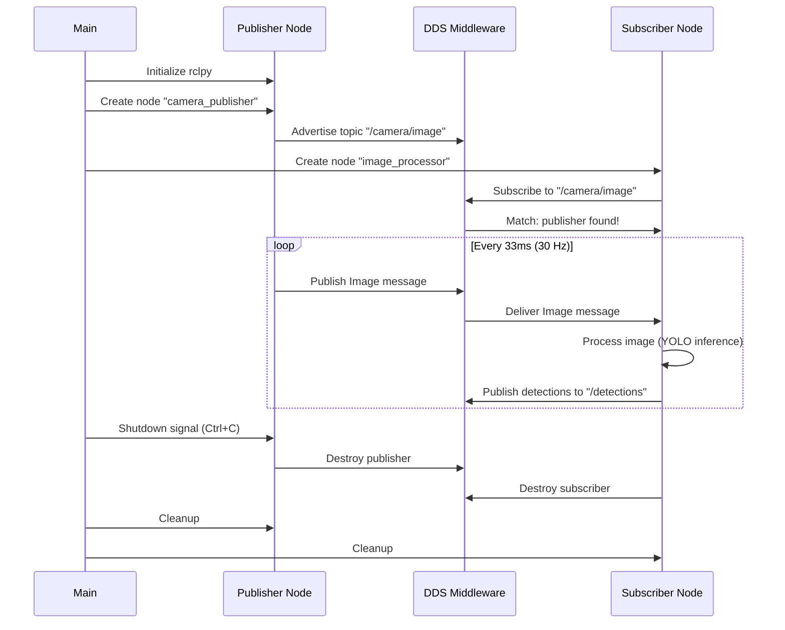
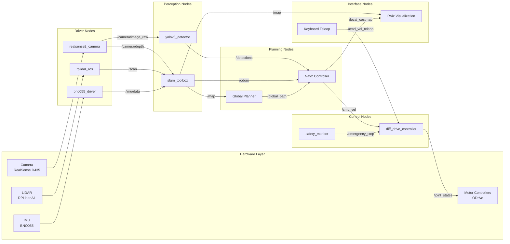

# ROS 2 Fundamentals: Building the Nervous System of Your Robot

<!-- Metadata -->
**Module**: 1 - ROS 2 Nervous System
**Week**: 2
**Estimated Reading Time**: 45 minutes
**Prerequisites**: Week 1 (Physical AI Introduction), Basic Python or C++ knowledge, Linux command line

---

## 1. Overview

In Week 1, we explored Physical AI as the convergence of perception, cognition, action, and learning. But how do these components actually communicate? How does a camera node send images to a vision processing node? How does a planner tell a motor controller to move the robot arm? Enter **ROS 2** (Robot Operating System 2)—the nervous system that connects every part of your robot.

ROS 2 is not an operating system in the traditional sense (like Linux or Windows). Instead, it's a **middleware framework**—a layer of software that sits between your application code and the operating system, providing communication infrastructure, tools, and libraries. Think of it as the "postal service" of your robot: nodes (programs) send messages to topics (mailboxes), and other nodes retrieve those messages without knowing who sent them.

Why does this matter? Modern robots are distributed systems with dozens or hundreds of independent processes:
- **Perception nodes**: YOLO object detector, SLAM localizer, semantic segmentation
- **Planning nodes**: Path planner, task scheduler, grasp planner
- **Control nodes**: PID controllers for each motor, safety monitors, emergency stop handlers
- **Interface nodes**: Joystick input, voice command processor, web dashboard

Without ROS 2, you'd spend months writing custom networking code, synchronizing timestamps, managing coordinate transforms, and reinventing the wheel for every project. ROS 2 provides all of this out-of-the-box, along with a massive ecosystem of pre-built packages (MoveIt2 for manipulation, Nav2 for navigation, Gazebo for simulation) and tools (RViz for visualization, rqt for debugging).

This chapter will take you from ROS 2 basics (publishers and subscribers) to advanced patterns (actions, launch files, parameters) to practical integration (Gazebo simulation). By the end, you'll build a multi-node robot system that simulates a mobile robot navigating an environment while avoiding obstacles. You'll understand the architecture deeply enough to debug issues, optimize performance, and extend functionality.

Let's build the nervous system of your robot.

---

## 2. Learning Outcomes

By the end of this chapter, you will be able to:

- **LO-1**: Explain the ROS 2 architecture: nodes, topics, services, actions, and the DDS middleware layer
- **LO-2**: Implement publisher and subscriber nodes in Python and C++ with proper message types
- **LO-3**: Create service servers and clients for request-reply interactions
- **LO-4**: Build action servers for long-running tasks with feedback and cancellation support
- **LO-5**: Write launch files to start multiple nodes with parameters and remapping
- **LO-6**: Use ROS 2 parameters for runtime configuration and dynamic reconfiguration
- **LO-7**: Integrate Gazebo simulation with ROS 2 for testing robot behavior in virtual environments
- **LO-8**: Debug ROS 2 systems using CLI tools (topic echo, node info, TF visualization)

---

## 3. Key Concepts

### 3.1 ROS 2 Architecture: The Big Picture

ROS 2 is built on a **layered architecture**:

```
┌─────────────────────────────────────────┐
│  Application Layer (Your Nodes)        │  ← Python/C++ code
├─────────────────────────────────────────┤
│  ROS 2 Client Libraries (rclpy, rclcpp) │  ← APIs for nodes, topics, etc.
├─────────────────────────────────────────┤
│  DDS Middleware (rtps, CycloneDDS)      │  ← Network communication
├─────────────────────────────────────────┤
│  Operating System (Linux, Windows, macOS)│
└─────────────────────────────────────────┘
```

**Key Components**:

1. **Nodes**: Independent programs (processes) that perform specific tasks
   - Example: `camera_node`, `object_detector_node`, `motor_controller_node`
   - Nodes can be written in different languages and run on different computers
   - Each node has a unique name (e.g., `/robot/sensors/camera`)

2. **Topics**: Named channels for asynchronous data streaming (publish-subscribe pattern)
   - Example: `/camera/image_raw` (camera publishes RGB images)
   - Multiple publishers and subscribers allowed (many-to-many)
   - No acknowledgment—fire-and-forget messaging

3. **Services**: Synchronous request-reply interactions (like function calls)
   - Example: `/reset_odometry` (client asks to reset, server responds with success/failure)
   - One client, one server at a time (one-to-one)
   - Blocks until response received (or timeout)

4. **Actions**: Long-running tasks with feedback and cancellation (like advanced services)
   - Example: `/navigate_to_goal` (send target pose, get periodic progress updates)
   - Client can cancel mid-execution
   - Server sends result when finished

5. **Parameters**: Runtime configuration values (like global variables accessible to nodes)
   - Example: `camera_node.frame_rate = 30` (set camera to 30 FPS)
   - Can be changed at runtime without restarting nodes

6. **TF2 (Transform Library)**: Manages coordinate frame transformations
   - Example: "What is the detected object's position relative to the robot's hand?"
   - Tracks transformations over time (e.g., robot moving through environment)

**Why This Design?**
- **Modularity**: Each node is a separate process—crashes don't bring down the whole system
- **Language Agnostic**: Python nodes can talk to C++ nodes seamlessly
- **Distributed**: Nodes can run on different computers (robot, laptop, cloud server)
- **Scalable**: Add/remove nodes without modifying existing code

### 3.2 Topics and Publish-Subscribe Pattern

**Topics** are the workhorse of ROS 2. They enable **loose coupling**—publishers don't know (or care) who subscribes, and subscribers don't know who publishes.

**How It Works**:
1. **Publisher** creates a topic (e.g., `/laser_scan`) and advertises it
2. **Subscriber** subscribes to the topic
3. DDS middleware matches them based on topic name and message type
4. Publisher sends messages; all subscribers receive copies

**Message Types** are strongly typed interfaces defined in `.msg` files:
```
# sensor_msgs/msg/LaserScan.msg
std_msgs/Header header
float32 angle_min         # Start angle of scan [rad]
float32 angle_max         # End angle of scan [rad]
float32 angle_increment   # Angular distance between measurements [rad]
float32[] ranges          # Range data [m]
```

**Quality of Service (QoS)** profiles control reliability and performance:
- **Reliable**: Guarantees delivery (like TCP)—use for critical data
- **Best Effort**: Fire-and-forget (like UDP)—use for high-frequency sensor data
- **History Depth**: How many messages to buffer (depth=10 means keep last 10 messages)

**Real-World Example**:
- **Scenario**: Mobile robot with LiDAR sensor
- **Publisher**: `lidar_driver_node` publishes `/scan` topic at 40 Hz
- **Subscribers**:
  - `obstacle_detector_node` (real-time safety—needs low latency)
  - `mapper_node` (SLAM—needs reliable delivery for accuracy)
  - `logger_node` (data logging—can tolerate some loss)

Each subscriber gets the same data but processes it differently. Publisher doesn't know or care how many subscribers exist.

### 3.3 Services for Request-Reply

**Services** are for **synchronous** interactions where you need a response. Unlike topics (continuous streams), services are one-shot calls.

**Use Cases**:
- Reset odometry: `/reset_odometry` → server clears position estimates
- Get robot status: `/get_battery_level` → server returns battery percentage
- Trigger calibration: `/calibrate_camera` → server runs calibration routine

**Service Definition** (`.srv` file):
```
# std_srvs/srv/SetBool.srv
# Request
bool data    # True to enable, False to disable
---
# Response
bool success
string message
```

**How It Works**:
1. Client sends request and **blocks** (waits for response)
2. Server processes request (synchronously)
3. Server sends response
4. Client receives response and continues

**Limitation**: Client is blocked during service call. For long-running tasks (e.g., "navigate to room"), use **actions** instead.

### 3.4 Actions for Long-Running Tasks

**Actions** are like services but designed for tasks that take time and provide progress updates.

**Key Features**:
1. **Goal**: Client sends target (e.g., "move arm to position X")
2. **Feedback**: Server periodically sends progress (e.g., "70% complete, current position: ...")
3. **Result**: Server sends final outcome when done (e.g., "success" or "failed: collision detected")
4. **Cancellation**: Client can cancel mid-execution

**Action Definition** (`.action` file):
```
# example_interfaces/action/Fibonacci.action
# Goal
int32 order
---
# Result
int32[] sequence
---
# Feedback
int32[] partial_sequence
```

**Real-World Example**: Navigation
- **Goal**: "Move robot to position (x=5.0, y=3.0)"
- **Feedback** (every second): "Current position: (x=2.3, y=1.5), distance remaining: 3.2m"
- **Result**: "SUCCESS: Reached target position" or "FAILED: Path blocked by obstacle"
- **Cancellation**: User clicks "Stop" button → robot halts navigation

**When to Use What?**
- **Topic**: Continuous data streams (sensors, state updates)
- **Service**: Quick request-reply (get status, reset state)
- **Action**: Long tasks with feedback (navigation, manipulation, trajectory execution)

### 3.5 Launch Files: Orchestrating Multi-Node Systems

Real robots have dozens of nodes. Starting them manually (`ros2 run package node` repeated 20 times) is tedious and error-prone. **Launch files** automate this.

**Launch File Capabilities**:
- Start multiple nodes with one command
- Set parameters for each node
- Remap topic names (e.g., connect `/camera1/image` to `/front_camera/image`)
- Set environment variables
- Include other launch files (modular launch configurations)
- Conditional logic (e.g., start simulation nodes only if `use_sim=true`)

**Example Launch File** (Python format):
```python
from launch import LaunchDescription
from launch_ros.actions import Node

def generate_launch_description():
    return LaunchDescription([
        Node(
            package='my_robot',
            executable='camera_node',
            name='front_camera',
            parameters=[{'frame_rate': 30, 'resolution': '1920x1080'}]
        ),
        Node(
            package='my_robot',
            executable='lidar_node',
            name='laser_scanner',
            remappings=[('/scan', '/front_laser/scan')]
        ),
        Node(
            package='my_robot',
            executable='controller_node',
            name='base_controller'
        )
    ])
```

Running: `ros2 launch my_robot robot.launch.py` starts all three nodes with configured parameters.

### 3.6 Parameters for Configuration

**Parameters** are key-value pairs stored per node. They enable runtime configuration without recompiling code.

**Use Cases**:
- Camera frame rate: `camera_node.frame_rate = 60`
- PID controller gains: `controller.Kp = 1.5, controller.Ki = 0.2, controller.Kd = 0.8`
- Algorithm thresholds: `detector.confidence_threshold = 0.7`

**Setting Parameters**:
1. **Launch file**:
   ```python
   parameters=[{'frame_rate': 30}]
   ```

2. **YAML file**:
   ```yaml
   camera_node:
     ros__parameters:
       frame_rate: 30
       resolution: "1920x1080"
   ```

3. **Command line**:
   ```bash
   ros2 run my_robot camera_node --ros-args -p frame_rate:=60
   ```

4. **Programmatically** (from another node):
   ```python
   client = node.create_client(SetParameters, '/camera_node/set_parameters')
   ```

**Dynamic Reconfiguration**: Some parameters can be changed while the node is running (e.g., adjust PID gains during tuning without restarting the robot).

---

## 4. Diagrams

### 4.1 ROS 2 Communication Patterns Overview

```mermaid
graph TB
    subgraph "Topics (Pub/Sub)"
        PUB1[Publisher Node<br/>Camera Driver]
        PUB2[Publisher Node<br/>LiDAR Driver]
        TOPIC1[/camera/image_raw]
        TOPIC2[/scan]
        SUB1[Subscriber Node<br/>Object Detector]
        SUB2[Subscriber Node<br/>SLAM]
        SUB3[Subscriber Node<br/>Logger]

        PUB1 -->|Publish 30 Hz| TOPIC1
        PUB2 -->|Publish 40 Hz| TOPIC2
        TOPIC1 --> SUB1
        TOPIC1 --> SUB3
        TOPIC2 --> SUB2
        TOPIC2 --> SUB3
    end

    subgraph "Services (Request/Reply)"
        CLIENT[Service Client<br/>UI Node]
        SERVER[Service Server<br/>Battery Monitor]

        CLIENT -->|Request: Get Battery| SERVER
        SERVER -->|Response: 75%| CLIENT
    end

    subgraph "Actions (Long-Running Tasks)"
        ACTION_CLIENT[Action Client<br/>Navigation Controller]
        ACTION_SERVER[Action Server<br/>Path Planner]

        ACTION_CLIENT -->|Goal: Move to (5,3)| ACTION_SERVER
        ACTION_SERVER -->|Feedback: 50% done| ACTION_CLIENT
        ACTION_SERVER -->|Result: SUCCESS| ACTION_CLIENT
    end

    style TOPIC1 fill:#00FFFF,color:#000
    style TOPIC2 fill:#00FFFF,color:#000
```

**Figure 1**: The three core ROS 2 communication patterns. Topics enable many-to-many async data streams. Services provide synchronous request-reply. Actions add feedback and cancellation for long tasks.

### 4.2 ROS 2 Node Lifecycle and Communication Flow



**Figure 2**: Lifecycle of ROS 2 nodes and message flow. DDS middleware handles discovery (matching publishers/subscribers) and reliable delivery.

### 4.3 Multi-Node Robot System Architecture



**Figure 3**: Real-world multi-node system for a mobile robot. Sensors connect to driver nodes, which publish to perception nodes, feeding into planning and control. Each node is independent and replaceable.

---

## 5. Code Samples

### 5.1 Publisher and Subscriber (Python)

**Objective**: Create a temperature publisher and subscriber to demonstrate basic topic communication

**Publisher Node**:
```python
# Language: Python
# Description: Publishes simulated temperature readings to /robot/temperature topic

import rclpy
from rclpy.node import Node
from std_msgs.msg import Float32
import random

class TemperaturePublisher(Node):
    """Simulates temperature sensor with noise"""

    def __init__(self):
        super().__init__('temperature_publisher')

        # Create publisher
        self.publisher = self.create_publisher(
            Float32,              # Message type
            '/robot/temperature', # Topic name
            10                    # QoS history depth
        )

        # Publish at 2 Hz (every 0.5 seconds)
        self.timer = self.create_timer(0.5, self.publish_temperature)
        self.base_temp = 25.0  # Base temperature in Celsius

        self.get_logger().info('Temperature Publisher started')

    def publish_temperature(self):
        """Generate and publish temperature reading"""
        msg = Float32()
        # Add random noise (±2°C)
        msg.data = self.base_temp + random.uniform(-2.0, 2.0)

        self.publisher.publish(msg)
        self.get_logger().info(f'Published: {msg.data:.2f}°C')

def main(args=None):
    rclpy.init(args=args)
    node = TemperaturePublisher()
    rclpy.spin(node)
    node.destroy_node()
    rclpy.shutdown()

if __name__ == '__main__':
    main()
```

**Subscriber Node**:
```python
# Language: Python
# Description: Subscribes to /robot/temperature and logs warnings for high temps

import rclpy
from rclpy.node import Node
from std_msgs.msg import Float32

class TemperatureMonitor(Node):
    """Monitors temperature and logs warnings"""

    def __init__(self):
        super().__init__('temperature_monitor')

        # Create subscriber
        self.subscription = self.create_subscription(
            Float32,
            '/robot/temperature',
            self.temperature_callback,  # Callback function
            10  # QoS history depth
        )

        self.high_temp_threshold = 30.0  # Celsius
        self.get_logger().info('Temperature Monitor started')

    def temperature_callback(self, msg):
        """Called whenever a message is received"""
        temp = msg.data

        if temp > self.high_temp_threshold:
            self.get_logger().warn(f'HIGH TEMPERATURE: {temp:.2f}°C')
        else:
            self.get_logger().info(f'Temperature OK: {temp:.2f}°C')

def main(args=None):
    rclpy.init(args=args)
    node = TemperatureMonitor()
    rclpy.spin(node)
    node.destroy_node()
    rclpy.shutdown()

if __name__ == '__main__':
    main()
```

**Try It Yourself**:
1. Terminal 1: `python3 temperature_publisher.py`
2. Terminal 2: `python3 temperature_monitor.py`
3. Observe: Monitor receives every published message
4. Test: `ros2 topic hz /robot/temperature` (should show ~2 Hz)

### 5.2 Service Server and Client (Python)

**Objective**: Create a service that resets a counter (simulating odometry reset)

**Server Node**:
```python
# Language: Python
# Description: Service server that resets robot odometry

import rclpy
from rclpy.node import Node
from std_srvs.srv import Trigger  # Empty request, bool+string response

class OdometryResetServer(Node):
    """Provides a service to reset odometry"""

    def __init__(self):
        super().__init__('odometry_reset_server')

        # Create service
        self.srv = self.create_service(
            Trigger,                    # Service type
            '/reset_odometry',          # Service name
            self.reset_callback         # Callback function
        )

        self.odometry_x = 10.5  # Simulated position
        self.odometry_y = 3.2
        self.get_logger().info('Odometry Reset Service ready')

    def reset_callback(self, request, response):
        """Handle service request"""
        # Reset odometry
        old_x, old_y = self.odometry_x, self.odometry_y
        self.odometry_x = 0.0
        self.odometry_y = 0.0

        # Fill response
        response.success = True
        response.message = f'Odometry reset from ({old_x:.2f}, {old_y:.2f}) to (0.00, 0.00)'

        self.get_logger().info(response.message)
        return response

def main(args=None):
    rclpy.init(args=args)
    node = OdometryResetServer()
    rclpy.spin(node)
    node.destroy_node()
    rclpy.shutdown()

if __name__ == '__main__':
    main()
```

**Client Node**:
```python
# Language: Python
# Description: Service client that calls odometry reset

import rclpy
from rclpy.node import Node
from std_srvs.srv import Trigger

class OdometryResetClient(Node):
    """Calls the reset odometry service"""

    def __init__(self):
        super().__init__('odometry_reset_client')

        # Create client
        self.client = self.create_client(Trigger, '/reset_odometry')

        # Wait for service to be available
        while not self.client.wait_for_service(timeout_sec=1.0):
            self.get_logger().info('Waiting for /reset_odometry service...')

        self.get_logger().info('Service found! Sending request...')
        self.send_request()

    def send_request(self):
        """Call the service"""
        request = Trigger.Request()  # Empty request

        # Call asynchronously
        future = self.client.call_async(request)
        future.add_done_callback(self.response_callback)

    def response_callback(self, future):
        """Handle service response"""
        try:
            response = future.result()
            if response.success:
                self.get_logger().info(f'SUCCESS: {response.message}')
            else:
                self.get_logger().error(f'FAILED: {response.message}')
        except Exception as e:
            self.get_logger().error(f'Service call failed: {str(e)}')

def main(args=None):
    rclpy.init(args=args)
    node = OdometryResetClient()
    rclpy.spin_once(node)  # Process callbacks once
    node.destroy_node()
    rclpy.shutdown()

if __name__ == '__main__':
    main()

# Expected Output:
# [odometry_reset_client]: Service found! Sending request...
# [odometry_reset_client]: SUCCESS: Odometry reset from (10.50, 3.20) to (0.00, 0.00)
```

**Try It Yourself**:
1. Terminal 1: `python3 odometry_reset_server.py`
2. Terminal 2: `python3 odometry_reset_client.py`
3. Watch server log show reset message
4. Test CLI: `ros2 service call /reset_odometry std_srvs/srv/Trigger`

### 5.3 Action Server and Client (Python)

**Objective**: Implement Fibonacci sequence generator as an action (demonstrates goal, feedback, result)

**Action Server**:
```python
# Language: Python
# Description: Action server that computes Fibonacci sequence

import rclpy
from rclpy.action import ActionServer
from rclpy.node import Node
from example_interfaces.action import Fibonacci
import time

class FibonacciActionServer(Node):
    """Generates Fibonacci sequence with progress feedback"""

    def __init__(self):
        super().__init__('fibonacci_action_server')

        # Create action server
        self._action_server = ActionServer(
            self,
            Fibonacci,
            '/fibonacci',
            self.execute_callback
        )

        self.get_logger().info('Fibonacci Action Server ready')

    def execute_callback(self, goal_handle):
        """Execute the action (called when client sends goal)"""
        self.get_logger().info(f'Executing goal: order={goal_handle.request.order}')

        # Initialize feedback and result
        feedback_msg = Fibonacci.Feedback()
        feedback_msg.partial_sequence = [0, 1]

        # Generate Fibonacci sequence
        for i in range(1, goal_handle.request.order):
            # Check if client requested cancellation
            if goal_handle.is_cancel_requested:
                goal_handle.canceled()
                self.get_logger().info('Goal canceled')
                return Fibonacci.Result()

            # Compute next Fibonacci number
            feedback_msg.partial_sequence.append(
                feedback_msg.partial_sequence[i] + feedback_msg.partial_sequence[i-1]
            )

            # Send feedback to client
            goal_handle.publish_feedback(feedback_msg)
            self.get_logger().info(f'Feedback: {feedback_msg.partial_sequence}')

            time.sleep(0.5)  # Simulate computation time

        # Mark goal as succeeded
        goal_handle.succeed()

        # Return final result
        result = Fibonacci.Result()
        result.sequence = feedback_msg.partial_sequence
        self.get_logger().info(f'Result: {result.sequence}')
        return result

def main(args=None):
    rclpy.init(args=args)
    node = FibonacciActionServer()
    rclpy.spin(node)
    node.destroy_node()
    rclpy.shutdown()

if __name__ == '__main__':
    main()
```

**Action Client**:
```python
# Language: Python
# Description: Action client that requests Fibonacci sequence

import rclpy
from rclpy.action import ActionClient
from rclpy.node import Node
from example_interfaces.action import Fibonacci

class FibonacciActionClient(Node):
    """Sends goal to Fibonacci action server"""

    def __init__(self):
        super().__init__('fibonacci_action_client')

        self._action_client = ActionClient(self, Fibonacci, '/fibonacci')

    def send_goal(self, order):
        """Send goal to action server"""
        goal_msg = Fibonacci.Goal()
        goal_msg.order = order

        self.get_logger().info(f'Waiting for action server...')
        self._action_client.wait_for_server()

        self.get_logger().info(f'Sending goal: order={order}')
        send_goal_future = self._action_client.send_goal_async(
            goal_msg,
            feedback_callback=self.feedback_callback
        )

        send_goal_future.add_done_callback(self.goal_response_callback)

    def goal_response_callback(self, future):
        """Called when server accepts/rejects goal"""
        goal_handle = future.result()

        if not goal_handle.accepted:
            self.get_logger().error('Goal rejected!')
            return

        self.get_logger().info('Goal accepted')
        get_result_future = goal_handle.get_result_async()
        get_result_future.add_done_callback(self.get_result_callback)

    def feedback_callback(self, feedback_msg):
        """Called when server sends feedback"""
        feedback = feedback_msg.feedback
        self.get_logger().info(f'Feedback: {feedback.partial_sequence}')

    def get_result_callback(self, future):
        """Called when action completes"""
        result = future.result().result
        self.get_logger().info(f'Final result: {result.sequence}')

def main(args=None):
    rclpy.init(args=args)
    client = FibonacciActionClient()
    client.send_goal(order=10)  # Generate first 10 Fibonacci numbers
    rclpy.spin(client)
    client.destroy_node()
    rclpy.shutdown()

if __name__ == '__main__':
    main()

# Expected Output (Client):
# [fibonacci_action_client]: Sending goal: order=10
# [fibonacci_action_client]: Goal accepted
# [fibonacci_action_client]: Feedback: [0, 1, 1]
# [fibonacci_action_client]: Feedback: [0, 1, 1, 2]
# ...
# [fibonacci_action_client]: Final result: [0, 1, 1, 2, 3, 5, 8, 13, 21, 34, 55]
```

**Try It Yourself**:
1. Terminal 1: `python3 fibonacci_server.py`
2. Terminal 2: `python3 fibonacci_client.py`
3. Watch feedback messages stream in real-time
4. Test cancellation: Send goal, then `Ctrl+C` in client

---

## 6. Simulation Workflows

### 6.1 Launching a Simulated Robot in Gazebo

**Prerequisites**:
- ROS 2 Humble installed
- Gazebo installed: `sudo apt install ros-humble-gazebo-ros-pkgs`

**Steps**:

1. **Install TurtleBot3 Simulation Packages**
   ```bash
   sudo apt install ros-humble-turtlebot3-gazebo
   ```

2. **Set TurtleBot3 Model Environment Variable**
   ```bash
   export TURTLEBOT3_MODEL=waffle_pi
   ```

3. **Launch Gazebo Simulation**
   ```bash
   ros2 launch turtlebot3_gazebo turtlebot3_world.launch.py
   ```
   Expected: Gazebo window opens showing TurtleBot3 in a test world

4. **Verify Topics Are Publishing**
   ```bash
   ros2 topic list
   ```
   Expected output:
   ```
   /camera/image_raw
   /scan
   /odom
   /cmd_vel
   ...
   ```

5. **Echo LiDAR Data**
   ```bash
   ros2 topic echo /scan
   ```
   Expected: Stream of LaserScan messages

6. **Control Robot with Keyboard**
   ```bash
   ros2 run turtlebot3_teleop teleop_keyboard
   ```
   Use WASD keys to drive the robot

**Validation**:
- [ ] Gazebo shows robot in 3D world
- [ ] `/scan` topic publishes at ~10 Hz
- [ ] Robot moves when teleop commands sent

### 6.2 Visualizing Robot State in RViz

**Prerequisites**:
- Gazebo simulation running (Workflow 6.1)

**Steps**:

1. **Launch RViz with TurtleBot3 Configuration**
   ```bash
   ros2 launch turtlebot3_gazebo turtlebot3_gazebo.launch.py
   ```
   (This launches both Gazebo and RViz)

2. **Add LaserScan Display**
   - In RViz, click "Add" → "By topic" → "/scan" → "LaserScan"
   - Set color to red for visibility

3. **Add Robot Model**
   - Click "Add" → "RobotModel"
   - Ensure "Description Topic" is `/robot_description`

4. **Add TF Display**
   - Click "Add" → "TF"
   - See coordinate frames for base_link, lidar_link, etc.

5. **Add Odometry Display**
   - Click "Add" → "Odometry"
   - Topic: `/odom`
   - Shows robot's estimated path

**Validation**:
- [ ] RViz shows 3D robot model
- [ ] LaserScan data visualized as red points
- [ ] TF frames visible and moving as robot moves

### 6.3 Creating a Custom Launch File

**Prerequisites**:
- ROS 2 workspace set up

**Steps**:

1. **Create Launch File Directory**
   ```bash
   cd ~/ros2_ws/src/my_robot_package
   mkdir launch
   ```

2. **Create Launch File** (`launch/robot_bringup.launch.py`):
   ```python
   from launch import LaunchDescription
   from launch_ros.actions import Node

   def generate_launch_description():
       return LaunchDescription([
           # Camera node
           Node(
               package='usb_cam',
               executable='usb_cam_node_exe',
               name='camera',
               parameters=[{
                   'video_device': '/dev/video0',
                   'framerate': 30.0,
                   'image_width': 640,
                   'image_height': 480
               }]
           ),

           # Object detector node
           Node(
               package='my_robot_package',
               executable='object_detector',
               name='detector',
               parameters=[{
                   'confidence_threshold': 0.5,
                   'model_path': '/models/yolov8n.pt'
               }],
               remappings=[
                   ('/camera/image_raw', '/camera/image_raw')
               ]
           ),

           # RViz visualization
           Node(
               package='rviz2',
               executable='rviz2',
               name='rviz',
               arguments=['-d', '/path/to/config.rviz']
           )
       ])
   ```

3. **Build Workspace**
   ```bash
   cd ~/ros2_ws
   colcon build --packages-select my_robot_package
   source install/setup.bash
   ```

4. **Launch System**
   ```bash
   ros2 launch my_robot_package robot_bringup.launch.py
   ```

**Validation**:
- [ ] All three nodes start simultaneously
- [ ] Camera publishes to `/camera/image_raw`
- [ ] Detector subscribes and publishes to `/detections`

---

## 7. Recap Questions

1. **What is the difference between ROS 2 topics, services, and actions? Give an example use case for each.**
   <details>
   <summary>Answer</summary>

   **Topics** (Publish-Subscribe):
   - **Pattern**: Asynchronous, many-to-many
   - **Use case**: Continuous data streams (sensor readings, robot state)
   - **Example**: Camera publishes images to `/camera/image_raw` at 30 Hz; object detector and logger both subscribe

   **Services** (Request-Reply):
   - **Pattern**: Synchronous, one-to-one
   - **Use case**: Quick request-reply interactions (get status, reset state)
   - **Example**: UI requests battery level via `/get_battery_level` service; battery monitor responds with "75%"

   **Actions** (Long-Running Tasks):
   - **Pattern**: Asynchronous with feedback, one-to-one
   - **Use case**: Tasks that take time and need progress updates or cancellation
   - **Example**: Navigation goal to move robot to position (5.0, 3.0); server sends periodic feedback ("70% complete, 2.1m remaining"); client can cancel mid-execution

   **Key difference**: Topics don't wait for response, services block until response, actions provide feedback while executing.
   </details>

2. **Why is DDS middleware important in ROS 2? What problems does it solve?**
   <details>
   <summary>Answer</summary>

   **DDS (Data Distribution Service)** is the networking layer beneath ROS 2. It solves several critical problems:

   1. **Discovery**: Automatically finds publishers and subscribers without central broker (unlike ROS 1's roscore)
   2. **Quality of Service**: Configurable reliability (reliable vs best-effort), history depth, durability
   3. **Real-time Performance**: Low-latency communication suitable for 100-1000 Hz control loops
   4. **Scalability**: Handles hundreds of nodes across multiple computers without bottlenecks
   5. **Security**: Encrypted communication, authentication, access control (important for commercial robots)

   **Why it matters**: Without DDS, ROS 2 couldn't support distributed systems (nodes on different computers), real-time control, or reliable delivery guarantees. DDS enables robots to scale from hobby projects to industrial deployments.
   </details>

3. **What are ROS 2 parameters and why are they useful? How do they differ from topics?**
   <details>
   <summary>Answer</summary>

   **Parameters** are configuration values stored per node (like global variables accessible to all nodes).

   **Use cases**:
   - Camera frame rate: `camera_node.frame_rate = 30`
   - PID gains: `controller.Kp = 1.5, controller.Ki = 0.2`
   - Algorithm thresholds: `detector.confidence_threshold = 0.7`

   **Why useful**:
   - **No recompilation**: Change behavior without rebuilding code
   - **Runtime reconfiguration**: Tune PID gains while robot is running
   - **Launch file configuration**: Set different values for different robots
   - **Persistent storage**: Save parameters to file, reload on restart

   **Difference from topics**:
   - **Parameters**: Static configuration (change infrequently)
   - **Topics**: Dynamic data streams (change continuously)

   **Example**: Camera frame rate is a parameter (set once at startup), but camera images are published to a topic (30 times per second).
   </details>

4. **Explain the role of launch files in a ROS 2 system. What problems do they solve?**
   <details>
   <summary>Answer</summary>

   **Launch files** automate starting multiple nodes with configuration. They solve several problems:

   1. **Manual startup tedium**: Without launch files, you'd run `ros2 run package node` 20+ times for a complex robot
   2. **Parameter management**: Set different parameters for each node in one place
   3. **Topic remapping**: Connect nodes that expect different topic names (e.g., remap `/camera1/image` to `/front_camera/image`)
   4. **Modularity**: Include other launch files (e.g., `navigation.launch.py` includes `sensors.launch.py`)
   5. **Conditional logic**: Start simulation nodes only if `use_sim=true` argument passed
   6. **Reproducibility**: Ensures every team member starts the system the same way

   **Real-world example**: TurtleBot3 launch file starts 15+ nodes (Gazebo, RViz, SLAM, navigation, drivers) with one command. Trying to start these manually would be error-prone and time-consuming.
   </details>

5. **What is the TF2 library in ROS 2? Why is coordinate frame management critical for robotics?**
   <details>
   <summary>Answer</summary>

   **TF2 (Transform Library 2)** manages coordinate frame transformations in ROS 2. It tracks relationships between coordinate frames (e.g., base_link, camera_link, end_effector) and transforms points/vectors between them.

   **Why critical**:
   - **Sensor fusion**: Camera sees object at (0.5, 0.2) in camera_link; TF2 transforms to (1.3, -0.4) in base_link (robot's reference frame)
   - **Multi-sensor systems**: Merge data from camera, LiDAR, IMU which all use different coordinate frames
   - **Manipulation**: "Where is the detected object relative to the robot's hand?"
   - **Navigation**: "What is the obstacle's position relative to the robot's base?"

   **How it works**:
   - Nodes publish transforms (e.g., "camera_link is 0.3m forward, 0.1m up from base_link")
   - TF2 builds a tree of all transforms
   - Nodes query: "Transform point P from frame A to frame B at time T"
   - TF2 handles chain of transforms and interpolation

   **Without TF2**: You'd manually track coordinate frames, write transformation matrices, handle time synchronization—reinventing the wheel and introducing bugs.
   </details>

---

## 8. Multiple Choice Questions (MCQs)

**Q1**: In ROS 2, which communication pattern should you use for continuous sensor data streaming (e.g., camera images at 30 Hz)?

A) Service
B) Action
C) Topic
D) Parameter

<details>
<summary>Correct Answer</summary>

**C** - **Topics** are designed for asynchronous, high-frequency data streams. Sensors publish continuously; multiple nodes can subscribe.

- A (Service) is for synchronous request-reply, not continuous streams
- B (Action) is for long-running tasks with feedback, not continuous data
- D (Parameter) is for configuration, not data streaming
</details>

---

**Q2**: What happens if a ROS 2 service client calls a service but the server crashes mid-processing?

A) The client receives a partial response
B) The client hangs indefinitely waiting for response
C) The client automatically retries the request
D) The client times out and receives an error

<details>
<summary>Correct Answer</summary>

**D** - Service calls have configurable timeouts. If the server crashes or doesn't respond within the timeout period, the client receives an error (exception in Python, error code in C++).

- A is wrong: No partial responses in services (unlike actions with feedback)
- B is wrong: Clients don't hang indefinitely; timeouts prevent this
- C is wrong: Clients don't automatically retry (application must implement retry logic)
</details>

---

**Q3**: Which DDS Quality of Service (QoS) setting guarantees message delivery even if subscribers join after messages are published?

A) Best Effort reliability
B) Transient Local durability
C) Volatile durability
D) Keep Last 1 history

<details>
<summary>Correct Answer</summary>

**B** - **Transient Local** durability caches messages so late-joining subscribers receive the last N messages (based on history depth).

- A (Best Effort) provides no delivery guarantees (fire-and-forget)
- C (Volatile) only delivers to currently connected subscribers (default)
- D (Keep Last 1) controls buffer size but doesn't affect late-joiners without Transient Local
</details>

---

**Q4**: In a ROS 2 action, what can the client do while the server is executing the goal?

A) Nothing—client must wait until completion
B) Receive periodic feedback and optionally cancel the goal
C) Send additional goals to the same action server
D) Modify the goal mid-execution

<details>
<summary>Correct Answer</summary>

**B** - Actions are designed for long-running tasks. The client receives periodic **feedback** (progress updates) and can **cancel** the goal at any time.

- A is wrong: That's how services work (blocking), not actions
- C is wrong: Only one goal per action server at a time (server can queue, but client can't send multiple simultaneously)
- D is wrong: Cannot modify goal mid-execution (would need to cancel and send new goal)
</details>

---

**Q5**: What is the primary purpose of TF2 in ROS 2?

A) Transform image formats (JPEG to PNG)
B) Manage coordinate frame transformations between robot links
C) Transform LaTeX documents to PDF
D) Translate code from Python to C++

<details>
<summary>Correct Answer</summary>

**B** - **TF2** tracks spatial relationships between coordinate frames (base_link, camera_link, end_effector) and transforms points/vectors between them.

- A, C, D are unrelated to robotics coordinate transforms
</details>

---

**Q6**: Which file format is used for ROS 2 launch files in Python-based launches?

A) .xml
B) .yaml
C) .py (Python script)
D) .json

<details>
<summary>Correct Answer</summary>

**C** - ROS 2 supports **Python** launch files (`.launch.py`) and XML launch files (`.launch.xml`). Python is more powerful (supports conditional logic, loops, programmatic configuration).

- A (XML) is supported but less flexible than Python
- B (YAML) is for parameters, not launch files
- D (JSON) is not used for launch files
</details>

---

## 9. Hands-On Assignment

### Assignment Title: Build a Multi-Node Temperature Monitoring System

**Difficulty**: Intermediate
**Estimated Time**: 4 hours
**Type**: Individual

**Objective**:
Build a complete ROS 2 system with three nodes:
1. **Sensor node**: Publishes simulated temperature readings
2. **Monitor node**: Subscribes to temperature, logs warnings, provides a service to reset alerts
3. **Controller node**: Calls the reset service when user presses a key

This assignment integrates topics, services, and multi-node communication.

**Problem Statement**:
You're building a temperature monitoring system for a humanoid robot's onboard computer. The system must:
- Continuously monitor CPU temperature
- Log warnings when temperature exceeds threshold
- Allow operators to reset the alert counter via a service
- Provide a simple interface for triggering the reset

**Requirements**:
- **R1**: **Sensor node** (`temperature_sensor.py`):
  - Publish `Float32` messages to `/robot/temperature` at 2 Hz
  - Simulate temperature: `30 + 15 * sin(time) + noise` (ranges 15-45°C)
  - Add Gaussian noise (±3°C)

- **R2**: **Monitor node** (`temperature_monitor.py`):
  - Subscribe to `/robot/temperature`
  - Log INFO if temperature < 35°C
  - Log WARN if temperature ≥ 35°C and < 40°C
  - Log ERROR if temperature ≥ 40°C
  - Count total warnings/errors
  - Provide service `/reset_alerts` (std_srvs/Trigger) that resets counters

- **R3**: **Controller node** (`alert_controller.py`):
  - Wait for user to press 'r' key
  - Call `/reset_alerts` service
  - Print server response

- **R4**: **Launch file** (`temperature_system.launch.py`):
  - Start all three nodes simultaneously
  - Set parameters: `sensor.update_rate: 2.0`, `monitor.warn_threshold: 35.0`, `monitor.error_threshold: 40.0`

- **R5**: **Documentation**:
  - README.md with architecture diagram, usage instructions, expected behavior

**Starter Code**:

**temperature_sensor.py** (partial):
```python
import rclpy
from rclpy.node import Node
from std_msgs.msg import Float32
import math
import random

class TemperatureSensor(Node):
    def __init__(self):
        super().__init__('temperature_sensor')

        # Declare parameter
        self.declare_parameter('update_rate', 2.0)
        update_rate = self.get_parameter('update_rate').value

        # TODO: Create publisher for /robot/temperature

        # TODO: Create timer based on update_rate

        self.time = 0.0
        self.get_logger().info(f'Temperature Sensor started at {update_rate} Hz')

    def publish_temperature(self):
        # TODO: Calculate temperature: 30 + 15*sin(time) + noise
        # TODO: Publish to /robot/temperature
        # TODO: Increment time
        pass

def main():
    rclpy.init()
    node = TemperatureSensor()
    rclpy.spin(node)
    node.destroy_node()
    rclpy.shutdown()
```

**temperature_monitor.py** (partial):
```python
import rclpy
from rclpy.node import Node
from std_msgs.msg import Float32
from std_srvs.srv import Trigger

class TemperatureMonitor(Node):
    def __init__(self):
        super().__init__('temperature_monitor')

        # Declare parameters
        self.declare_parameter('warn_threshold', 35.0)
        self.declare_parameter('error_threshold', 40.0)

        # TODO: Get parameters

        # TODO: Create subscriber for /robot/temperature

        # TODO: Create service /reset_alerts

        self.warn_count = 0
        self.error_count = 0

    def temperature_callback(self, msg):
        # TODO: Check thresholds and log appropriately
        # TODO: Increment counters
        pass

    def reset_callback(self, request, response):
        # TODO: Reset counters
        # TODO: Set response.success and response.message
        pass

# TODO: Implement main()
```

**alert_controller.py** (complete implementation required)

**Deliverables**:
1. All four Python files (sensor, monitor, controller, and launch file)
2. README.md with:
   - System architecture diagram (Mermaid or hand-drawn)
   - How to run: `ros2 launch my_package temperature_system.launch.py`
   - Screenshot showing all three nodes running
   - Screenshot showing service call resetting alerts
3. Video (optional): 30-second demo showing temperature warnings and reset

**Evaluation Rubric** (Total: 100 points):

| Criteria | Points | Description |
|----------|--------|-------------|
| **Sensor Node** | 20 | Publishes correct temperature with noise at specified rate |
| **Monitor Node** | 25 | Correctly logs INFO/WARN/ERROR, tracks counters, provides service |
| **Controller Node** | 20 | Successfully calls service and displays response |
| **Launch File** | 15 | Starts all nodes with correct parameters |
| **Documentation** | 10 | Clear README with architecture diagram and usage |
| **Code Quality** | 10 | Clean code, proper naming, docstrings |

**Submission Guidelines**:
- Create GitHub repository
- Include all code, README, and screenshots
- Submit repository link
- Self-paced (no deadline for self-study)

**Hints**:
- Test each node individually before integrating
- Use `ros2 node list` to verify nodes are running
- Use `ros2 topic hz /robot/temperature` to check publishing rate
- Use `ros2 service call /reset_alerts std_srvs/srv/Trigger` to test service manually

---

## 10. Glossary

**Action**: ROS 2 communication pattern for long-running tasks with feedback and cancellation support. Used for navigation, manipulation, trajectory execution.

**Client Library**: Language-specific API for ROS 2 (rclpy for Python, rclcpp for C++, rcljs for JavaScript).

**Colcon**: Build tool for ROS 2 workspaces. Compiles packages, manages dependencies, generates setup scripts.

**DDS (Data Distribution Service)**: Middleware protocol used by ROS 2 for publish-subscribe communication. Enables discovery, QoS policies, and real-time performance.

**Executor**: Component that manages callbacks in ROS 2 (spinning the node to process messages, timers, services).

**Gazebo**: 3D robot simulator with physics engine (ODE, Bullet). Integrates with ROS 2 for testing robots in virtual environments.

**Launch File**: Configuration file (.py or .xml) that starts multiple nodes, sets parameters, and configures system.

**Node**: Independent program (process) in ROS 2 that performs a specific function. Communicates via topics, services, actions.

**Package**: Directory containing ROS 2 code, organized with package.xml, setup.py, src/, launch/, config/.

**Parameter**: Configuration value stored per node (e.g., camera.frame_rate = 30). Can be set via launch files, YAML, or CLI.

**QoS (Quality of Service)**: DDS configuration for reliability (reliable vs best-effort), durability (transient vs volatile), history depth.

**rclpy**: ROS 2 client library for Python. Provides Node class, publishers, subscribers, services, actions.

**rclcpp**: ROS 2 client library for C++. High-performance implementation for real-time control.

**RViz**: ROS visualization tool for 3D display of robot models, sensor data, maps, trajectories.

**Service**: ROS 2 communication pattern for synchronous request-reply. Client sends request, server processes, returns response.

**TF2 (Transform Library 2)**: Library for managing coordinate frame transformations. Tracks spatial relationships between robot links.

**Topic**: Named channel for publish-subscribe messaging. Publishers send messages; subscribers receive asynchronously.

**URDF (Unified Robot Description Format)**: XML format describing robot structure (links, joints, visual/collision geometry).

**Workspace**: Directory containing ROS 2 packages (typically `~/ros2_ws`). Built with colcon, sourced with `source install/setup.bash`.

---

## Further Reading & Resources

**Official Documentation**:
- [ROS 2 Humble Docs](https://docs.ros.org/en/humble/): Official tutorials, API references
- [DDS Specification](https://www.omg.org/spec/DDS/): Deep dive into middleware
- [ROS 2 Design Documents](https://design.ros2.org/): Architectural decisions and rationale

**Tutorials & Guides**:
- [Articulated Robotics - ROS 2 Control](https://articulatedrobotics.xyz/): Excellent video series on ros2_control
- [The Construct - ROS 2 Courses](https://www.theconstructsim.com/): Interactive learning platform
- [Robotics Backend - ROS 2 Tutorials](https://roboticsbackend.com/category/ros2/): Written tutorials with code examples

**Books**:
- *A Concise Introduction to Robot Programming with ROS2* by Francisco Martín Rico
- *Programming Robots with ROS* (ROS 1, but concepts apply)

**Videos**:
- [ROS World 2021 - What's New in ROS 2](https://vimeo.com/649654298): Latest features
- [ROSCon 2022 Talks](https://roscon.ros.org/2022/): Advanced topics from the community

**GitHub Repositories**:
- [ros2/examples](https://github.com/ros2/examples): Official example code
- [ros2/demos](https://github.com/ros2/demos): Demo applications

---

## Next Chapter

Continue to **Week 5: Digital Twin Simulation (Gazebo + Unity)** where you'll learn to create photorealistic simulations, design custom robot models in URDF, build physics-accurate environments, and implement sim-to-real transfer techniques. You'll simulate a complete humanoid robot before deploying to real hardware.

---

**Last Updated**: 2025-01-05
**Contributors**: Claude Code (Sonnet 4.5) + Human Review
**License**: Educational use - Physical AI & Humanoid Robotics Textbook
