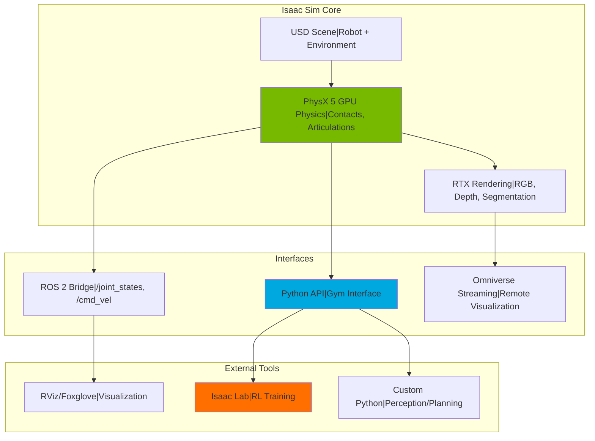
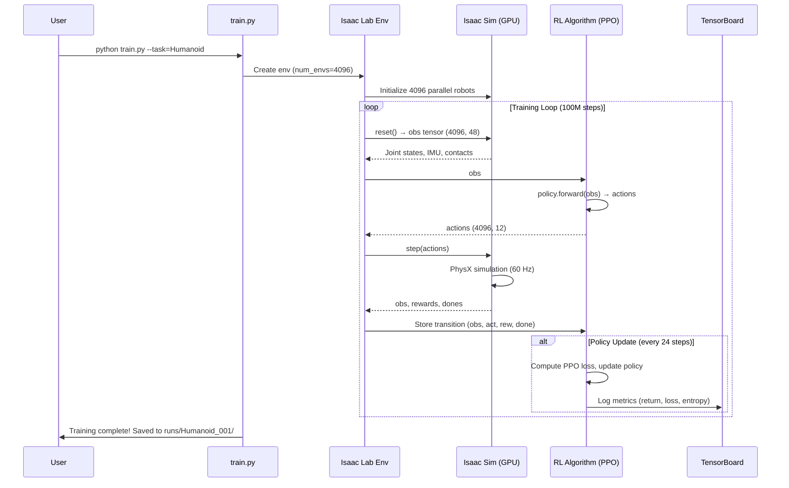
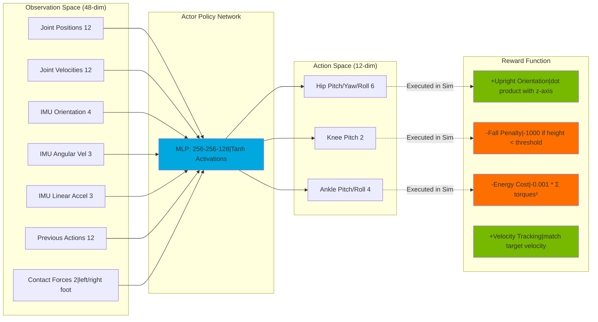

# NVIDIA Isaac Platform: GPU-Accelerated Simulation and Reinforcement Learning

<!-- Metadata -->
**Module**: 3 - NVIDIA Isaac AI Brain
**Week**: 8-10
**Estimated Reading Time**: 45 minutes
**Prerequisites**: ROS 2 fundamentals, digital twin concepts, basic Python programming, NVIDIA GPU (GTX 1060 or better, or Jetson Orin)

---

## 1. Overview

Traditional robot simulation has always faced a fundamental trade-off: **speed vs. realism**. Gazebo provides accurate physics but runs 2-10x slower than real-time on complex scenes. Unity renders beautifully but lacks the precision physics needed for contact-rich manipulation tasks. Training a humanoid robot to walk in these simulators can take weeks of real-world time for what amounts to a few hours of simulated experience.

**NVIDIA Isaac** shatters this trade-off by leveraging **GPU-accelerated physics and rendering**. Isaac Sim can simulate thousands of parallel robot environments simultaneously on a single RTX 4090, achieving 1000x speedups over CPU-based simulators. This isn't just faster—it's transformative. What once took a week now completes in minutes. Reinforcement learning experiments that were impractical become routine. Sim-to-real transfer becomes viable because you can iterate rapidly enough to close the reality gap.

The Isaac platform consists of two integrated components:

1. **Isaac Sim**: A photorealistic simulator built on NVIDIA Omniverse, featuring PhysX 5 for accurate rigid body dynamics, ray-traced rendering, and native ROS 2 integration. You use Isaac Sim to create digital twins of robots, test perception algorithms under varied lighting, and prototype behaviors before deploying to hardware.

2. **Isaac Lab**: A reinforcement learning framework optimized for robotics, providing pre-built RL environments, vectorized simulation (thousands of parallel envs), and reference implementations of algorithms like PPO and SAC. You use Isaac Lab to train policies for locomotion, manipulation, and navigation—all within Isaac Sim.

This chapter will guide you from zero to running your first humanoid RL training session. You'll install Isaac Sim on either a desktop GPU or NVIDIA Jetson Orin, load a Unitree H1 humanoid robot, run physics simulations, and train a policy to make it stand upright. By the end, you'll understand why Isaac has become the standard for modern robotics AI development.

---

## 2. Learning Outcomes

By the end of this chapter, you will be able to:

- **LO-1**: Explain the architecture of Isaac Sim (Omniverse, PhysX, USD format) and how GPU acceleration enables parallel simulation
- **LO-2**: Install and configure Isaac Sim on Linux (Docker) for both x86 desktop and Jetson Orin platforms
- **LO-3**: Load robot models (URDF/USD) into Isaac Sim, run physics simulation, and visualize sensor data
- **LO-4**: Describe the Isaac Lab workflow: environment definition, RL algorithm selection, training, and evaluation
- **LO-5**: Implement a basic RL training script for a humanoid standing task using Isaac Lab and PPO
- **LO-6**: Diagnose common issues (Docker GPU access, USD file errors, Isaac Lab dependency conflicts) and apply troubleshooting strategies

---

## 3. Key Concepts

### 3.1 Why GPU Simulation Matters for Robotics

**The CPU Bottleneck**:
Traditional simulators (Gazebo, MuJoCo, PyBullet) run physics on the CPU. Each simulation step involves:
1. Collision detection (checking all object pairs)
2. Constraint solving (joint limits, contacts)
3. Integration (updating positions/velocities)

On a 16-core CPU, you might run 10-20 parallel robot environments at 100 Hz (real-time). Training a humanoid to walk via RL requires **~100 million timesteps**. At 100 Hz real-time, that's:
```
100,000,000 timesteps ÷ 100 Hz ÷ 3600 s/hr = 278 hours = 11.5 days
```
And that's for a *single* training run. Hyperparameter tuning (10+ runs) becomes impractical.

**The GPU Solution**:
Isaac Sim moves physics to the GPU using **NVIDIA PhysX 5**, which parallelizes:
- Collision detection across all object pairs simultaneously
- Constraint solving for thousands of robots in parallel
- Tensor-based state representation (no CPU-GPU data transfers)

On a single RTX 4090, you can run **2000-4000 parallel humanoid environments** at 60 Hz. Same 100M timesteps now takes:
```
100,000,000 ÷ (4000 envs × 60 Hz) ÷ 3600 = 0.12 hours = 7 minutes
```
This 1000x speedup isn't just convenient—it fundamentally changes what's possible. You can now:
- Train complex policies (locomotion, manipulation) in hours instead of weeks
- Sweep hyperparameters exhaustively
- Iterate on reward functions and environment randomization rapidly

**Key Insight**: GPU simulation isn't about making the same experiments faster; it's about enabling experiments that were previously impossible.

### 3.2 Isaac Sim Architecture: Omniverse + PhysX + USD

**NVIDIA Omniverse** is a platform for 3D collaboration and simulation, built on three technologies:

#### Universal Scene Description (USD)
- **What**: An open-source 3D scene file format developed by Pixar
- **Why**: Unlike URDF (XML-based, limited), USD supports:
  - Hierarchical scene composition (reuse assets, override properties)
  - Time-sampled animation (not just static poses)
  - Material and lighting definitions (PBR rendering)
  - Multi-user collaboration (artists + engineers working on same scene)
- **Example**: A humanoid robot USD file references separate USD files for the body, head, arms—changes to the arm USD automatically propagate

#### PhysX 5 Engine
- **What**: NVIDIA's GPU-accelerated rigid body physics engine
- **Features**:
  - Contact-rich simulation (stable grasping, multi-contact locomotion)
  - Articulation solvers (reduced-coordinate dynamics for robot joints)
  - Soft body and deformable objects (cloth, rubber)
  - Tensor API (direct GPU memory access, no CPU transfers)
- **Performance**: Can simulate 10,000+ rigid bodies with contacts in real-time on an RTX 3080

#### Ray-Traced Rendering (RTX)
- **What**: Photorealistic rendering using hardware-accelerated ray tracing
- **Why for Robotics**: Synthetic camera data (RGB, depth) that closely matches real sensors
- **Use Cases**:
  - Training vision models on synthetic data (domain randomization)
  - Testing perception pipelines under varied lighting before hardware deployment
  - Generating labeled datasets (perfect ground truth segmentation, 6D poses)

**Integration**: Isaac Sim combines these into a single environment where you can:
1. Design robot and environment in USD
2. Run PhysX simulation at 60-240 Hz
3. Render synthetic sensor data (cameras, LiDAR)
4. Stream data to ROS 2 or Python (via Isaac Lab)

### 3.3 Isaac Lab: RL Framework for Robotics

**Isaac Lab** (formerly Isaac Gym) is a reinforcement learning framework that sits on top of Isaac Sim, providing:

#### Vectorized Environments
- **Concept**: Run N identical copies of an environment in parallel on the GPU
- **API**: Gym-like interface (`env.reset()`, `env.step(action)`)
- **Performance**: 4000+ environments on one GPU, all states/observations as GPU tensors
- **Code Pattern**:
  ```python
  env = IsaacLabEnv(num_envs=4096)  # 4096 parallel envs
  obs = env.reset()  # Tensor: shape (4096, obs_dim)
  actions = policy(obs)  # Inference on GPU
  obs, rewards, dones, info = env.step(actions)  # All on GPU
  ```

#### Pre-Built RL Environments
Isaac Lab includes reference implementations for:
- **Locomotion**: Humanoid, quadruped (ANYmal, Unitree Go1/H1), bipedal (Cassie)
- **Manipulation**: Franka arm pick-and-place, in-hand object rotation
- **Navigation**: Mobile robots with LiDAR obstacle avoidance
- **Task Composition**: Mobile manipulation (wheeled base + arm)

Each environment defines:
- **Observation space**: Joint positions/velocities, IMU, contact forces
- **Action space**: Target joint positions or torques
- **Reward function**: Task-specific (e.g., for humanoid standing: penalty for falling, reward for upright orientation)
- **Termination conditions**: Episode ends if robot falls or task succeeds

#### Algorithm Integration
Isaac Lab integrates with popular RL libraries:
- **rl_games** (default): Fast PPO/SAC implementations optimized for Isaac
- **Stable-Baselines3**: Standard PyTorch RL library
- **RSL-RL**: ETH Zurich's locomotion-focused RL library
- **SKRL**: Modular RL library with JAX support

**Workflow**:
1. Choose pre-built environment or create custom one (define obs/action/reward)
2. Configure RL algorithm (PPO with custom hyperparameters)
3. Run training script: `python train.py --task=Humanoid --num_envs=4096`
4. Monitor with TensorBoard (return, episode length, policy entropy)
5. Evaluate trained policy: `python play.py --checkpoint=best_model.pth`

### 3.4 Sim-to-Real Transfer with Isaac

**The Reality Gap**: Policies trained in simulation often fail on real robots due to:
- **Model mismatch**: Simulated friction/damping ≠ real physics
- **Sensor noise**: Real cameras have motion blur, IMUs drift
- **Latency**: Sim runs at perfect 60 Hz; real control loops have jitter

**Isaac's Sim-to-Real Strategies**:

1. **Domain Randomization** (built into Isaac Lab):
   - Randomize physics parameters (mass, friction, motor gains) each episode
   - Randomize visual appearance (lighting, textures, camera position)
   - Forces policy to learn robust, generalizable behaviors
   - Example:
     ```python
     randomization = {
         "mass": Uniform(0.8, 1.2),  # ±20% mass variation
         "friction": Uniform(0.5, 1.5),
         "motor_strength": Uniform(0.9, 1.1)
     }
     ```

2. **Accurate Modeling**:
   - Import CAD models directly (USD conversion from SolidWorks/Fusion)
   - Measure real robot parameters (inertia, joint limits) and match in sim
   - Use real sensor specs (camera FOV, depth noise characteristics)

3. **System Identification**:
   - Run experiments on real robot to measure friction, damping
   - Fit simulation parameters to match observed behavior
   - Tools: Isaac Sim provides "parameter estimation" workflows

4. **Sim-to-Real-to-Sim Loop**:
   - Train initial policy in sim
   - Deploy to real robot, collect data
   - Fine-tune simulation to match reality
   - Re-train policy in improved sim
   - Iterate until real-world performance acceptable

**Success Stories**:
- **Agility Robotics (Digit)**: Trained walking policies entirely in Isaac Sim, deployed to real biped with 90%+ success rate
- **NVIDIA Research**: Trained humanoid manipulation (pick-and-place) in Isaac, transferred to real Franka arm with zero real-world training
- **Boston Dynamics-style parkour**: Multiple research labs replicated Atlas-like behaviors using Isaac Lab + domain randomization

---

## 4. Diagrams

### 4.1 Isaac Sim Architecture Overview



**Figure 1**: Isaac Sim architecture showing the USD scene feeding into GPU-accelerated physics and rendering, with multiple interface options for ROS 2, Python/RL, and remote visualization.

### 4.2 Isaac Lab Training Workflow



**Figure 2**: Isaac Lab reinforcement learning training loop, showing how observations and actions flow between the RL algorithm and 4096 parallel Isaac Sim environments entirely on the GPU.

### 4.3 Humanoid RL Environment Setup



**Figure 3**: Isaac Lab humanoid environment structure showing observation space (joint states + IMU + contacts), policy network architecture, action space (joint targets), and reward function components.

---

## 5. Code Samples

### 5.1 Installing Isaac Sim with Docker (Desktop + Jetson)

**Objective**: Install Isaac Sim 4.0+ using Docker for GPU-accelerated simulation

```bash
# Prerequisites: Docker, NVIDIA Docker runtime, CUDA 12.1+
# Verify GPU access:
nvidia-smi

# Expected Output:
# +-----------------------------------------------------------------------------+
# | NVIDIA-SMI 535.154.05   Driver Version: 535.154.05   CUDA Version: 12.2    |
# +-----------------------------------------------------------------------------+

# Pull official Isaac Sim Docker image (22GB download)
docker pull nvcr.io/nvidia/isaac-sim:4.0.0

# Run Isaac Sim with GPU passthrough and X11 forwarding for GUI
xhost +local:docker  # Allow Docker to access display

docker run --rm -it \
  --gpus all \
  -e DISPLAY=$DISPLAY \
  -v /tmp/.X11-unix:/tmp/.X11-unix:rw \
  -v ~/isaac_workspace:/workspace \
  --network host \
  nvcr.io/nvidia/isaac-sim:4.0.0

# Inside container, launch Isaac Sim GUI:
./isaac-sim.sh

# For headless mode (e.g., on Jetson):
./isaac-sim.sh --headless
```

**Explanation**:
- `--gpus all`: Exposes all NVIDIA GPUs to container (required for PhysX/RTX)
- `-e DISPLAY + -v /tmp/.X11-unix`: Enables GUI rendering on host display
- `-v ~/isaac_workspace:/workspace`: Mount local directory for code persistence
- `--network host`: Required for ROS 2 DDS discovery between container and host

**Try It Yourself**:
1. After launching, click "Create > Humanoid Robot > Unitree H1"
2. Press "Play" button (bottom-left) to start physics simulation
3. Robot should fall realistically—we'll train it to stand in Section 5.4

**Jetson Orin Specific**:
```bash
# Use Jetson-optimized image (lighter, no RTX rendering)
docker pull nvcr.io/nvidia/isaac-sim:4.0.0-jetson

# Run with reduced resource limits
docker run --rm -it --gpus all --network host \
  -v ~/isaac_workspace:/workspace \
  nvcr.io/nvidia/isaac-sim:4.0.0-jetson \
  ./isaac-sim.sh --headless --num-envs=256  # Limit parallel envs
```

### 5.2 Loading a URDF Robot into Isaac Sim (Python API)

**Objective**: Programmatically load a Unitree H1 robot from URDF and run simulation

```python
# File: load_robot.py
# Description: Load URDF into Isaac Sim, configure physics, run simulation
import omni
from omni.isaac.kit import SimulationApp

# Initialize Isaac Sim in headless mode (no GUI)
simulation_app = SimulationApp({"headless": True})

from omni.isaac.core import World
from omni.isaac.core.robots import Robot
from omni.isaac.core.utils.stage import add_reference_to_stage
import numpy as np

def main():
    # Create world (manages simulation timeline)
    world = World(stage_units_in_meters=1.0)

    # Load Unitree H1 robot from URDF
    # URDF auto-converts to USD internally
    h1_robot_path = "/workspace/urdf/unitree_h1/h1.urdf"
    robot_prim_path = "/World/H1"

    robot = world.scene.add(
        Robot(
            prim_path=robot_prim_path,
            name="unitree_h1",
            usd_path=h1_robot_path,
            position=np.array([0, 0, 1.0]),  # Start 1m above ground
        )
    )

    # Configure physics properties
    robot.set_default_state(
        joint_positions=np.zeros(12),  # All joints at zero (standing pose)
        joint_velocities=np.zeros(12)
    )

    # Add ground plane
    world.scene.add_default_ground_plane()

    # Reset simulation
    world.reset()

    print(f"Robot loaded at {robot.prim_path}")
    print(f"Number of DoF: {robot.num_dof}")
    print(f"Joint names: {robot.dof_names}")

    # Run simulation for 1000 steps (60 Hz = 16.67 seconds)
    for i in range(1000):
        # Apply zero torques (robot will fall due to gravity)
        actions = np.zeros(robot.num_dof)
        robot.set_joint_efforts(actions)

        # Step physics
        world.step(render=False)

        # Get observations every 60 steps (1 second intervals)
        if i % 60 == 0:
            joint_pos = robot.get_joint_positions()
            robot_pos, robot_quat = robot.get_world_pose()
            print(f"[{i:04d}] Position: {robot_pos}, Height: {robot_pos[2]:.3f}m")

    print("Simulation complete!")
    simulation_app.close()

if __name__ == "__main__":
    main()

# Expected Output:
# Robot loaded at /World/H1
# Number of DoF: 12
# Joint names: ['hip_pitch_l', 'hip_yaw_l', 'hip_roll_l', 'knee_pitch_l', ...]
# [0000] Position: [0. 0. 1.], Height: 1.000m
# [0060] Position: [0.02 -0.01 0.85], Height: 0.850m  (falling)
# [0120] Position: [0.05 -0.03 0.45], Height: 0.450m  (collapsed)
# ...
# Simulation complete!
```

**Explanation**:
- **Line 7-8**: `SimulationApp` initializes Omniverse without GUI for faster execution
- **Line 18**: `Robot` class auto-converts URDF to USD, handles kinematics
- **Line 38**: `world.step()` advances PhysX by one timestep (default 1/60 second)
- **Line 42**: Observations (joint positions, world pose) extracted for RL/control

### 5.3 Isaac Lab Environment: Humanoid Standing Task

**Objective**: Define a custom Isaac Lab RL environment for training a humanoid to stand upright

```python
# File: humanoid_stand_env.py
# Description: Isaac Lab environment for humanoid standing task
import torch
from omni.isaac.lab.envs import ManagerBasedRLEnv, ManagerBasedRLEnvCfg
from omni.isaac.lab.managers import SceneEntityCfg
from omni.isaac.lab.assets import ArticulationCfg, AssetBaseCfg
from omni.isaac.lab.sensors import ContactSensorCfg
from omni.isaac.lab.utils.assets import ISAAC_NUCLEUS_DIR
import omni.isaac.lab.sim as sim_utils

##
# Scene Configuration
##
@configclass
class HumanoidStandSceneCfg:
    """Scene configuration for humanoid standing task"""

    # Robot asset (Unitree H1)
    robot: ArticulationCfg = ArticulationCfg(
        prim_path="/World/envs/env_.*/Robot",
        spawn=sim_utils.UsdFileCfg(
            usd_path=f"{ISAAC_NUCLEUS_DIR}/Robots/Unitree/H1/h1.usd",
            rigid_props=sim_utils.RigidBodyPropertiesCfg(
                rigid_body_enabled=True,
                max_linear_velocity=1000.0,
                max_angular_velocity=64.0,
            ),
            articulation_props=sim_utils.ArticulationRootPropertiesCfg(
                enabled_self_collisions=False,
            ),
        ),
        init_state=ArticulationCfg.InitialStateCfg(
            pos=(0.0, 0.0, 1.0),  # Start 1m above ground
            joint_pos={
                ".*hip.*": 0.0,
                ".*knee.*": 0.0,
                ".*ankle.*": 0.0,
            },
        ),
    )

    # Contact sensors (detect foot-ground contacts)
    contact_sensor: ContactSensorCfg = ContactSensorCfg(
        prim_path="/World/envs/env_.*/Robot/.*_foot",
        history_length=3,
        update_period=0.0,  # Update every physics step
        track_air_time=True,
    )

    # Ground plane
    ground = AssetBaseCfg(
        prim_path="/World/ground",
        spawn=sim_utils.GroundPlaneCfg(),
    )

##
# Environment Configuration
##
@configclass
class HumanoidStandEnvCfg(ManagerBasedRLEnvCfg):
    """Configuration for humanoid standing environment"""

    # Scene
    scene: HumanoidStandSceneCfg = HumanoidStandSceneCfg(num_envs=4096, env_spacing=4.0)

    # Simulation settings
    sim: SimulationCfg = SimulationCfg(dt=1/60, render_interval=2)  # 60 Hz physics

    # Observation space
    observation_space = 48  # Joint pos (12) + vel (12) + IMU (10) + prev_actions (12) + contacts (2)

    # Action space (PD target joint positions)
    action_space = 12  # 12 DoF humanoid

    # Episode settings
    episode_length_s = 10.0  # 10-second episodes

    # Reward function weights
    reward_scales = {
        "orientation_penalty": -1.0,     # Penalty for tilting
        "height_penalty": -10.0,          # Penalty for low height
        "energy_penalty": -0.001,         # Penalty for high torques
        "fall_penalty": -1000.0,          # Large penalty for falling
        "alive_bonus": 1.0,               # Bonus for staying upright
    }

##
# Environment Class
##
class HumanoidStandEnv(ManagerBasedRLEnv):
    cfg: HumanoidStandEnvCfg

    def __init__(self, cfg: HumanoidStandEnvCfg, **kwargs):
        super().__init__(cfg, **kwargs)

        # Cache references
        self.robot = self.scene["robot"]
        self.contacts = self.scene["contact_sensor"]

        # Target height (standing height)
        self.target_height = 1.0  # meters

    def _get_observations(self) -> torch.Tensor:
        """Compute observation vector for each environment"""
        # Joint positions/velocities
        joint_pos = self.robot.data.joint_pos  # (num_envs, 12)
        joint_vel = self.robot.data.joint_vel  # (num_envs, 12)

        # Root orientation (quaternion) and angular velocity
        root_quat = self.robot.data.root_quat_w  # (num_envs, 4)
        root_ang_vel = self.robot.data.root_ang_vel_b  # (num_envs, 3)
        root_lin_accel = self.robot.data.root_lin_acc_b  # (num_envs, 3)

        # Contact forces (binary: foot in contact or not)
        left_contact = (self.contacts.data.net_forces_w[:, 0, 2] > 1.0).float().unsqueeze(-1)
        right_contact = (self.contacts.data.net_forces_w[:, 1, 2] > 1.0).float().unsqueeze(-1)

        # Previous actions
        prev_actions = self.actions

        # Concatenate all observations
        obs = torch.cat([
            joint_pos,           # 12
            joint_vel,           # 12
            root_quat,           # 4
            root_ang_vel,        # 3
            root_lin_accel,      # 3
            prev_actions,        # 12
            left_contact,        # 1
            right_contact,       # 1
        ], dim=-1)  # Total: 48

        return obs

    def _get_rewards(self) -> torch.Tensor:
        """Compute reward for each environment"""
        # Root position and orientation
        root_pos = self.robot.data.root_pos_w  # (num_envs, 3)
        root_quat = self.robot.data.root_quat_w  # (num_envs, 4)

        # Upright orientation reward (dot product with z-axis)
        # Quaternion z-component represents alignment with world up
        upright_reward = root_quat[:, 2]  # Closer to 1.0 = more upright

        # Height penalty (want to stay at target height)
        height_error = torch.abs(root_pos[:, 2] - self.target_height)
        height_reward = -height_error

        # Energy penalty (minimize torques)
        torques = self.robot.data.applied_torque
        energy_cost = -torch.sum(torch.square(torques), dim=-1)

        # Alive bonus (staying in episode)
        alive_bonus = torch.ones(self.num_envs, device=self.device)

        # Total reward (weighted sum)
        total_reward = (
            self.cfg.reward_scales["orientation_penalty"] * (1.0 - upright_reward) +
            self.cfg.reward_scales["height_penalty"] * height_reward +
            self.cfg.reward_scales["energy_penalty"] * energy_cost +
            self.cfg.reward_scales["alive_bonus"] * alive_bonus
        )

        return total_reward

    def _get_dones(self) -> tuple:
        """Check if episodes should terminate"""
        # Terminate if robot falls (height too low or tilted too much)
        root_pos = self.robot.data.root_pos_w
        root_quat = self.robot.data.root_quat_w

        # Height check
        fallen_height = root_pos[:, 2] < 0.4  # Below 40cm = fallen

        # Orientation check (upright quaternion z > 0.7 ≈ 45° tilt)
        fallen_tilt = root_quat[:, 2] < 0.7

        # Episode timeout
        time_out = self.episode_length_buf >= self.max_episode_length

        # Combine termination conditions
        dones = fallen_height | fallen_tilt | time_out

        return dones, time_out

# Expected usage:
# env = HumanoidStandEnv(cfg=HumanoidStandEnvCfg())
# obs = env.reset()  # Returns (4096, 48) tensor
# for _ in range(1000):
#     actions = policy(obs)  # Your RL agent
#     obs, rewards, dones, info = env.step(actions)
```

**Explanation**:
- **Lines 16-41**: Robot configuration with USD path, physics properties, initial pose
- **Lines 44-50**: Contact sensors detect when feet touch ground (critical for locomotion rewards)
- **Lines 111-134**: Observation function extracts 48-dim state (joints + IMU + contacts)
- **Lines 136-164**: Reward function balances upright orientation, height maintenance, and energy efficiency
- **Lines 166-183**: Termination conditions (fallen = height < 40cm or tilt > 45°)

**Design Choices**:
- **PD target actions** (not direct torques): More stable for RL, matches real robot low-level controllers
- **Previous actions in obs**: Helps policy learn smooth trajectories (avoid jerk)
- **Contact sensors**: Essential for locomotion (policy learns to balance on feet)

### 5.4 Training PPO Policy for Humanoid Standing

**Objective**: Train a policy using Proximal Policy Optimization (PPO) to keep the humanoid upright

```python
# File: train_humanoid_stand.py
# Description: Train PPO policy for humanoid standing task
import torch
from omni.isaac.lab_tasks.utils import parse_env_cfg
from omni.isaac.lab.envs import ManagerBasedRLEnv
from rl_games.torch_runner import Runner
from rl_games.common import env_configurations, vecenv

# Import our custom environment
from humanoid_stand_env import HumanoidStandEnv, HumanoidStandEnvCfg

def train():
    # PPO Hyperparameters (tuned for humanoid tasks)
    ppo_config = {
        "params": {
            "seed": 42,
            "algo": {
                "name": "a2c_continuous",  # PPO is a variant of A2C
            },
            "model": {
                "name": "continuous_a2c_logstd",  # Policy architecture
            },
            "network": {
                "name": "actor_critic",
                "separate": False,  # Shared backbone for actor/critic
                "space": {
                    "continuous": {
                        "mu_activation": "None",  # Linear output for mean
                        "sigma_activation": "None",
                        "mu_init": {"name": "default"},
                        "sigma_init": {"name": "const_initializer", "val": 0.0},
                        "fixed_sigma": False,  # Learn std dev
                    }
                },
                "mlp": {
                    "units": [256, 256, 128],  # Hidden layer sizes
                    "activation": "elu",
                    "d2rl": False,
                    "initializer": {"name": "default"},
                },
            },
            "config": {
                # Training settings
                "name": "HumanoidStand",
                "num_actors": 4096,  # Parallel environments
                "num_agents": 1,     # Single-agent (not multi-agent)
                "env_name": "isaac-lab",

                # PPO-specific
                "normalize_input": True,  # Normalize observations (critical!)
                "normalize_value": True,  # Normalize value targets
                "value_bootstrap": True,

                "reward_shaper": {
                    "scale_value": 0.01,  # Reward scaling (helps gradient stability)
                },

                # Learning rates
                "lr": 3e-4,  # Adam learning rate
                "lr_schedule": "adaptive",  # Reduce LR if KL divergence too high
                "kl_threshold": 0.008,

                # PPO parameters
                "gamma": 0.99,        # Discount factor
                "tau": 0.95,          # GAE lambda
                "e_clip": 0.2,        # PPO clipping epsilon
                "entropy_coef": 0.0,  # Entropy bonus (0 = no exploration bonus)
                "clip_value": True,
                "num_actors": 4096,

                # Training loop
                "horizon_length": 24,     # Rollout length (24 steps = 0.4 seconds)
                "minibatch_size": 32768,  # Samples per gradient update
                "mini_epochs": 5,         # PPO epochs per rollout
                "critic_coef": 2.0,       # Value loss weight
                "bounds_loss_coef": 0.0,
                "max_epochs": 5000,       # Total training iterations

                # Logging
                "save_frequency": 100,    # Save checkpoint every 100 epochs
                "save_best_after": 100,
                "print_stats": True,
                "grad_norm": 1.0,         # Gradient clipping
                "use_diagnostics": True,
                "use_tensorboard": True,
                "tensorboard_dir": "./runs/HumanoidStand",
            },
        }
    }

    # Create environment
    env_cfg = HumanoidStandEnvCfg()
    env = HumanoidStandEnv(cfg=env_cfg)

    # Wrap for rl_games compatibility
    vecenv.register(
        "isaac-lab",
        lambda config_name, num_actors, **kwargs: env,
    )

    # Initialize RL Games runner
    runner = Runner()
    runner.load(ppo_config)
    runner.reset()

    # Start training
    print("Starting PPO training for Humanoid Standing task...")
    print(f"Num environments: {env.num_envs}")
    print(f"Observation dim: {env.observation_space.shape}")
    print(f"Action dim: {env.action_space.shape}")
    print(f"Target timesteps: {5000 * 24 * 4096 / 1e6:.1f}M")
    print("-" * 80)

    runner.run({
        "train": True,
        "play": False,
        "checkpoint": None,  # Start from scratch (or provide path to resume)
        "sigma": None,
    })

    print("Training complete!")
    print(f"Best model saved to: {runner.algo_observer.writer.log_dir}/best_policy.pth")

if __name__ == "__main__":
    train()

# Expected Output (first 100 epochs):
# ================================================================================
# Starting PPO training for Humanoid Standing task...
# Num environments: 4096
# Observation dim: (48,)
# Action dim: (12,)
# Target timesteps: 491.5M
# --------------------------------------------------------------------------------
# Epoch: 1   Reward: -850.3   Ep Len: 120   FPS: 18500   Time: 5.3s
# Epoch: 10  Reward: -420.1   Ep Len: 240   FPS: 21000   Time: 52s    (learning to stay upright longer)
# Epoch: 50  Reward: -85.4    Ep Len: 480   FPS: 19800   Time: 4m30s  (robot balances for ~8 seconds)
# Epoch: 100 Reward: 12.6     Ep Len: 600   FPS: 20200   Time: 9m10s  (full episode standing!)
# ...
# Epoch: 500 Reward: 45.2     Ep Len: 600   FPS: 20000   Time: 45m
# ================================================================================
# Training complete!
# Best model saved to: ./runs/HumanoidStand/nn/best_policy.pth
```

**Explanation**:
- **Lines 40-41**: `units: [256, 256, 128]` defines a 3-layer MLP policy network
- **Line 56**: `normalize_input=True` is **critical**—joints are in radians (-3 to 3), heights in meters (0-2), different scales break gradient descent
- **Lines 71-73**: `horizon_length=24` means collect 24 steps (0.4s) of experience before updating policy
- **Line 75**: `mini_epochs=5` means perform 5 gradient updates on the same batch (PPO's "multiple epochs")
- **Line 90**: `save_frequency=100` checkpoints every 100 epochs (~10 minutes of training)

**Performance**:
- **GPU**: RTX 4090 achieves ~20,000 FPS (frames per second across all 4096 envs)
- **Training time**: 500 epochs ≈ 45 minutes for a working standing policy
- **Expected results**: By epoch 100, robot should stand for full 10-second episodes

**Hyperparameter Notes**:
- **`lr=3e-4`**: Standard for PPO. Too high (1e-3) causes instability; too low (1e-5) converges slowly
- **`e_clip=0.2`**: Prevents large policy updates. Critical for stability
- **`gamma=0.99`**: High discount factor (future rewards matter) because standing is a long-horizon task

---

## 6. Simulation Workflows

### 6.1 Workflow 1: Setting Up Isaac Sim on Jetson Orin

**Prerequisites**:
- NVIDIA Jetson AGX Orin (32GB recommended) or Orin NX
- JetPack 5.1+ (Ubuntu 20.04, CUDA 11.8)
- Docker installed with NVIDIA container runtime

**Steps**:

1. **Verify Jetson Configuration**
   ```bash
   # Check JetPack version
   sudo apt-cache show nvidia-jetpack

   # Expected: Version 5.1+

   # Check CUDA version
   nvcc --version

   # Expected: CUDA 11.8 or higher

   # Verify GPU accessible
   tegrastats
   # Should show GPU utilization, memory stats
   ```

2. **Enable Docker GPU Access**
   ```bash
   # Install NVIDIA Docker runtime (if not present)
   distribution=$(. /etc/os-release;echo $ID$VERSION_ID)
   curl -s -L https://nvidia.github.io/nvidia-docker/gpgkey | sudo apt-key add -
   curl -s -L https://nvidia.github.io/nvidia-docker/$distribution/nvidia-docker.list | \
     sudo tee /etc/apt/sources.list.d/nvidia-docker.list

   sudo apt update
   sudo apt install -y nvidia-docker2
   sudo systemctl restart docker

   # Test GPU access in Docker
   docker run --rm --gpus all nvcr.io/nvidia/cuda:11.8.0-base-ubuntu20.04 nvidia-smi
   ```
   Expected output: GPU info (Orin iGPU shows as "NVIDIA Tegra ...")

3. **Pull Isaac Sim Jetson Image**
   ```bash
   # Jetson-specific image (optimized for ARM + smaller size)
   docker pull nvcr.io/nvidia/isaac-sim:4.0.0-jetson

   # Create persistent workspace
   mkdir -p ~/isaac_workspace
   ```

4. **Run Isaac Sim Headless**
   ```bash
   # Jetson runs headless (no GUI) to save memory
   docker run --rm -it \
     --gpus all \
     --network host \
     -v ~/isaac_workspace:/workspace \
     nvcr.io/nvidia/isaac-sim:4.0.0-jetson \
     bash

   # Inside container:
   ./isaac-sim.sh --headless
   ```
   Expected output:
   ```
   Isaac Sim 4.0.0 starting...
   Loading Kit kernel...
   PhysX initialized (GPU mode)
   Ready for Python API connections
   ```

5. **Resource Optimization for Jetson**
   ```bash
   # Limit parallel environments (Orin has 8-16 GB GPU memory)
   export ISAAC_MAX_ENVS=256  # Instead of 4096 on desktop

   # Reduce physics timestep for more stable sim
   export ISAAC_PHYSICS_DT=0.01  # 100 Hz instead of 240 Hz

   # Disable RTX rendering (not available on Jetson)
   export ISAAC_DISABLE_RTX=1
   ```

**Validation**:
- [ ] `nvidia-smi` shows GPU accessible
- [ ] Isaac Sim starts without errors
- [ ] Can run Python API scripts (e.g., load_robot.py from Section 5.2)
- [ ] 256 parallel environments run at >30 FPS

### 6.2 Workflow 2: Exporting Trained Policy to ONNX for Deployment

**Prerequisites**:
- Trained PPO policy checkpoint (.pth file)
- PyTorch 2.0+
- ONNX and ONNXRuntime installed

**Steps**:

1. **Export PyTorch Policy to ONNX**
   ```python
   # File: export_policy.py
   import torch
   import torch.onnx
   from rl_games.torch_runner import Runner

   # Load trained policy
   checkpoint_path = "./runs/HumanoidStand/nn/best_policy.pth"

   # Initialize runner and load checkpoint
   runner = Runner()
   runner.load_from_file(checkpoint_path)

   # Extract policy network (actor)
   policy = runner.algo.model.a2c_network.actor
   policy.eval()  # Inference mode

   # Create dummy input (observation vector)
   dummy_obs = torch.randn(1, 48)  # Batch size 1, obs dim 48

   # Export to ONNX
   torch.onnx.export(
       policy,
       dummy_obs,
       "humanoid_policy.onnx",
       export_params=True,
       opset_version=14,
       input_names=["observations"],
       output_names=["actions"],
       dynamic_axes={"observations": {0: "batch"}, "actions": {0: "batch"}},
   )

   print("Policy exported to humanoid_policy.onnx")
   ```

2. **Verify ONNX Model**
   ```python
   # File: test_onnx.py
   import onnx
   import onnxruntime as ort
   import numpy as np

   # Load ONNX model
   onnx_model = onnx.load("humanoid_policy.onnx")
   onnx.checker.check_model(onnx_model)
   print("ONNX model valid!")

   # Test inference
   session = ort.InferenceSession("humanoid_policy.onnx")
   obs = np.random.randn(1, 48).astype(np.float32)

   outputs = session.run(None, {"observations": obs})
   actions = outputs[0]

   print(f"Input shape: {obs.shape}")
   print(f"Output shape: {actions.shape}")  # Should be (1, 12)
   print(f"Sample actions: {actions[0][:5]}")  # First 5 joint targets
   ```

3. **Deploy to ROS 2 Node**
   ```python
   # File: rl_policy_node.py
   # ROS 2 node that runs ONNX policy for real robot
   import rclpy
   from rclpy.node import Node
   from sensor_msgs.msg import JointState
   from std_msgs.msg import Float64MultiArray
   import onnxruntime as ort
   import numpy as np

   class RLPolicyNode(Node):
       def __init__(self):
           super().__init__("rl_policy_node")

           # Load ONNX policy
           self.session = ort.InferenceSession("humanoid_policy.onnx")

           # Subscribe to joint states (observations)
           self.sub = self.create_subscription(
               JointState, "/joint_states", self.joint_state_callback, 10
           )

           # Publish joint commands (actions)
           self.pub = self.create_publisher(
               Float64MultiArray, "/joint_commands", 10
           )

           # Observation buffer (need IMU, contacts too in real deployment)
           self.obs = np.zeros(48, dtype=np.float32)

           self.get_logger().info("RL Policy Node started. Waiting for /joint_states...")

       def joint_state_callback(self, msg):
           # Extract joint positions and velocities
           joint_pos = np.array(msg.position[:12], dtype=np.float32)
           joint_vel = np.array(msg.velocity[:12], dtype=np.float32)

           # Build observation (simplified: only joints, no IMU/contacts)
           self.obs[:12] = joint_pos
           self.obs[12:24] = joint_vel
           # In real deployment, add IMU data (indices 24-34) and contacts (34-36)

           # Run inference
           actions = self.session.run(None, {"observations": self.obs.reshape(1, -1)})
           action_values = actions[0][0]  # Shape (12,)

           # Publish actions
           cmd = Float64MultiArray()
           cmd.data = action_values.tolist()
           self.pub.publish(cmd)

   def main():
       rclpy.init()
       node = RLPolicyNode()
       rclpy.spin(node)

   if __name__ == "__main__":
       main()
   ```

4. **Test on Real Robot**
   ```bash
   # Terminal 1: Start robot drivers (publishes /joint_states)
   ros2 launch unitree_h1_bringup h1_bringup.launch.py

   # Terminal 2: Run RL policy node
   python3 rl_policy_node.py

   # Expected: Robot attempts to stand upright using trained policy
   # Monitor with: ros2 topic echo /joint_commands
   ```

**Validation**:
- [ ] ONNX model exports without errors
- [ ] ONNX inference matches PyTorch inference (same input → same output)
- [ ] ROS 2 node publishes joint commands at 60 Hz
- [ ] Real robot executes policy (may need sim-to-real tuning)

---

## 7. Recap Questions

Test your understanding with these conceptual questions:

1. **What is the main advantage of GPU-accelerated physics simulation for robotics RL? How does it change the training paradigm?**
   <details>
   <summary>Answer</summary>
   GPU simulation (Isaac Sim/PhysX) enables running thousands of parallel robot environments simultaneously (e.g., 4000 Unitree H1s on one RTX 4090). This provides a 100-1000x speedup over CPU simulators, transforming RL from taking weeks to hours. The paradigm shift is from "sample efficiency" (minimize timesteps needed) to "wall-clock efficiency" (maximize parallelism). You can now exhaustively search hyperparameters, use simpler algorithms (PPO instead of SAC), and iterate on reward functions rapidly. This makes complex tasks like humanoid locomotion tractable.
   </details>

2. **Explain the role of Universal Scene Description (USD) in Isaac Sim. Why is it better than URDF for robotics simulation?**
   <details>
   <summary>Answer</summary>
   USD (Universal Scene Description) is a hierarchical 3D scene format that supports: (1) **composition** (reference assets, override properties without duplication), (2) **time-sampled data** (animations, not just static poses), (3) **materials/lighting** (PBR rendering for photorealistic sensors), and (4) **multi-user collaboration** (artists and engineers work on same scene). URDF is limited to robot kinematics (links/joints) and basic collision geometry. USD enables complete digital twins (robot + environment + sensors + lighting), domain randomization (swap textures via USD layers), and integration with 3D tools (Blender, Maya, CAD software).
   </details>

3. **Describe the Isaac Lab RL training workflow. What are the key components: environment, observations, actions, rewards, and termination?**
   <details>
   <summary>Answer</summary>
   **Workflow**:
   1. **Environment**: Define robot (Articulation), sensors (ContactSensor, Camera), and scene (ground, obstacles) in USD
   2. **Observations**: Extract state from Isaac Sim (joint pos/vel, IMU, camera images, contacts) as GPU tensors
   3. **Actions**: Policy network outputs target joint positions or torques; apply via `robot.set_joint_efforts()`
   4. **Rewards**: Compute task-specific reward (e.g., upright orientation + alive bonus - energy penalty) from sim state
   5. **Termination**: Check if episode should end (robot fell, task succeeded, timeout)
   6. **RL Algorithm**: Collect rollouts (obs, action, reward, done), update policy via PPO/SAC
   7. **Vectorization**: All 4096 environments step in parallel on GPU, no CPU-GPU transfers

   This loop runs at 60 Hz physics, achieving 20K+ FPS throughput on modern GPUs.
   </details>

4. **What is domain randomization and why is it critical for sim-to-real transfer? Provide three examples of parameters to randomize.****
   <details>
   <summary>Answer</summary>
   **Domain randomization** varies simulation parameters during training to force the policy to learn robust, generalizable behaviors instead of overfitting to exact sim physics. This bridges the reality gap—the policy encounters so much variation in sim that real-world differences are just another variation.

   **Examples**:
   1. **Physics**: Randomize mass (±20%), friction coefficients (0.5-1.5), motor strength (±10%) each episode
   2. **Visual**: Randomize lighting direction, texture colors, camera position/FOV for vision policies
   3. **Sensor noise**: Add Gaussian noise to joint encoders, IMU drift, depth camera speckle

   **Why critical**: Without randomization, policies exploit sim artifacts (e.g., perfect friction, no motor delays) and fail on real robots. With randomization, they learn conservative strategies (e.g., wider stance for balance) that work across variations.
   </details>

5. **Compare Isaac Sim to Gazebo and Unity ML-Agents. When would you use each simulator for humanoid robotics?**
   <details>
   <summary>Answer</summary>
   **Gazebo**:
   - **Pros**: ROS 2 native, mature, widely used, accurate physics for traditional robots
   - **Cons**: CPU-bound (slow), limited rendering, poor RL scaling
   - **Use when**: Rapid prototyping with existing ROS packages, testing traditional control (not RL), simpler robots

   **Unity ML-Agents**:
   - **Pros**: Beautiful graphics, easy to use, good RL integration, cross-platform
   - **Cons**: Less accurate physics (PhysX 4 on CPU), not robotics-focused, manual ROS integration
   - **Use when**: Training vision-based RL with complex scenes, need Windows/Mac support, game-like environments

   **Isaac Sim**:
   - **Pros**: GPU-accelerated physics (1000x faster), photorealistic rendering (RTX), vectorized RL (4000+ envs), ROS 2 bridge, best sim-to-real accuracy
   - **Cons**: Requires NVIDIA GPU, steeper learning curve, less community content (vs Gazebo)
   - **Use when**: Training humanoid RL (locomotion, manipulation), need massive parallelism, sim-to-real deployment critical, have NVIDIA hardware

   **For humanoids**: Isaac Sim is optimal for RL training (speed + accuracy); Gazebo for traditional control testing; Unity for demos/visualization.
   </details>

---

## 8. Multiple Choice Questions (MCQs)

**Q1**: What is the primary bottleneck that prevents CPU-based simulators like Gazebo from efficiently training humanoid locomotion policies?

A) Lack of accurate physics models for contact-rich scenarios
B) Sequential processing of collision detection and constraint solving across robot environments
C) Insufficient rendering quality for vision-based reinforcement learning
D) Poor integration with modern RL libraries like PyTorch

<details>
<summary>Correct Answer</summary>
**B** - CPU simulators process environments sequentially (or with limited parallelism via multiprocessing), achieving only 10-20 real-time environments. Training 100M timesteps sequentially is impractical. GPU simulators parallelize all physics computations, running 1000+ environments simultaneously. While (A) is partially true (Gazebo has good physics), it's not the training bottleneck. (C) is irrelevant for non-vision tasks. (D) is false—Gazebo integrates fine with RL libs; it's just slow.
</details>

---

**Q2**: In Isaac Sim, what does the Universal Scene Description (USD) format provide that URDF does not?

A) More accurate joint friction and damping parameters
B) Support for hierarchical scene composition and time-sampled animations
C) Built-in ROS 2 message definitions for sensor data
D) Faster physics simulation through GPU acceleration

<details>
<summary>Correct Answer</summary>
**B** - USD supports composition (reference sub-scenes, override properties without duplication) and time-varying data (animations, not just static poses). URDF is limited to static robot structure (links, joints, collision). (A) is false—both can represent friction/damping. (C) is false—ROS 2 messages are separate from file format. (D) is false—GPU acceleration comes from PhysX, not USD itself.
</details>

---

**Q3**: When training a humanoid standing policy in Isaac Lab, why is observation normalization (`normalize_input=True`) critical for learning success?

A) It reduces the dimensionality of the observation space
B) It ensures all observation components (joints, IMU, contacts) have similar scales, preventing gradient issues
C) It encrypts sensitive robot data for security
D) It compresses observations to reduce memory usage during training

<details>
<summary>Correct Answer</summary>
**B** - Observations have vastly different scales: joint positions are -3 to 3 (radians), heights are 0-2 (meters), velocities are -10 to 10, contact forces are 0-1000 (Newtons). Without normalization, gradients for high-magnitude inputs dominate, and the network ignores low-magnitude signals. Normalization (z-score: subtract mean, divide by std dev) puts all inputs in a similar range, allowing balanced learning. (A) is false—doesn't change dimensionality. (C, D) are irrelevant.
</details>

---

**Q4**: What is the purpose of domain randomization in sim-to-real transfer for humanoid robots?

A) To speed up simulation by reducing physics fidelity
B) To force policies to learn robust behaviors that generalize across simulation imperfections and real-world variations
C) To generate diverse training data for supervised learning of vision models
D) To test robot hardware reliability under extreme conditions

<details>
<summary>Correct Answer</summary>
**B** - Domain randomization introduces variation (physics, visuals, sensor noise) during training so the policy doesn't overfit to exact sim parameters. When deployed to the real world, the policy treats reality as "just another randomization" and generalizes. (A) is false—randomization adds overhead, not reduces it. (C) is a valid use but not the primary purpose for RL. (D) is false—randomization happens in sim, not on hardware.
</details>

---

**Q5**: On an NVIDIA Jetson AGX Orin with 32GB memory, what is a recommended configuration for running Isaac Lab RL training compared to a desktop RTX 4090?

A) Use the same configuration (4096 environments, 60 Hz physics, RTX rendering)
B) Reduce parallel environments to 256-512, disable RTX rendering, lower physics rate to 100 Hz
C) Use only CPU-based simulation since Jetson GPU is not powerful enough
D) Train on desktop GPU, then deploy only the trained policy to Jetson

<details>
<summary>Correct Answer</summary>
**B** - Jetson Orin's integrated GPU has 8-16GB VRAM (vs 24GB on RTX 4090) and lower compute. Recommended: 256-512 environments (vs 4096), headless mode (no GUI), no RTX ray tracing (not available on Orin), and 100 Hz physics (vs 240 Hz) for stability. This still achieves 5-10K FPS, sufficient for training. (A) causes out-of-memory errors. (C) is wrong—Orin has a capable GPU (2048 CUDA cores). (D) is viable but defeats the purpose of on-device training (e.g., for edge robotics).
</details>

---

## 9. Hands-On Assignment

### Assignment Title: Train a Humanoid Locomotion Policy in Isaac Lab

**Difficulty**: Intermediate
**Estimated Time**: 4-6 hours
**Type**: Individual

**Objective**:
Train a reinforcement learning policy for a Unitree H1 humanoid robot to walk forward at a target velocity using Isaac Lab and PPO. Deploy the trained policy to a simulated environment and evaluate its performance.

**Problem Statement**:
You are developing an autonomous humanoid for warehouse logistics. The robot must navigate to pick-up locations by walking at a commanded velocity (0.5 m/s forward). Your task is to:
1. Extend the `HumanoidStandEnv` from Section 5.3 to a walking task
2. Design a reward function that encourages forward velocity, upright orientation, and energy efficiency
3. Train a PPO policy using Isaac Lab (minimum 500 epochs)
4. Evaluate the policy by commanding different target velocities and measuring success rate

**Requirements**:
- **R1**: Modify `HumanoidStandEnv` to add target velocity tracking (forward velocity command as input)
- **R2**: Implement reward function with components: velocity tracking error, upright penalty, energy cost, foot clearance bonus (encourage stepping)
- **R3**: Train PPO policy for at least 500 epochs (target: average return > 100)
- **R4**: Evaluate on 100 test episodes with random target velocities (0.2-0.8 m/s), report success rate (robot walks without falling for 10 seconds)
- **R5**: Visualize training progress (plot return, episode length over epochs using TensorBoard logs)

**Starter Code**:

```python
# File: humanoid_walk_env.py
# TODO: Extend HumanoidStandEnv from Section 5.3

from humanoid_stand_env import HumanoidStandEnv, HumanoidStandEnvCfg
import torch

class HumanoidWalkEnv(HumanoidStandEnv):
    """Environment for humanoid walking task"""

    def __init__(self, cfg, **kwargs):
        super().__init__(cfg, **kwargs)
        # TODO: Add target velocity buffer (randomized each episode)
        self.target_velocity = torch.zeros(self.num_envs, 3, device=self.device)

    def _get_observations(self) -> torch.Tensor:
        # TODO: Add target velocity to observation space
        # Hint: Concatenate base obs + target_velocity (3-dim)
        base_obs = super()._get_observations()
        # YOUR CODE HERE
        pass

    def _get_rewards(self) -> torch.Tensor:
        # TODO: Implement reward function with:
        # 1. Velocity tracking: -||v_actual - v_target||²
        # 2. Upright orientation: -(1 - quat_z)
        # 3. Energy penalty: -0.001 * Σ(torques²)
        # 4. Foot clearance: +bonus if foot lifted during swing phase
        # YOUR CODE HERE
        pass

    def reset(self):
        obs = super().reset()
        # TODO: Randomize target velocity (forward: 0.2-0.8 m/s, lateral: 0, yaw: 0)
        # YOUR CODE HERE
        return obs

# TODO: Update environment config (observation_space now 51-dim: 48 + 3 velocity)
```

**Deliverables**:
1. **Code**: Completed `humanoid_walk_env.py` with reward function implementation
2. **Training logs**: TensorBoard logs showing training progress (saved in `./runs/HumanoidWalk/`)
3. **Evaluation report** (`eval_report.md`):
   - Training curves (return, episode length, policy loss over epochs)
   - Test results: success rate, average velocity error, sample videos (if possible)
   - Hyperparameters used (PPO config)
   - Challenges faced and solutions (e.g., reward shaping iterations, falling issues)
4. **README.md**: Instructions to reproduce training and evaluation

**Evaluation Rubric** (Total: 100 points):

| Criteria | Points | Description |
|----------|--------|-------------|
| **Environment Implementation** | 30 | Correct observation/reward/reset implementation; code runs without errors |
| **Reward Function Design** | 25 | Thoughtful reward shaping (velocity tracking + stability + efficiency); justifies design choices in report |
| **Training Success** | 25 | Policy achieves average return > 100 by epoch 500; robot walks without falling |
| **Evaluation & Analysis** | 15 | Comprehensive test results (success rate, velocity tracking accuracy); includes training curves |
| **Code Quality & Documentation** | 5 | Clean code, comments, README with setup instructions |

**Submission Guidelines**:
- Submit via GitHub repository (include all code, logs, report, README)
- Include checkpoint file (`best_policy.pth`) if size < 50MB; otherwise provide download link
- Due: Complete at your own pace (suggested: 1 week for thorough experimentation)

**Hints**:
- Start with simpler reward: just velocity tracking + upright orientation; add energy penalty later if robot is too jerky
- Use TensorBoard to debug: if return doesn't increase after 100 epochs, reward function may be poorly scaled
- Foot clearance reward is advanced—optional for first iteration
- Test with 256 environments first (faster iteration), scale to 4096 for final training
- Refer to Isaac Lab examples: `IsaacLabExtension/omni/isaac/lab_tasks/omni/isaac/lab_tasks/manager_based/locomotion/velocity/` for reference implementations

---

## 10. Glossary

**Articulation**: A robotic system with joints (articulated body), represented in Isaac Sim as a connected hierarchy of rigid bodies (links) and constraints (joints). Contrasts with rigid body (no joints).

**Domain Randomization**: A sim-to-real transfer technique that randomizes simulation parameters (physics, visuals, sensor noise) during training to prevent overfitting and improve real-world robustness.

**GAE (Generalized Advantage Estimation)**: An RL algorithm component (parameterized by λ, lambda) that balances bias vs variance in advantage estimation for policy gradient updates. Used in PPO.

**GPU-Accelerated Physics**: Using graphics processing units (GPUs) to parallelize physics simulation (collision detection, constraint solving), achieving 100-1000x speedup over CPU-based simulators.

**Isaac Lab**: NVIDIA's reinforcement learning framework for robotics, providing vectorized GPU environments, pre-built tasks (locomotion, manipulation), and RL algorithm integration (PPO, SAC).

**Isaac Sim**: NVIDIA's robotics simulator built on Omniverse, featuring GPU-accelerated PhysX physics, ray-traced rendering (RTX), USD scene format, and ROS 2 integration.

**Omniverse**: NVIDIA's platform for 3D collaboration and simulation, providing the foundation for Isaac Sim (rendering, USD support, multi-user workflows).

**PhysX 5**: NVIDIA's GPU-accelerated rigid body physics engine, capable of simulating thousands of robots in parallel with accurate contact dynamics and articulation solvers.

**PPO (Proximal Policy Optimization)**: A popular on-policy RL algorithm that updates policies via clipped objective function (prevents large updates), balancing sample efficiency and stability. Default for Isaac Lab.

**Sim-to-Real Transfer**: The process of deploying policies trained in simulation to real robots. Challenges include model mismatch (sim ≠ reality) and sensor noise; mitigated via domain randomization and accurate modeling.

**Tensor API**: Isaac Sim's direct GPU memory access interface for observations/actions, avoiding CPU-GPU transfers (bottleneck in traditional sims). All data stays on GPU as PyTorch tensors.

**Universal Scene Description (USD)**: An open-source 3D scene file format (developed by Pixar) supporting hierarchical composition, time-sampled data, materials, and lighting. Used by Isaac Sim for robot/environment definitions.

**Vectorized Environment**: Running N identical RL environments in parallel on the GPU, with batch operations (obs, actions, rewards as tensors). Enables massive throughput (20K+ FPS in Isaac Lab).

---

## Further Reading & Resources

**Official Documentation**:
- [Isaac Sim Documentation](https://docs.omniverse.nvidia.com/isaacsim/latest/index.html): Complete reference for installation, Python API, ROS 2 integration
- [Isaac Lab GitHub](https://github.com/isaac-sim/IsaacLab): Source code, example environments, tutorials
- [NVIDIA Omniverse](https://www.nvidia.com/en-us/omniverse/): Platform overview, USD documentation

**Tutorials & Guides**:
- [Isaac Sim Tutorials (Official)](https://docs.omniverse.nvidia.com/isaacsim/latest/tutorial_intro.html): Step-by-step GUI and Python API tutorials
- [Isaac Lab RL Training Guide](https://isaac-sim.github.io/IsaacLab/source/tutorials/03_envs/run_rl_training.html): End-to-end walkthrough of creating custom RL environments
- [ROS 2 Bridge Setup](https://docs.omniverse.nvidia.com/isaacsim/latest/ros2_bridge.html): Configure Isaac Sim ↔ ROS 2 communication

**Research Papers** *(optional for advanced readers)*:
- **"Learning to Walk in Minutes Using Massively Parallel Deep RL"** (Rudin et al., 2021): ANYmal quadruped locomotion trained in 20 minutes using Isaac Gym (predecessor to Isaac Lab)
- **"Sim-to-Real Transfer of Robotic Control with Dynamics Randomization"** (Peng et al., 2018): Foundational paper on domain randomization for legged robots
- **"Rapid Locomotion via Reinforcement Learning"** (Hwangbo et al., 2019): ETH Zurich's ANYmal work, combining sim training with real-world fine-tuning

**Videos**:
- [NVIDIA Isaac Sim Overview (YouTube)](https://www.youtube.com/watch?v=9mn89VgJD_E): Official demo of features (15 min)
- [Training Humanoid Locomotion in Isaac Lab](https://www.youtube.com/results?search_query=isaac+lab+humanoid+locomotion): Community tutorials and results
- [GTC 2024: Isaac Platform Updates](https://www.nvidia.com/gtc/): Annual conference with latest Isaac features and research

---

## Next Chapter

Continue to **Chapter 5: Vision-Language-Action (VLA) Systems** where you'll learn how to integrate computer vision (Depth Anything, Segment Anything) and large language models (GPT-4) with robot control to enable voice-commanded manipulation and navigation.

---

**Last Updated**: 2025-12-05
**Contributors**: Claude Code (Sonnet 4.5) + Human Review
**License**: CC BY-NC-SA 4.0
