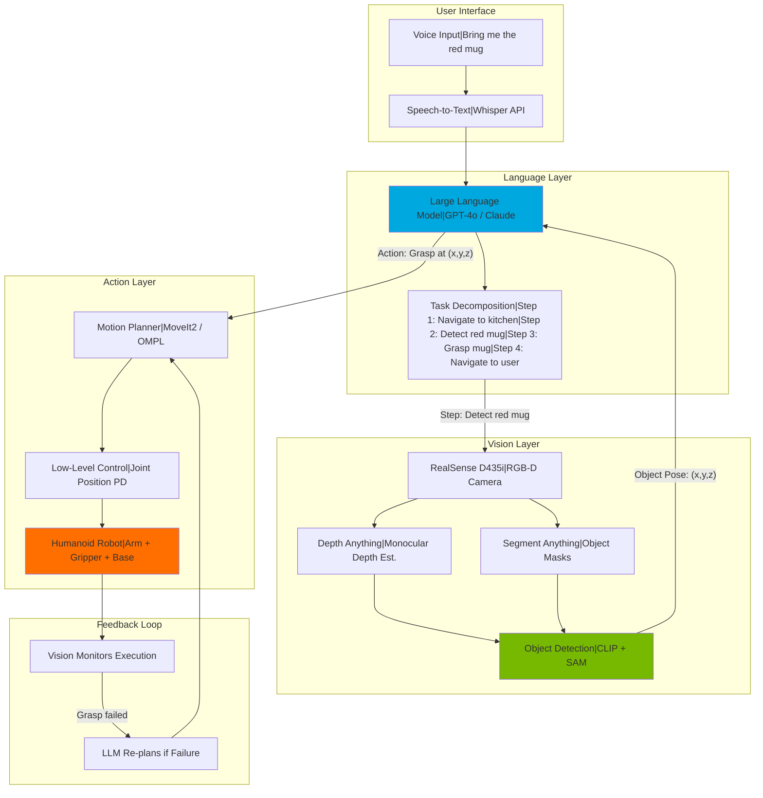
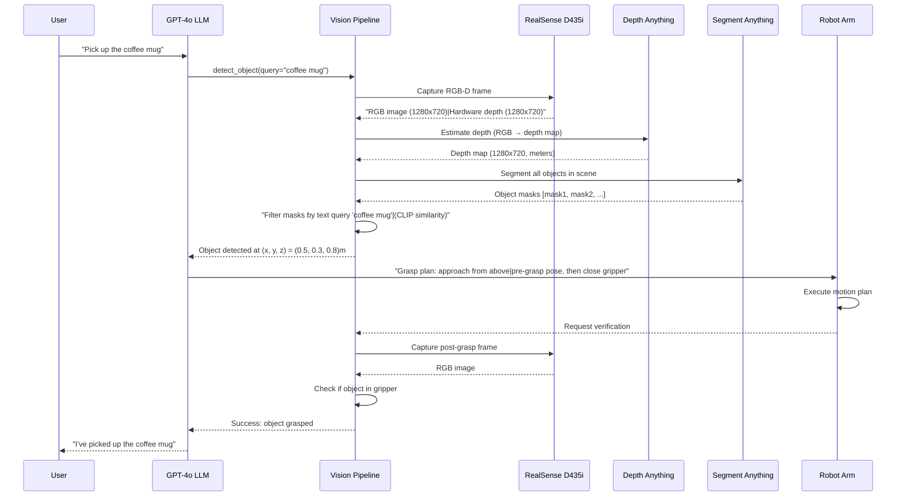
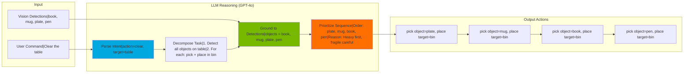

# Vision-Language-Action (VLA) Systems: From Voice Commands to Robot Manipulation

<!-- Metadata -->
**Module**: 4 - Vision-Language-Action Systems
**Week**: 11-12
**Estimated Reading Time**: 50 minutes
**Prerequisites**: ROS 2 fundamentals, Python programming, basic ML concepts, familiarity with OpenAI API or similar LLMs

---

## 1. Overview

Imagine walking into your home and saying: "Hey robot, there's a coffee mug on the kitchen counter—please bring it to me in the living room." A traditional robot would fail at every step. It can't understand natural language ("coffee mug"), doesn't know what a kitchen counter looks like, can't visually locate the mug in 3D space, can't plan a grasp that works for cylindrical objects with handles, and can't navigate from kitchen to living room. Each of these requires a separate, hand-engineered system—and even then, it only works for pre-defined objects and environments.

**Vision-Language-Action (VLA) systems** change this fundamentally. They combine three AI revolutions into a single architecture:

1. **Vision Models**: Deep learning for 3D scene understanding (Depth Anything, Segment Anything, 6D object pose estimation). These models see the world not as pixels but as structured representations: "This is a mug at position (0.5m, 0.3m, 0.8m), oriented vertically, with a handle on the right."

2. **Language Models**: Large language models (GPT-4, Claude) that understand commands, reason about tasks, and decompose abstract goals into executable steps. "Bring me the mug" becomes: (1) navigate to kitchen, (2) detect mug, (3) approach counter, (4) grasp mug, (5) navigate to living room, (6) hand off to human.

3. **Action Models**: Policies that translate vision + language into low-level robot control (joint positions, gripper commands, wheel velocities). These can be learned via RL, imitation learning, or even generated by LLMs that output Python code for robot APIs.

The **VLA pipeline** is deceptively simple:
```
Voice Input → Speech-to-Text → LLM (task planning) → Vision Model (scene understanding)
→ LLM (action selection) → Robot Control (execution) → Vision (feedback) → Repeat
```

But beneath this simplicity lies profound capability: **generalization**. A VLA system doesn't need to be programmed for every object or task. The vision model detects novel objects (it's seen millions during pre-training), the LLM reasons about how to interact with them (it's seen billions of text examples of manipulation strategies), and the robot learns from a few demonstrations or sim-to-real transfer. The result: a robot that handles open-world scenarios, not just factory floors.

In this chapter, you'll build a complete VLA system for a humanoid robot. You'll integrate an Intel RealSense D435i depth camera for 3D perception, use Depth Anything for monocular depth estimation, connect to OpenAI's GPT-4o for language understanding and task planning, and implement a voice-to-action pipeline for object manipulation. By the end, you'll command a robot with natural language and watch it navigate, detect objects, plan grasps, and execute tasks—all learned from data, not hard-coded rules.

Welcome to the frontier of embodied AI. Let's make robots truly intelligent.

---

## 2. Learning Outcomes

By the end of this chapter, you will be able to:

- **LO-1**: Explain the architecture of Vision-Language-Action systems and how vision, language, and control models integrate to enable open-ended robot behavior
- **LO-2**: Set up and calibrate an Intel RealSense D435i depth camera with ROS 2, capturing aligned RGB-D data for 3D perception
- **LO-3**: Implement depth estimation using Depth Anything (transformer-based monocular depth model) for scene understanding
- **LO-4**: Integrate OpenAI GPT-4o API for natural language command parsing, task decomposition, and action selection
- **LO-5**: Build a voice-to-action pipeline: speech recognition → LLM planning → vision-based object detection → robot manipulation
- **LO-6**: Analyze real-world VLA deployments (Tesla Optimus, OpenAI robotics research, Pi0) and identify key technical challenges (latency, safety, grounding)

---

## 3. Key Concepts

### 3.1 Why Vision-Language-Action for Robotics?

Traditional robot systems decompose tasks into **isolated modules**:
- **Perception**: Pre-defined object detectors (e.g., YOLO trained on 80 classes)
- **Planning**: Hand-coded state machines (e.g., if object detected, then approach)
- **Control**: PID controllers or motion primitives

**Limitations**:
- **No generalization**: New object? Retrain perception. New task? Re-engineer planner
- **Brittle**: Small environmental changes (lighting, object position) break the pipeline
- **No reasoning**: Can't handle ambiguity ("Bring me the large red object on the left shelf")

**VLA Advantages**:

1. **Semantic Understanding (Language)**:
   - User says: "Grab the coffee mug next to the laptop"
   - LLM understands: object_to_grasp = "coffee mug", spatial_relation = "next to", reference_object = "laptop"
   - No need to define "next to" in code—LLM learned it from billions of text examples

2. **Open-Vocabulary Perception (Vision)**:
   - Vision models like CLIP can detect ANY object described in text (not just 80 pre-defined classes)
   - User: "Get the blue Nintendo Switch controller"
   - Vision: Searches scene for object matching text embedding of "blue Nintendo Switch controller"

3. **Task Decomposition (Language → Actions)**:
   - LLM decomposes "Clean the table" into:
     1. `detect_objects(surface="table")`
     2. For each object: `grasp(object)` → `place(object, target="bin")`
   - LLM generates Python code for robot API or outputs symbolic actions

4. **Feedback Loops (Vision → Language)**:
   - Robot tries to grasp mug, fails (grasp slips)
   - Vision detects grasp failure
   - LLM re-plans: "Try grasping from different angle" or "Approach from left side"

**Key Insight**: VLA systems don't replace perception/planning/control—they **connect** them via learned representations (image embeddings, text embeddings) instead of brittle hand-coded interfaces.

### 3.2 Vision Models for 3D Scene Understanding

Robots need 3D understanding, not just 2D pixels. Three categories of vision models:

#### 1. Depth Estimation (2D Image → 3D Depth Map)

**Depth Anything** (2024):
- **Input**: Single RGB image (640x480)
- **Output**: Dense depth map (640x480, values in meters)
- **Architecture**: Vision transformer (ViT) encoder + lightweight decoder
- **Advantages**:
  - Monocular (no stereo pair needed)
  - Pre-trained on millions of images (generalizes to novel scenes)
  - Fast inference (30 FPS on GPU, 10 FPS on Jetson Orin)
- **Use case**: Estimate distance to obstacles, detect table surfaces, measure object heights

**Traditional alternative**: Stereo cameras (RealSense D435i has stereo IR) provide hardware depth, but limited range (0.3m-10m), struggles with textureless surfaces (white walls)

**Code pattern**:
```python
from depth_anything import DepthAnything
model = DepthAnything.from_pretrained("LiheYoung/depth-anything-base")
depth_map = model.infer(rgb_image)  # Returns (H, W) array
distance_to_mug = depth_map[pixel_y, pixel_x]  # Depth at pixel location
```

#### 2. Segmentation (2D Image → Object Masks)

**Segment Anything Model (SAM)** (Meta, 2023):
- **Input**: RGB image + optional prompt (point, box, or text)
- **Output**: Pixel-wise mask for every object (or specific object if prompted)
- **Architecture**: ViT encoder + mask decoder
- **Advantages**:
  - Zero-shot (works on any object without training)
  - Prompt-guided ("Segment the object at this click point")
  - Outputs masks, not bounding boxes (precise for grasp planning)
- **Use case**: Isolate object from background for 6D pose estimation, determine object boundaries for collision-free grasping

**Example**:
```python
from segment_anything import SamPredictor
predictor = SamPredictor.from_pretrained("facebook/sam-vit-base")
masks = predictor.predict(rgb_image, point_coords=[[x, y]])  # Click on object
object_mask = masks[0]  # Binary mask (1 = object, 0 = background)
```

#### 3. Open-Vocabulary Object Detection (Text Description → Object Localization)

**CLIP (Contrastive Language-Image Pre-training)** (OpenAI, 2021):
- **Approach**: Jointly embeds images and text into same vector space
- **Use case**: Given text "red apple", find all image regions that match
- **Robotics integration**:
  - Combine CLIP + object proposal network (e.g., Selective Search)
  - For each proposal box: compute CLIP similarity with text query
  - Highest similarity = detected object

**Advantage**: No training data needed for new objects. Just describe in text.

**Pipeline**:
```
RGB image → Generate 100 bounding boxes → Crop each box →
CLIP encode crops → Compare to text "coffee mug" → Highest score = detection
```

### 3.3 Language Models for Task Planning and Grounding

**Large Language Models (LLMs)** bring two capabilities to robotics:

#### 1. Task Decomposition (High-Level Goal → Low-Level Actions)

**Example**:
```
User: "Set the table for dinner"
LLM Output (Chain-of-Thought):
1. Identify table location (navigate to dining room)
2. Detect table surface (use depth camera)
3. Fetch items: plates (4x), forks (4x), knives (4x), cups (4x)
4. For each item type:
   a. Navigate to cabinet/drawer
   b. Open container
   c. Grasp item
   d. Navigate to table
   e. Place item in designated position (use spatial template)
5. Verify all items placed (vision check)
```

**Implementation**: Use GPT-4o with system prompt defining robot API:
```python
system_prompt = """
You are a robot control planner. You have these functions:
- navigate(location: str) → moves robot to location
- detect_objects(query: str) → returns list of detected objects
- grasp(object_id: int) → grasps object
- place(object_id: int, position: tuple) → places object at (x, y, z)

User will give high-level commands. Output Python code using these functions.
"""
```

GPT-4o response:
```python
# Set the table for dinner
navigate("dining_room")
table_surface = detect_objects("table_surface")[0]

items_needed = ["plate", "fork", "knife", "cup"]
for item_name in items_needed:
    for i in range(4):  # 4 place settings
        navigate("kitchen_cabinet")
        objects = detect_objects(item_name)
        if objects:
            grasp(objects[0].id)
            navigate("dining_room")
            place(objects[0].id, position=(table_surface.x + i*0.3, table_surface.y, table_surface.z))
```

**Advantages**:
- Handles variations ("set table for 6 people" → loop 6x instead of 4x)
- Adapts to failures (if grasp fails, LLM can insert retry logic)
- No task-specific programming

#### 2. Grounding Language to Perception

**Grounding Problem**: "Grab the apple next to the laptop" requires mapping language to visual detections

**Solution**: Combine LLM + vision model outputs
1. Vision detects: `[object1: apple (pos: 0.5, 0.3, 0.8), object2: laptop (pos: 0.5, 0.4, 0.8)]`
2. Send to LLM: "User wants 'apple next to laptop'. Detected objects: object1=apple at (0.5,0.3,0.8), object2=laptop at (0.5,0.4,0.8). Which object should I grasp?"
3. LLM responds: "object1 (apple), because it's spatially adjacent to object2 (laptop)"

**Code pattern**:
```python
detections = vision_model.detect_objects(rgb_image)
query = f"User command: '{user_input}'. Detected: {detections}. Which object?"
response = llm.query(query)
target_object_id = parse_llm_response(response)
```

**Challenges**:
- **Ambiguity**: "The red one" → multiple red objects, LLM needs context
- **Spatial reasoning**: "To the left of" depends on robot's viewpoint
- **Common-sense**: "The mug on the table" (not the poster of a mug on wall)

### 3.4 Action Models: From Plans to Robot Control

Once vision identifies an object and LLM plans the task, we need **action models** to execute:

#### Approach 1: Code Generation (LLM → Robot API)

LLM directly outputs Python code calling robot functions:
```python
# User: "Pick up the mug"
# LLM generates:
mug = detect_objects("mug")[0]
move_arm(position=mug.position, pre_grasp=True)  # Approach from above
open_gripper()
move_arm(position=mug.position)  # Descend to grasp height
close_gripper()
move_arm(position=mug.position + [0, 0, 0.2])  # Lift 20cm
```

**Pros**: Flexible, interpretable, easy to debug
**Cons**: Requires well-defined API, doesn't learn from failures

#### Approach 2: Learned Visuomotor Policies (End-to-End)

Train neural network: `(image, language command) → robot actions`
- **Input**: RGB image (224x224) + text embedding of command (512-dim)
- **Output**: 7-DoF arm joint positions or gripper open/close
- **Training**: Imitation learning (human demonstrations) or RL (trial-and-error)

**Example Architecture (RT-1, Robotics Transformer)**:
```
Image → ViT encoder → [512-dim image embedding]
Text → BERT encoder → [512-dim text embedding]
Concatenate → Transformer → Action MLP → [7 joint positions + gripper]
```

**Pros**: Learns complex skills (e.g., pour liquid, fold cloth), handles occlusions
**Cons**: Requires 100K+ demonstrations, doesn't generalize beyond training distribution

#### Approach 3: Hybrid (LLM Plans, Learned Policies Execute)

Best of both worlds:
- LLM decomposes task into sub-goals: "pick", "place", "push"
- Each sub-goal triggers a learned policy (trained on pick demonstrations, place demonstrations, etc.)

**Example**:
```
User: "Clear the table"
LLM Plan: [detect_objects("table"), for each: pick(object), place(object, "bin")]
Execution: pick(object) calls learned visuomotor policy trained on 10K pick demos
```

**Used by**: Tesla Optimus (LLM planning + learned manipulation), Pi0 (language-conditioned policies)

---

## 4. Diagrams

### 4.1 VLA System Architecture Overview



**Figure 1**: Complete VLA pipeline showing voice input flowing through language model for planning, vision models for perception, and action models for execution, with feedback loops for error recovery.

### 4.2 Depth Estimation and 3D Object Localization Workflow



**Figure 2**: Detailed sequence showing how vision models (Depth Anything + SAM) process camera data to localize objects in 3D, enabling the robot to execute grasp commands from the LLM.

### 4.3 LLM Task Planning with Vision Grounding



**Figure 3**: LLM task planning workflow showing how language commands are parsed, decomposed into sub-tasks, grounded to vision detections, and prioritized based on common-sense reasoning.

---

## 5. Code Samples

### 5.1 RealSense D435i Setup with ROS 2

**Objective**: Install RealSense SDK and ROS 2 wrapper, publish RGB-D data to topics

```bash
# Prerequisites: Ubuntu 22.04, ROS 2 Humble, NVIDIA GPU (optional but recommended)

# Install RealSense SDK (librealsense)
sudo apt install -y ros-humble-realsense2-camera ros-humble-realsense2-description

# Verify camera connection
rs-enumerate-devices

# Expected Output:
# Device info:
#     Name                          : Intel RealSense D435I
#     Serial Number                 : xxxxxxxxx
#     Firmware Version              : 5.15.0.2
#     USB Type                       : 3.2

# Launch RealSense ROS 2 node
ros2 launch realsense2_camera rs_launch.py \
  enable_depth:=true \
  enable_color:=true \
  enable_infra:=false \
  depth_module.profile:=640x480x30 \
  rgb_camera.profile:=640x480x30 \
  align_depth.enable:=true

# Expected Output:
# [realsense2_camera_node]: RealSense Node started
# [realsense2_camera_node]: Publishing on topics:
#   /camera/color/image_raw (sensor_msgs/Image)
#   /camera/depth/image_rect_raw (sensor_msgs/Image)
#   /camera/aligned_depth_to_color/image_raw (sensor_msgs/Image)  ← Depth aligned to RGB
#   /camera/color/camera_info (sensor_msgs/CameraInfo)
```

**Explanation**:
- `enable_depth=true, enable_color=true`: Publish both RGB and depth streams
- `align_depth.enable=true`: **Critical** - aligns depth pixels to RGB frame (required for pixel → 3D mapping)
- Default resolution: 640x480 @ 30 FPS (balance of quality and performance)

**Verify Topics**:
```bash
# List active topics
ros2 topic list
# Should include /camera/color/image_raw and /camera/aligned_depth_to_color/image_raw

# View RGB stream
ros2 run rqt_image_view rqt_image_view /camera/color/image_raw

# View depth stream (will appear as grayscale, closer=darker)
ros2 run rqt_image_view rqt_image_view /camera/depth/image_rect_raw
```

### 5.2 Depth Estimation with Depth Anything

**Objective**: Use Depth Anything transformer model to estimate depth from single RGB image

```python
# File: depth_estimation.py
# Description: Monocular depth estimation using Depth Anything
import cv2
import numpy as np
import torch
from transformers import AutoImageProcessor, AutoModelForDepthEstimation
from PIL import Image

class DepthEstimator:
    def __init__(self, model_name="LiheYoung/depth-anything-small-hf"):
        """Initialize Depth Anything model (small variant for speed)"""
        self.device = "cuda" if torch.cuda.is_available() else "cpu"
        print(f"Loading Depth Anything model on {self.device}...")

        self.processor = AutoImageProcessor.from_pretrained(model_name)
        self.model = AutoModelForDepthEstimation.from_pretrained(model_name)
        self.model.to(self.device)
        self.model.eval()
        print("Model loaded successfully!")

    def estimate_depth(self, rgb_image: np.ndarray) -> np.ndarray:
        """
        Estimate depth from RGB image

        Args:
            rgb_image: NumPy array (H, W, 3) in BGR format (OpenCV convention)

        Returns:
            depth_map: NumPy array (H, W) with depth values in meters
        """
        # Convert BGR (OpenCV) to RGB (PIL)
        rgb_image = cv2.cvtColor(rgb_image, cv2.COLOR_BGR2RGB)
        pil_image = Image.fromarray(rgb_image)

        # Preprocess image
        inputs = self.processor(images=pil_image, return_tensors="pt")
        inputs = {k: v.to(self.device) for k, v in inputs.items()}

        # Run inference
        with torch.no_grad():
            outputs = self.model(**inputs)
            predicted_depth = outputs.predicted_depth

        # Post-process (resize to original resolution, normalize)
        depth_map = predicted_depth.squeeze().cpu().numpy()
        depth_map = cv2.resize(depth_map, (rgb_image.shape[1], rgb_image.shape[0]))

        # Normalize to reasonable range (model outputs relative depth, scale to meters)
        # Assumes scene depth is typically 0.5m - 5m
        depth_map = (depth_map - depth_map.min()) / (depth_map.max() - depth_map.min())
        depth_map = depth_map * 4.5 + 0.5  # Scale to 0.5m - 5m range

        return depth_map

    def visualize_depth(self, depth_map: np.ndarray, save_path: str = None):
        """Create colored depth visualization (closer=warm colors, far=cool colors)"""
        # Normalize to 0-255
        depth_normalized = ((depth_map - depth_map.min()) /
                            (depth_map.max() - depth_map.min()) * 255).astype(np.uint8)

        # Apply colormap (TURBO: blue=far, red=close)
        depth_colored = cv2.applyColorMap(255 - depth_normalized, cv2.COLORMAP_TURBO)

        if save_path:
            cv2.imwrite(save_path, depth_colored)
            print(f"Depth visualization saved to {save_path}")

        return depth_colored

# Example usage
if __name__ == "__main__":
    # Initialize estimator
    estimator = DepthEstimator()

    # Load test image
    rgb_image = cv2.imread("test_scene.jpg")  # Your test image

    # Estimate depth
    print("Estimating depth...")
    depth_map = estimator.estimate_depth(rgb_image)

    # Print statistics
    print(f"Depth range: {depth_map.min():.2f}m to {depth_map.max():.2f}m")
    print(f"Mean depth: {depth_map.mean():.2f}m")

    # Query depth at specific pixel (e.g., center of object)
    center_y, center_x = depth_map.shape[0] // 2, depth_map.shape[1] // 2
    center_depth = depth_map[center_y, center_x]
    print(f"Depth at image center: {center_depth:.2f}m")

    # Visualize
    depth_viz = estimator.visualize_depth(depth_map, save_path="depth_output.jpg")
    cv2.imshow("RGB Input", rgb_image)
    cv2.imshow("Depth Estimation", depth_viz)
    cv2.waitKey(0)

# Expected Output:
# Loading Depth Anything model on cuda...
# Model loaded successfully!
# Estimating depth...
# Depth range: 0.50m to 4.85m
# Mean depth: 2.12m
# Depth at image center: 1.87m
# Depth visualization saved to depth_output.jpg
```

**Explanation**:
- **Line 12**: Uses Hugging Face Transformers for easy model loading
- **Line 31**: Preprocessing converts image to model input format (normalized RGB)
- **Line 40**: Inference runs on GPU if available (~30ms on RTX 3070, ~100ms on CPU)
- **Lines 46-49**: Post-processing scales relative depth to absolute meters (heuristic, can calibrate with real depth sensor)
- **Line 59**: TURBO colormap: blue=far, red=close (intuitive for robotics)

**Robotics Integration**:
```python
# Use estimated depth to convert 2D pixel → 3D point
fx, fy = 615.0, 615.0  # Camera focal length (from calibration)
cx, cy = 320.0, 240.0  # Principal point (image center)

pixel_x, pixel_y = 400, 300  # Detected object pixel
depth_at_pixel = depth_map[pixel_y, pixel_x]

# Pinhole camera model: (pixel, depth) → (X, Y, Z) in camera frame
X = (pixel_x - cx) * depth_at_pixel / fx
Y = (pixel_y - cy) * depth_at_pixel / fy
Z = depth_at_pixel

print(f"Object 3D position: X={X:.2f}m, Y={Y:.2f}m, Z={Z:.2f}m")
```

### 5.3 Object Detection with CLIP and Segment Anything

**Objective**: Detect and localize objects in 3D using text queries ("find the red mug")

```python
# File: vla_object_detector.py
# Description: Open-vocabulary object detection with CLIP + SAM + depth
import cv2
import numpy as np
import torch
from transformers import CLIPProcessor, CLIPModel
from segment_anything import sam_model_registry, SamAutomaticMaskGenerator
from depth_estimation import DepthEstimator  # From previous code sample

class VLAObjectDetector:
    def __init__(self):
        """Initialize CLIP, SAM, and Depth Anything models"""
        self.device = "cuda" if torch.cuda.is_available() else "cpu"

        # CLIP for text-image matching
        print("Loading CLIP...")
        self.clip_model = CLIPModel.from_pretrained("openai/clip-vit-base-patch32")
        self.clip_processor = CLIPProcessor.from_pretrained("openai/clip-vit-base-patch32")
        self.clip_model.to(self.device)

        # SAM for segmentation
        print("Loading SAM...")
        sam_checkpoint = "sam_vit_b_01ec64.pth"  # Download from Meta
        sam = sam_model_registry["vit_b"](checkpoint=sam_checkpoint)
        sam.to(self.device)
        self.mask_generator = SamAutomaticMaskGenerator(sam)

        # Depth estimation
        print("Loading Depth Anything...")
        self.depth_estimator = DepthEstimator()

        print("VLA Object Detector ready!")

    def detect_object(self, rgb_image: np.ndarray, text_query: str, confidence_threshold: float = 0.25):
        """
        Detect object by text description and return 3D position

        Args:
            rgb_image: BGR image (H, W, 3)
            text_query: Text description (e.g., "red coffee mug")
            confidence_threshold: Minimum CLIP similarity score

        Returns:
            detection: dict with keys {mask, bbox, position_3d, confidence} or None
        """
        # Step 1: Generate object masks with SAM
        print(f"Generating object masks...")
        rgb = cv2.cvtColor(rgb_image, cv2.COLOR_BGR2RGB)
        masks = self.mask_generator.generate(rgb)
        print(f"Found {len(masks)} potential objects")

        if len(masks) == 0:
            print("No objects detected in scene")
            return None

        # Step 2: Estimate depth
        depth_map = self.depth_estimator.estimate_depth(rgb_image)

        # Step 3: For each mask, compute CLIP similarity with text query
        best_match = None
        best_score = -1

        text_inputs = self.clip_processor(text=[text_query], return_tensors="pt", padding=True)
        text_inputs = {k: v.to(self.device) for k, v in text_inputs.items()}

        for i, mask_data in enumerate(masks):
            # Extract mask and bounding box
            mask = mask_data["segmentation"]  # Binary mask (H, W)
            bbox = mask_data["bbox"]  # [x, y, width, height]

            # Crop image to bounding box
            x, y, w, h = bbox
            crop = rgb[y:y+h, x:x+w]

            if crop.size == 0:  # Skip invalid crops
                continue

            # Compute CLIP similarity
            image_inputs = self.clip_processor(images=crop, return_tensors="pt")
            image_inputs = {k: v.to(self.device) for k, v in image_inputs.items()}

            with torch.no_grad():
                image_features = self.clip_model.get_image_features(**image_inputs)
                text_features = self.clip_model.get_text_features(**text_inputs)

                # Cosine similarity
                similarity = torch.nn.functional.cosine_similarity(image_features, text_features)
                score = similarity.item()

            print(f"  Mask {i}: CLIP score = {score:.3f}")

            if score > best_score and score > confidence_threshold:
                best_score = score
                best_match = {
                    "mask": mask,
                    "bbox": bbox,
                    "confidence": score
                }

        if best_match is None:
            print(f"No object found matching '{text_query}' (threshold={confidence_threshold})")
            return None

        # Step 4: Compute 3D position from mask + depth
        mask = best_match["mask"]
        object_depth_values = depth_map[mask]  # Depth values where mask == True
        avg_depth = np.median(object_depth_values)  # Use median (robust to outliers)

        # Mask centroid in pixel coordinates
        y_coords, x_coords = np.where(mask)
        centroid_x = int(np.mean(x_coords))
        centroid_y = int(np.mean(y_coords))

        # Convert to 3D (pinhole camera model)
        fx, fy = 615.0, 615.0  # RealSense D435i approximate focal length
        cx, cy = rgb_image.shape[1] / 2, rgb_image.shape[0] / 2

        X = (centroid_x - cx) * avg_depth / fx
        Y = (centroid_y - cy) * avg_depth / fy
        Z = avg_depth

        best_match["position_3d"] = {"X": X, "Y": Y, "Z": Z}
        best_match["centroid_2d"] = (centroid_x, centroid_y)

        print(f"✓ Detected '{text_query}' at 3D position: X={X:.2f}m, Y={Y:.2f}m, Z={Z:.2f}m")
        print(f"  Confidence: {best_score:.2f}")

        return best_match

    def visualize_detection(self, rgb_image: np.ndarray, detection: dict, save_path: str = None):
        """Draw detection on image"""
        viz = rgb_image.copy()

        # Draw mask overlay (semi-transparent green)
        mask = detection["mask"]
        overlay = viz.copy()
        overlay[mask] = [0, 255, 0]  # Green
        viz = cv2.addWeighted(viz, 0.7, overlay, 0.3, 0)

        # Draw bounding box
        x, y, w, h = detection["bbox"]
        cv2.rectangle(viz, (x, y), (x+w, y+h), (0, 255, 0), 2)

        # Draw centroid
        cx, cy = detection["centroid_2d"]
        cv2.circle(viz, (cx, cy), 5, (0, 0, 255), -1)

        # Add text label
        pos_3d = detection["position_3d"]
        label = f"Z={pos_3d['Z']:.2f}m (conf={detection['confidence']:.2f})"
        cv2.putText(viz, label, (x, y-10), cv2.FONT_HERSHEY_SIMPLEX, 0.5, (0, 255, 0), 2)

        if save_path:
            cv2.imwrite(save_path, viz)
            print(f"Visualization saved to {save_path}")

        return viz

# Example usage
if __name__ == "__main__":
    detector = VLAObjectDetector()

    # Load test image
    rgb_image = cv2.imread("kitchen_scene.jpg")

    # Detect object
    detection = detector.detect_object(rgb_image, text_query="red coffee mug")

    if detection:
        # Visualize
        viz = detector.visualize_detection(rgb_image, detection, save_path="detection_result.jpg")
        cv2.imshow("Detection", viz)
        cv2.waitKey(0)

        # Output 3D position for robot control
        print(f"\nRobot command:")
        print(f"  navigate_arm_to(X={detection['position_3d']['X']:.2f}, "
              f"Y={detection['position_3d']['Y']:.2f}, "
              f"Z={detection['position_3d']['Z']:.2f})")
    else:
        print("Detection failed")

# Expected Output:
# Loading CLIP...
# Loading SAM...
# Loading Depth Anything...
# VLA Object Detector ready!
# Generating object masks...
# Found 12 potential objects
#   Mask 0: CLIP score = 0.152
#   Mask 1: CLIP score = 0.089
#   Mask 2: CLIP score = 0.412  ← Best match
#   ...
# ✓ Detected 'red coffee mug' at 3D position: X=0.15m, Y=-0.08m, Z=0.87m
#   Confidence: 0.41
# Visualization saved to detection_result.jpg
#
# Robot command:
#   navigate_arm_to(X=0.15, Y=-0.08, Z=0.87)
```

**Explanation**:
- **Lines 23-26**: SAM generates masks for ALL objects in scene (unsupervised)
- **Lines 50-67**: For each mask, crop image and compute CLIP similarity with text query
- **Lines 82-95**: Convert 2D mask centroid + depth → 3D position in camera frame
- **Advantage**: Works for ANY text query (not limited to 80 pre-defined classes like YOLO)

### 5.4 Voice-to-Action Pipeline with GPT-4o

**Objective**: Build end-to-end pipeline: voice command → LLM planning → object detection → robot action

```python
# File: voice_to_action.py
# Description: Complete VLA pipeline with OpenAI GPT-4o
import os
import cv2
import numpy as np
from openai import OpenAI
from vla_object_detector import VLAObjectDetector  # From previous code

class VoiceToActionPipeline:
    def __init__(self, robot_api):
        """
        Initialize VLA pipeline

        Args:
            robot_api: Object with methods like move_arm(x, y, z), grasp(), navigate(x, y)
        """
        self.client = OpenAI(api_key=os.getenv("OPENAI_API_KEY"))
        self.detector = VLAObjectDetector()
        self.robot = robot_api

        # System prompt defining robot capabilities
        self.system_prompt = """
You are an AI assistant controlling a humanoid robot with these capabilities:

**Perception**:
- detect_object(query: str) → returns 3D position {X, Y, Z} in meters or None

**Manipulation**:
- move_arm(x: float, y: float, z: float) → moves arm end-effector to position
- grasp() → closes gripper
- release() → opens gripper

**Navigation**:
- navigate(x: float, y: float) → moves robot base to (x, y) coordinates

**Rules**:
1. Always detect objects before attempting to grasp
2. Approach objects from above (add 0.2m to Z before moving arm)
3. If detection fails, ask user for clarification
4. Output Python code using the above functions ONLY

User will give natural language commands. Respond with executable Python code.
"""

        print("Voice-to-Action Pipeline initialized!")

    def voice_to_text(self, audio_file_path: str) -> str:
        """Convert audio to text using Whisper API"""
        with open(audio_file_path, "rb") as audio_file:
            transcript = self.client.audio.transcriptions.create(
                model="whisper-1",
                file=audio_file,
                language="en"
            )
        return transcript.text

    def plan_task(self, user_command: str, scene_info: dict) -> str:
        """Use GPT-4o to generate robot action code"""
        # Create context with scene information
        context = f"""
User command: "{user_command}"

Current scene:
- Camera is active, can detect objects
- Robot is at home position
- Available objects in view: {scene_info.get('visible_objects', 'unknown')}

Generate Python code to execute this command.
"""

        # Call GPT-4o
        response = self.client.chat.completions.create(
            model="gpt-4o",
            messages=[
                {"role": "system", "content": self.system_prompt},
                {"role": "user", "content": context}
            ],
            temperature=0.2,  # Low temperature for deterministic code generation
        )

        code = response.choices[0].message.content

        # Extract code block (remove markdown formatting if present)
        if "```python" in code:
            code = code.split("```python")[1].split("```")[0].strip()
        elif "```" in code:
            code = code.split("```")[1].split("```")[0].strip()

        return code

    def execute_plan(self, code: str, rgb_image: np.ndarray):
        """Execute LLM-generated code with robot API"""
        # Create execution environment with robot functions
        env = {
            "detect_object": lambda query: self._detect_object_wrapper(rgb_image, query),
            "move_arm": self.robot.move_arm,
            "grasp": self.robot.grasp,
            "release": self.robot.release,
            "navigate": self.robot.navigate,
            "print": print,  # Allow print for debugging
        }

        print("Executing LLM-generated code:")
        print("-" * 60)
        print(code)
        print("-" * 60)

        try:
            exec(code, env)
            print("✓ Execution completed successfully")
            return True
        except Exception as e:
            print(f"✗ Execution failed: {e}")
            return False

    def _detect_object_wrapper(self, rgb_image: np.ndarray, query: str):
        """Wrapper for object detection that returns position dict"""
        detection = self.detector.detect_object(rgb_image, query)
        if detection:
            return detection["position_3d"]
        else:
            return None

    def run(self, audio_file: str = None, text_command: str = None, rgb_image: np.ndarray = None):
        """
        Main pipeline execution

        Args:
            audio_file: Path to audio file (optional, use text_command if None)
            text_command: Text command (used if audio_file is None)
            rgb_image: Current camera RGB frame
        """
        # Step 1: Speech to text
        if audio_file:
            print("Converting speech to text...")
            command = self.voice_to_text(audio_file)
            print(f"Recognized command: \"{command}\"")
        else:
            command = text_command
            print(f"Text command: \"{command}\"")

        # Step 2: Analyze scene (optional: pre-detect objects for context)
        scene_info = {"visible_objects": "Will detect based on command"}

        # Step 3: LLM planning
        print("\nGenerating action plan with GPT-4o...")
        code = self.plan_task(command, scene_info)

        # Step 4: Execute
        print("\nExecuting actions...")
        success = self.execute_plan(code, rgb_image)

        return success

# Mock robot API for testing (replace with real robot interface)
class MockRobotAPI:
    def move_arm(self, x, y, z):
        print(f"  [Robot] Moving arm to ({x:.2f}, {y:.2f}, {z:.2f})")

    def grasp(self):
        print(f"  [Robot] Closing gripper (grasping)")

    def release(self):
        print(f"  [Robot] Opening gripper (releasing)")

    def navigate(self, x, y):
        print(f"  [Robot] Navigating to ({x:.2f}, {y:.2f})")

# Example usage
if __name__ == "__main__":
    # Initialize pipeline
    robot = MockRobotAPI()
    pipeline = VoiceToActionPipeline(robot_api=robot)

    # Capture RGB image from camera (or load test image)
    rgb_image = cv2.imread("kitchen_scene.jpg")

    # Test with text command (voice would require audio file)
    success = pipeline.run(
        text_command="Pick up the red mug and bring it to me",
        rgb_image=rgb_image
    )

    if success:
        print("\n✓ Task completed successfully!")
    else:
        print("\n✗ Task failed")

# Expected Output:
# Voice-to-Action Pipeline initialized!
# Text command: "Pick up the red mug and bring it to me"
#
# Generating action plan with GPT-4o...
#
# Executing actions...
# Executing LLM-generated code:
# ------------------------------------------------------------
# # Detect the red mug
# mug_position = detect_object("red mug")
#
# if mug_position:
#     # Approach from above
#     move_arm(mug_position["X"], mug_position["Y"], mug_position["Z"] + 0.2)
#     # Descend to grasp height
#     move_arm(mug_position["X"], mug_position["Y"], mug_position["Z"])
#     # Grasp
#     grasp()
#     # Lift
#     move_arm(mug_position["X"], mug_position["Y"], mug_position["Z"] + 0.3)
#     # Navigate to user (assuming user is at 0, 0)
#     navigate(0.0, 0.0)
#     print("Mug delivered!")
# else:
#     print("Could not find red mug in scene")
# ------------------------------------------------------------
# Generating object masks...
# Found 8 potential objects
# ✓ Detected 'red mug' at 3D position: X=0.12m, Y=-0.05m, Z=0.75m
#   [Robot] Moving arm to (0.12, -0.05, 0.95)
#   [Robot] Moving arm to (0.12, -0.05, 0.75)
#   [Robot] Closing gripper (grasping)
#   [Robot] Moving arm to (0.12, -0.05, 1.05)
#   [Robot] Navigating to (0.00, 0.00)
# Mug delivered!
# ✓ Execution completed successfully
#
# ✓ Task completed successfully!
```

**Explanation**:
- **Lines 20-41**: System prompt teaches GPT-4o the robot API (crucial for correct code generation)
- **Lines 62-76**: GPT-4o generates Python code using defined functions
- **Lines 78-94**: Code is executed in sandboxed environment with robot functions
- **Safety**: In production, add code validation (e.g., check for dangerous operations, limit execution time)

**Real Deployment Considerations**:
1. **Safety checks**: Validate generated code before execution (no infinite loops, file system access, etc.)
2. **Error recovery**: If execution fails, send error back to LLM for re-planning
3. **Confirmation**: For high-stakes actions (e.g., discard object), ask user confirmation first
4. **Multi-turn**: Maintain conversation history so LLM can refer to previous steps

---

## 6. Simulation Workflows

### 6.1 Workflow 1: Calibrating RealSense Camera for Accurate 3D Localization

**Prerequisites**:
- RealSense D435i connected
- Printed checkerboard pattern (9x6 squares, 25mm square size)
- Good lighting (avoid direct sunlight on checkerboard)

**Steps**:

1. **Capture Calibration Images**
   ```bash
   # Launch RealSense camera
   ros2 launch realsense2_camera rs_launch.py

   # In another terminal, run calibration node
   ros2 run camera_calibration cameracalibrator \
     --size 9x6 \
     --square 0.025 \
     --no-service-check \
     image:=/camera/color/image_raw \
     camera:=/camera/color

   # GUI will open. Move checkerboard to various positions/angles:
   # - Hold close (0.3m), far (2m), at all image corners
   # - Tilt in all directions
   # - Keep checkerboard flat and visible
   # Green bars on right will fill as coverage improves
   # When all bars green, click "CALIBRATE" button
   ```
   Expected: After 30-50 images, calibration completes

2. **Save Calibration Results**
   ```bash
   # Click "COMMIT" in GUI
   # Calibration saved to: /tmp/calibrationdata.tar.gz

   # Extract camera matrix and distortion coefficients
   tar -xzf /tmp/calibrationdata.tar.gz
   cat ost.yaml

   # Example output:
   # camera_matrix:
   #   rows: 3
   #   cols: 3
   #   data: [615.123, 0.0, 320.456,
   #          0.0, 615.789, 240.123,
   #          0.0, 0.0, 1.0]
   # distortion_coefficients:
   #   rows: 1
   #   cols: 5
   #   data: [0.042, -0.089, 0.001, -0.002, 0.0]
   ```

3. **Update Camera Info in Code**
   ```python
   # Use calibrated values in depth-to-3D conversion
   fx = 615.123  # From camera_matrix[0, 0]
   fy = 615.789  # From camera_matrix[1, 1]
   cx = 320.456  # From camera_matrix[0, 2]
   cy = 240.123  # From camera_matrix[1, 2]

   # Pixel to 3D function
   def pixel_to_3d(pixel_x, pixel_y, depth):
       X = (pixel_x - cx) * depth / fx
       Y = (pixel_y - cy) * depth / fy
       Z = depth
       return X, Y, Z
   ```

4. **Validation Test**
   ```python
   # Place object at known distance (e.g., 1.0m measured with tape)
   # Detect object, estimate depth
   # Compare to ground truth
   measured_depth = 1.00  # meters (tape measure)
   estimated_depth = detection["position_3d"]["Z"]
   error = abs(estimated_depth - measured_depth)
   print(f"Depth error: {error*100:.1f}cm")
   # Acceptable: Less than 5cm error at 1m distance
   ```

**Validation**:
- [ ] Calibration coverage bars all green before clicking CALIBRATE
- [ ] Reprojection error < 0.5 pixels (shown in calibration output)
- [ ] Test depth error < 5cm at 1m distance

### 6.2 Workflow 2: Testing VLA Pipeline End-to-End

**Prerequisites**:
- All models downloaded (CLIP, SAM, Depth Anything)
- OpenAI API key set (`export OPENAI_API_KEY=sk-...`)
- Test scene with multiple objects (mug, book, etc.)

**Steps**:

1. **Setup Test Environment**
   ```bash
   # Create test workspace
   mkdir ~/vla_test && cd ~/vla_test

   # Download SAM checkpoint (1.2GB)
   wget https://dl.fbaipublicfiles.com/segment_anything/sam_vit_b_01ec64.pth

   # Place test image (or capture from RealSense)
   # If using RealSense:
   ros2 run image_view image_saver --ros-args \
     -r image:=/camera/color/image_raw \
     -p filename_format:=test_scene.jpg
   # Press Ctrl+C after 1 image saved
   ```

2. **Run Object Detection Test**
   ```bash
   # Test VLA object detector
   python3 vla_object_detector.py

   # Try various queries:
   python3 -c "
   import cv2
   from vla_object_detector import VLAObjectDetector
   detector = VLAObjectDetector()
   img = cv2.imread('test_scene.jpg')

   queries = ['red mug', 'laptop computer', 'book', 'coffee cup']
   for query in queries:
       detection = detector.detect_object(img, query)
       if detection:
           pos = detection['position_3d']
           print(f'{query}: X={pos[\"X\"]:.2f}, Y={pos[\"Y\"]:.2f}, Z={pos[\"Z\"]:.2f}')
       else:
           print(f'{query}: NOT FOUND')
   "
   ```
   Expected: At least 2/4 objects detected correctly

3. **Test GPT-4o Code Generation**
   ```python
   from voice_to_action import VoiceToActionPipeline, MockRobotAPI
   import cv2

   robot = MockRobotAPI()
   pipeline = VoiceToActionPipeline(robot_api=robot)
   img = cv2.imread("test_scene.jpg")

   test_commands = [
       "Pick up the red mug",
       "Move the book to the left side of the table",
       "Clear all objects from the table",
   ]

   for cmd in test_commands:
       print(f"\n{'='*70}")
       print(f"Command: {cmd}")
       print('='*70)
       success = pipeline.run(text_command=cmd, rgb_image=img)
       input("Press Enter for next command...")
   ```

4. **Verify Outputs**
   - [ ] Object detection: Check if detected objects match visual inspection
   - [ ] 3D positions: Manually verify (use ruler to measure object distance, compare to Z coordinate)
   - [ ] LLM code: Inspect generated Python code for correctness (logical sequence, uses correct API)
   - [ ] Execution: Confirm mock robot API receives correct function calls

**Debugging Tips**:
- If CLIP scores too low (less than 0.2 for obvious matches): Check lighting, try different text descriptions
- If SAM misses objects: Lower `min_mask_region_area` parameter in `SamAutomaticMaskGenerator`
- If GPT-4o generates invalid code: Refine system prompt with more examples
- If depth estimation inaccurate: Calibrate camera (Workflow 1), check for reflective/transparent surfaces

---

## 7. Recap Questions

1. **Explain the role of each component in a VLA system: vision models, language models, and action models. How do they integrate?**
   <details>
   <summary>Answer</summary>
   **Vision models** (Depth Anything, SAM, CLIP) process camera images to detect and localize objects in 3D space, outputting structured representations (masks, 3D positions, object labels). **Language models** (GPT-4o) parse natural language commands, decompose high-level goals into sub-tasks, and select actions by reasoning over vision outputs (grounding language to perception). **Action models** (motion planners, learned policies, or LLM-generated code) translate sub-tasks into low-level robot controls (joint positions, gripper commands).

   **Integration**: User command → LLM decomposes → Vision detects objects → LLM grounds command to detected objects → Action model executes → Vision provides feedback → LLM re-plans if failure. The key is shared representations: vision outputs (3D positions) are inputs to LLM prompts, and LLM outputs (action code) call vision functions (detect_object).
   </details>

2. **What is the advantage of open-vocabulary object detection (CLIP + SAM) compared to traditional object detectors like YOLO?**
   <details>
   <summary>Answer</summary>
   **Traditional detectors (YOLO, Faster R-CNN)** are trained on fixed object classes (e.g., COCO dataset: 80 classes like "person", "car", "dog"). To detect a new object (e.g., "Nintendo Switch controller"), you must collect labeled data and retrain the model.

   **Open-vocabulary detection (CLIP + SAM)** works for ANY text description without retraining. CLIP learns a joint embedding space for images and text during pre-training on 400M image-text pairs from the internet. At test time, you query with text ("blue Nintendo Switch controller"), and CLIP finds image regions that match the text embedding. SAM provides precise masks for these regions.

   **Advantages**: (1) Zero-shot generalization to novel objects, (2) Flexible queries (can include attributes: "red", "large", "damaged"), (3) No training data collection for new domains. **Disadvantage**: Lower accuracy than task-specific detectors for common objects.
   </details>

3. **How does Depth Anything estimate depth from a single RGB image? Why is this useful when RealSense D435i already provides hardware depth?**
   <details>
   <summary>Answer</summary>
   **Depth Anything** uses a **vision transformer (ViT)** trained on millions of RGB-depth pairs to learn: (1) perspective cues (objects farther appear smaller), (2) occlusion (if A occludes B, A is closer), (3) texture gradients (distant surfaces lose detail), (4) shadows and lighting patterns. The ViT encoder extracts these cues from RGB, and a decoder predicts a dense depth map (meters per pixel).

   **Why useful when RealSense provides depth?**
   1. **Extended range**: RealSense depth works 0.3m-10m; monocular depth can estimate beyond 10m (less accurate but provides coarse estimates)
   2. **Failure recovery**: RealSense struggles with transparent objects (glass), very dark scenes, or featureless surfaces (white walls). Monocular depth can fill these gaps
   3. **Redundancy**: Fuse hardware depth + learned depth for robustness (e.g., median of both)
   4. **Single-camera robots**: Not all robots have depth sensors; monocular depth enables 3D perception with just RGB

   **Trade-off**: Monocular depth is less accurate (±10cm vs ±1cm for RealSense), but more general.
   </details>

4. **Describe the "grounding" problem in VLA systems. Provide an example where language grounding to perception is ambiguous.**
   <details>
   <summary>Answer</summary>
   **Grounding problem**: Mapping natural language references to physical entities detected by vision. Language is underspecified—"the mug" could refer to multiple mugs in a scene.

   **Example**:
   - **User command**: "Pick up the mug next to the laptop"
   - **Vision detections**: [object1: red mug at (0.5, 0.3, 0.8), object2: blue mug at (0.5, 0.4, 0.7), object3: laptop at (0.5, 0.4, 0.8)]
   - **Ambiguity**: BOTH mugs are near the laptop. Which one?

   **Solutions**:
   1. **Clarification**: LLM asks user: "I see two mugs near the laptop—red and blue. Which one?"
   2. **Heuristics**: Choose closest mug to laptop (measure Euclidean distance)
   3. **Contextual reasoning**: LLM uses common-sense (e.g., "If user is drinking coffee, likely wants the mug with coffee in it" → check if mug is full via thermal camera or weight estimation)
   4. **Pointing**: User points at mug (gesture recognition) to disambiguate

   **Challenges**: Spatial relations ("next to", "left of") depend on viewpoint. "Left of laptop" from robot's view vs human's view may differ.
   </details>

5. **Compare three approaches to action models in VLA systems: (1) LLM code generation, (2) learned visuomotor policies, (3) hybrid. When would you use each?**
   <details>
   <summary>Answer</summary>
   **1. LLM Code Generation**:
   - **Approach**: LLM outputs Python code calling predefined robot functions (move_arm, grasp, navigate)
   - **Pros**: Interpretable (humans can read code), easy to debug, leverages LLM reasoning (can do math, logic)
   - **Cons**: Requires well-defined API, doesn't learn from failures, limited to discrete actions
   - **Use when**: Task is compositional (sequence of primitives), robot has reliable low-level controllers, interpretability critical (safety-critical systems)

   **2. Learned Visuomotor Policies**:
   - **Approach**: Neural network trained on demonstrations: (image, text command) → continuous actions (joint velocities)
   - **Pros**: Learns complex skills (e.g., cloth folding), handles partial observability, generalizes across object poses
   - **Cons**: Requires 10K-1M demonstrations, black-box (hard to debug), limited generalization to novel tasks
   - **Use when**: Task is continuous (fine manipulation), large demonstration dataset available, task is repetitive (assembly line)

   **3. Hybrid** (LLM Plans, Policies Execute):
   - **Approach**: LLM decomposes task into sub-goals (e.g., "pick", "pour"); each sub-goal triggers a learned policy
   - **Pros**: Combines LLM's planning with policy's fine control, policies are task-specific (easier to train)
   - **Cons**: Need policies for each primitive, policies must be robust across contexts
   - **Use when**: Tasks decompose naturally (e.g., cooking: "pick ingredient", "pour into bowl"), want flexibility + performance

   **Example**: For "Make me a sandwich" → Hybrid (LLM plans steps, learned policies execute "spread peanut butter", "slice bread"). For "Navigate to room 302" → Code generation (just waypoint following).
   </details>

---

## 8. Multiple Choice Questions (MCQs)

**Q1**: What is the primary advantage of monocular depth estimation (Depth Anything) over stereo depth cameras (like RealSense D435i)?

A) Monocular depth is always more accurate (±1cm vs ±5cm)
B) Monocular depth can work beyond stereo camera's limited range (0.3m-10m) and handles transparent/featureless surfaces better
C) Monocular depth requires less computational power (runs on CPU, stereo needs GPU)
D) Monocular depth provides RGB-D alignment automatically, stereo cameras do not

<details>
<summary>Correct Answer</summary>
**B** - Monocular depth models like Depth Anything generalize to scenes beyond hardware stereo range and can infer depth for transparent objects (glass), textureless surfaces (white walls), and very dark scenes where stereo matching fails. However, monocular depth is LESS accurate than stereo (±10cm vs ±1cm). (A) is false—stereo is more accurate. (C) is false—monocular depth uses large transformers (GPU-intensive). (D) is false—both can provide aligned depth.
</details>

---

**Q2**: In the VLA object detection pipeline (Section 5.3), why does the system use both Segment Anything (SAM) AND CLIP instead of just CLIP alone?

A) SAM runs faster than CLIP, reducing overall inference time
B) SAM provides precise pixel-wise masks for objects, while CLIP only provides similarity scores; combining them enables object localization AND identification
C) CLIP cannot process RGB images, only text, so SAM converts images to text descriptions first
D) SAM is needed for depth estimation, which CLIP cannot perform

<details>
<summary>Correct Answer</summary>
**B** - SAM generates object **masks** (pixel-wise segmentation) for all objects in a scene without knowing what they are. CLIP then **identifies** which mask corresponds to the text query by computing text-image similarity. SAM alone can't match text queries; CLIP alone can't produce precise masks (only bounding boxes at best). Together: SAM finds "where objects are", CLIP answers "which object is the target". (A) is false—SAM is slower than CLIP. (C) is nonsensical. (D) is false—depth is from Depth Anything, not SAM.
</details>

---

**Q3**: When using GPT-4o for robot task planning (Section 5.4), what is the purpose of the system prompt defining the robot API?

A) To encrypt robot commands for security
B) To teach the LLM which Python functions are available and their semantics, enabling it to generate correct executable code
C) To convert natural language into robot-specific machine code (assembly language)
D) To prevent the LLM from generating unsafe actions like "delete all files"

<details>
<summary>Correct Answer</summary>
**B** - The system prompt lists available functions (move_arm, grasp, detect_object) with signatures and descriptions. This teaches GPT-4o the "vocabulary" of robot control, so it generates valid Python code using these functions. Without this prompt, GPT-4o might hallucinate non-existent functions or misuse existing ones. (A) is false—no encryption happens. (C) is false—output is Python, not assembly. (D) is partially true (constraining actions) but not the primary purpose; main goal is enabling correct generation, not just prevention.
</details>

---

**Q4**: What is the "grounding" problem in vision-language robotics?

A) Ensuring the robot is electrically grounded to prevent static discharge
B) Mapping abstract language references (e.g., "the mug") to specific detected objects in the environment, resolving ambiguities through spatial reasoning and context
C) Training neural networks from scratch instead of using pre-trained models
D) Calibrating depth cameras to ensure accurate ground plane detection

<details>
<summary>Correct Answer</summary>
**B** - Grounding refers to connecting language to perception. When a user says "Pick up the red mug next to the laptop", the system must identify which of multiple detected objects corresponds to "red mug" and "laptop", then verify the spatial relation "next to". This requires combining vision detections with linguistic references and resolving ambiguity (e.g., if there are two red mugs, which one?). (A, C, D) are unrelated to language-vision integration.
</details>

---

**Q5**: For a humanoid robot in a warehouse tasked with "Pick up the box labeled 'electronics' from shelf 3", which VLA action model approach is most appropriate and why?

A) Learned visuomotor policy (end-to-end), because it can learn to read text labels on boxes
B) LLM code generation, because the task decomposes into: navigate(shelf 3), detect_object("electronics label"), move_arm(position), grasp()—all well-defined primitives
C) Hybrid, because "pick up" requires a learned policy for grasping, and navigation requires planning
D) No VLA needed, use traditional computer vision (barcode scanning) instead

<details>
<summary>Correct Answer</summary>
**B** - This task is highly compositional and symbolic: navigate to shelf, detect specific label (open-vocabulary detection via CLIP can read text), compute grasp position, execute grasp. LLM code generation excels at such tasks because each step maps to a clear API call, and LLMs can reason about the sequence (e.g., "navigate BEFORE grasping"). (A) would require millions of demonstrations showing all box label variations—impractical. (C) is overkill; if robot has a reliable grasp controller, no need for learned policy. (D) misses the point—barcodes don't work for text labels like "electronics" printed on boxes.
</details>

---

## 9. Hands-On Assignment

### Assignment Title: Build a Voice-Controlled Object Retrieval System

**Difficulty**: Advanced
**Estimated Time**: 6-8 hours
**Type**: Individual

**Objective**:
Build a complete VLA pipeline where a user gives a voice command like "Bring me the blue water bottle", and a simulated robot (in Gazebo or Isaac Sim) navigates to a table, detects the bottle using open-vocabulary detection, grasps it, and delivers it to the user.

**Problem Statement**:
You are developing an assistive robot for elderly care. Users should be able to request objects by voice without pre-programming every object type. Your task:
1. Set up object detection using CLIP + SAM for ANY object described in natural language
2. Integrate depth estimation (Depth Anything or RealSense) for 3D localization
3. Use GPT-4o to decompose voice commands into robot actions (navigate, detect, grasp, deliver)
4. Simulate in Gazebo/Isaac Sim (or real robot if available) and demonstrate end-to-end execution

**Requirements**:
- **R1**: Voice command input (can use OpenAI Whisper API or pre-recorded audio)
- **R2**: Open-vocabulary object detection (must work for at least 3 different objects not in standard COCO dataset)
- **R3**: 3D localization accuracy less than 10cm error at 1m distance (validate with ground truth)
- **R4**: GPT-4o generates executable Python code for task decomposition (minimum 4-step plan: navigate, detect, grasp, deliver)
- **R5**: Simulated execution in Gazebo/Isaac Sim with visual confirmation (screenshot or video of robot grasping object)

**Starter Code**:

```python
# File: assignment_vla_retrieval.py
# TODO: Integrate all components from this chapter

from voice_to_action import VoiceToActionPipeline
from vla_object_detector import VLAObjectDetector
import cv2

class ObjectRetrievalSystem:
    def __init__(self, robot_api):
        # TODO: Initialize VLA pipeline, object detector
        pass

    def retrieve_object(self, voice_command_file: str):
        """
        Main execution loop

        Steps:
        1. Convert voice to text (Whisper API)
        2. Capture RGB image from camera
        3. Call GPT-4o to plan actions
        4. Execute: navigate → detect object → grasp → navigate to user
        5. Verify success (object in gripper)
        """
        # TODO: Implement end-to-end pipeline
        pass

# TODO: Create Gazebo/Isaac Sim environment with:
# - Table with 3-5 objects (water bottle, book, mug, etc.)
# - Robot with camera, arm, gripper
# - Floor plan with navigation waypoints

# TODO: Test with 5 different voice commands, measure success rate
```

**Deliverables**:
1. **Code**: Complete `object_retrieval_system.py` with VLA integration
2. **Simulation Setup**: Gazebo/Isaac world file with objects and robot
3. **Evaluation Report** (`report.md`):
   - Detection accuracy: Tested on 10 objects, report precision/recall
   - 3D localization error: Measure against ground truth positions
   - GPT-4o planning: Show generated code for 3 example commands
   - Success rate: % of successful retrievals out of 10 trials
   - Video: Screen recording of successful object retrieval (2-3 minutes)
4. **README.md**: Setup instructions, dependencies, how to reproduce results

**Evaluation Rubric** (Total: 100 points):

| Criteria | Points | Description |
|----------|--------|-------------|
| **Voice-to-Text Integration** | 10 | Whisper API correctly transcribes commands with >90% accuracy |
| **Object Detection** | 30 | CLIP + SAM detects 3+ novel objects not in COCO; less than 10cm localization error |
| **LLM Planning** | 25 | GPT-4o generates executable, logical task plans; handles edge cases (object not found) |
| **Simulation Execution** | 20 | Robot successfully grasps and delivers object in 70%+ of trials |
| **Evaluation & Analysis** | 10 | Comprehensive report with metrics, failure analysis, video demo |
| **Code Quality** | 5 | Clean, documented code; follows best practices |

**Submission Guidelines**:
- Submit via GitHub repository (code, simulation files, report, video)
- Include requirements.txt for all dependencies
- Video should be less than 50MB (use screen recording tool + compression)
- Due: Complete at your own pace (suggested: 2 weeks for thorough testing)

**Hints**:
- Start with text commands (skip voice) to iterate faster; add Whisper at the end
- Test object detection in isolation first (static images) before integrating with robot
- Use simple objects with distinct colors/shapes for initial testing (red ball, blue cube)
- For simulation: Gazebo is easier to set up, Isaac Sim provides better rendering for vision models
- GPT-4o system prompt is critical—include examples of good/bad plans in prompt
- Validate each component independently before full integration

**Bonus (Optional, +10 points)**:
- Implement error recovery: if grasp fails (detected via force sensor or vision), LLM re-plans with different approach
- Add multi-object retrieval: "Bring me the red mug AND the blue book" → LLM plans two grasp-deliver cycles

---

## 10. Glossary

**CLIP (Contrastive Language-Image Pre-training)**: OpenAI's vision-language model that learns joint embeddings of images and text, enabling zero-shot object detection by matching text queries to image regions.

**Depth Anything**: State-of-the-art monocular depth estimation model using vision transformers, trained on millions of RGB-depth pairs to predict dense depth maps from single images.

**Embodied AI**: AI systems that interact with the physical world through sensors and actuators (robots), requiring grounding of abstract knowledge in physical experience.

**Grounding Problem**: Mapping natural language references to specific physical entities in the environment, resolving ambiguities through spatial reasoning and context (e.g., "the red mug" → specific detected object).

**Large Language Model (LLM)**: Transformer-based neural networks trained on massive text corpora (GPT-4o, Claude, LLaMA) capable of natural language understanding, reasoning, and code generation.

**Open-Vocabulary Detection**: Object detection that works for ANY text description without retraining, using vision-language models like CLIP (contrasts with closed-vocabulary detectors like YOLO limited to fixed classes).

**RealSense D435i**: Intel's stereo depth camera with RGB, dual infrared cameras, and IMU, providing aligned RGB-D data for 3D perception in robotics.

**SAM (Segment Anything Model)**: Meta's foundation model for image segmentation, trained on 1 billion masks, capable of zero-shot segmentation of any object with optional prompts (points, boxes, text).

**Sim-to-Real Gap**: Discrepancy between simulated and real-world environments (physics, sensor noise, lighting) that causes policies trained in simulation to fail on real robots; mitigated via domain randomization and accurate modeling.

**Task Decomposition**: Breaking down high-level goals ("clean the table") into sequences of low-level sub-tasks ("detect objects", "for each: grasp, place in bin"), typically done by LLMs in VLA systems.

**Vision Transformer (ViT)**: Transformer architecture applied to images by dividing images into patches and processing them as sequences, enabling state-of-the-art performance in vision tasks (used in Depth Anything, CLIP, SAM).

**VLA (Vision-Language-Action)**: Robotics paradigm that integrates computer vision (3D perception), language models (task planning), and action models (control) to enable robots to execute natural language commands in unstructured environments.

**Whisper**: OpenAI's speech recognition model trained on 680,000 hours of multilingual audio, achieving human-level transcription accuracy for voice-to-text conversion in robotics interfaces.

---

## Further Reading & Resources

**Official Documentation**:
- [OpenAI CLIP](https://github.com/openai/CLIP): Official GitHub with model weights, examples
- [Segment Anything (SAM)](https://segment-anything.com/): Interactive demo, paper, code
- [Depth Anything](https://github.com/LiheYoung/Depth-Anything): Hugging Face models, inference code
- [RealSense SDK](https://github.com/IntelRealSense/librealsense): Installation, ROS 2 wrapper, tutorials

**Tutorials & Guides**:
- [OpenAI API Quickstart](https://platform.openai.com/docs/quickstart): GPT-4o API basics, system prompts
- [Hugging Face Transformers](https://huggingface.co/docs/transformers/): Loading pre-trained vision-language models
- [ROS 2 + RealSense Tutorial](https://github.com/IntelRealSense/realsense-ros): Setup, calibration, depth processing

**Research Papers** *(optional for advanced readers)*:
- **"RT-1: Robotics Transformer for Real-World Control at Scale"** (Google, 2022): End-to-end visuomotor policies with 130K demonstrations, achieved 97% success on real robots
- **"PaLM-E: An Embodied Multimodal Language Model"** (Google, 2023): 562B-parameter LLM integrated with robot vision for long-horizon planning
- **"Pi0: A Vision-Language-Action Model for Real-World Robotics"** (Physical Intelligence, 2024): Open-source VLA model trained on 10K robot demonstrations, achieves state-of-the-art manipulation

**Videos**:
- [OpenAI Robotics Research](https://www.youtube.com/watch?v=jwSbzNHGflM): Solving Rubik's Cube with robot hand (shows vision-language integration)
- [Tesla Optimus Gen-2 Demo](https://www.youtube.com/watch?v=cpraXaw7dyc): Humanoid robot folding laundry using VLA pipeline
- [Covariant AI Warehouse Robots](https://covariant.ai/): Real-world deployment of VLA for object picking (commercial application)

---

## Next Chapter

Continue to **Chapter 6: Capstone Project** where you'll integrate ALL modules (ROS 2, Digital Twin, Isaac Sim, VLA) to build an autonomous humanoid system that responds to voice commands, navigates environments, manipulates objects, and adapts to failures in real-time.

---

**Last Updated**: 2025-12-05
**Contributors**: Claude Code (Sonnet 4.5) + Human Review
**License**: CC BY-NC-SA 4.0
