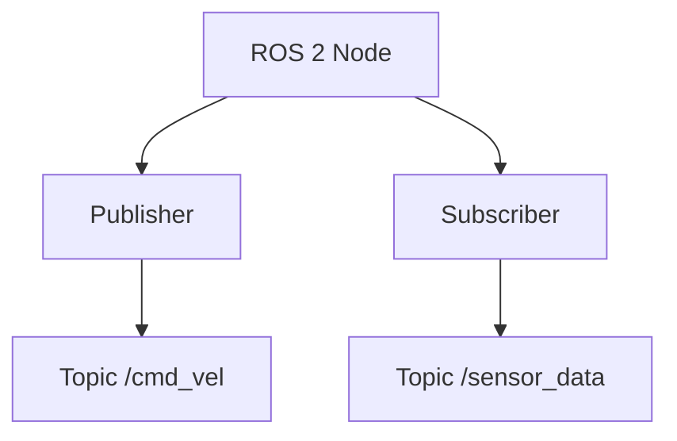
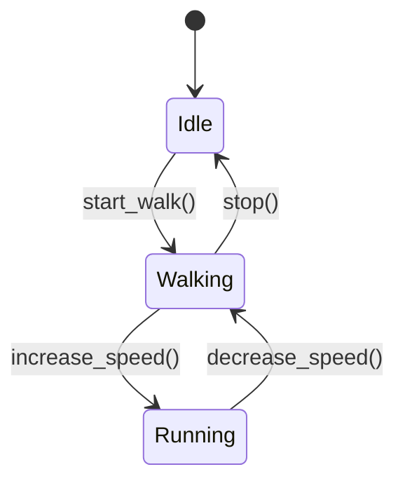
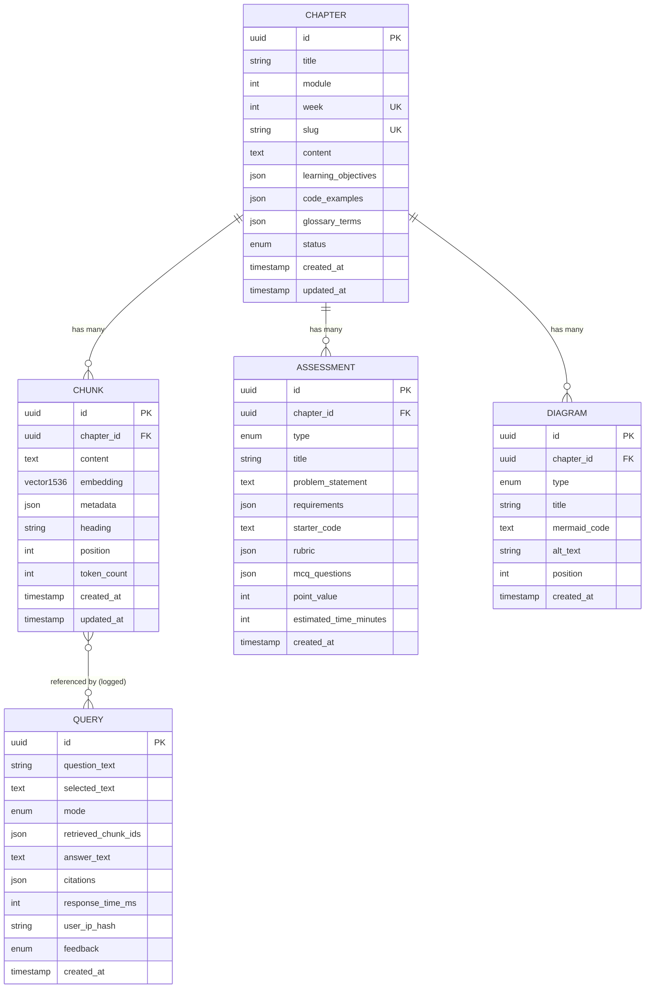

# Data Model: AI-Native Textbook System

**Feature**: AI-Native Physical AI & Humanoid Robotics Textbook
**Date**: 2025-12-04
**Status**: Design Complete

This document defines all entities, relationships, validation rules, and state transitions for the textbook and RAG system.

---

## Entity Overview

The system has 6 primary entities:
1. **Chapter** - Core textbook content unit
2. **Chunk** - Semantic content fragment for RAG retrieval
3. **Query** - User chatbot question and response (analytics)
4. **Assessment** - Hands-on exercises and quizzes per chapter
5. **Diagram** - Visual aids within chapters
6. **UserProfile** - (Optional) Personalization preferences

---

## 1. Chapter Entity

**Purpose**: Represents a complete learning unit covering one week of course content.

### Fields

| Field | Type | Constraints | Description |
|-------|------|-------------|-------------|
| `id` | UUID | Primary key, auto-generated | Unique identifier |
| `title` | String(200) | Required, unique per week | Chapter display title (e.g., "ROS 2 Nodes and Topics") |
| `module` | Integer | Required, 1-4 | Module number (1=ROS 2, 2=Digital Twin, 3=Isaac, 4=VLA) |
| `week` | Integer | Required, 1-13, unique | Week number in course sequence |
| `slug` | String(100) | Required, unique, URL-safe | Filename slug (e.g., "week-02-nodes-topics") |
| `content` | Text | Required, min 2000 chars | Full Markdown content including all sections |
| `learning_objectives` | JSON Array | Required, 3-7 items | List of learning objectives (strings) |
| `code_examples` | JSON Array | Optional | Array of code example objects (see CodeExample schema below) |
| `glossary_terms` | JSON Array | Optional | Array of term-definition pairs |
| `status` | Enum | Required, default='draft' | One of: draft, review, published |
| `created_at` | Timestamp | Auto-set on creation | ISO 8601 timestamp |
| `updated_at` | Timestamp | Auto-update on modification | ISO 8601 timestamp |
| `author` | String(100) | Optional | Primary author (default: "Claude Code + Human Review") |
| `estimated_reading_time` | Integer | Computed | Minutes to read (word count / 200) |

### Relationships

- One Chapter **has many** Chunks (1:N)
- One Chapter **has many** Assessments (1:N)
- One Chapter **has many** Diagrams (1:N)

### Validation Rules

1. `week` must be unique (no duplicate weeks)
2. `module` 1-4 mapping:
   - Module 1: Weeks 1-4 (ROS 2)
   - Module 2: Weeks 5-7 (Digital Twin)
   - Module 3: Weeks 8-10 (NVIDIA Isaac)
   - Module 4: Weeks 11-12 (VLA Systems)
   - Capstone: Week 13
3. `content` must include all 10 mandatory sections (validated via headings):
   - `## Introduction`
   - `## Theoretical Foundation`
   - `## Technical Implementation`
   - `## Hands-On Lab`
   - `## Real-World Applications`
   - `## Troubleshooting Guide`
   - `## Summary & Key Takeaways`
   - `## Assessment`
   - `## Further Reading`
4. `learning_objectives` must have 3-7 items
5. `slug` must match pattern: `week-{week:02d}-{topic-slug}`

### State Transitions

```
draft → review → published
  ↓       ↓         ↓
  ←-------←---------← (can revert to draft for updates)
```

**Transition Rules**:
- `draft → review`: Requires all mandatory sections present, no [TODO] markers in content
- `review → published`: Requires human approval, all validation checks passed
- `published → draft`: Allowed for corrections, triggers re-embedding of chunks

### CodeExample Schema (nested in `code_examples`)

```json
{
  "language": "python | yaml | xml | bash | cpp",
  "title": "String (50 chars max)",
  "code": "String (code content)",
  "explanation": "String (what this code does)",
  "expected_output": "String (optional, what user should see)"
}
```

---

## 2. Chunk Entity

**Purpose**: Semantic content fragment extracted from chapters for RAG vector search.

### Fields

| Field | Type | Constraints | Description |
|-------|------|-------------|-------------|
| `id` | UUID | Primary key, auto-generated | Unique identifier |
| `chapter_id` | UUID | Foreign key to Chapter, required | Parent chapter |
| `content` | Text | Required, 100-4096 chars | Extracted text content (plaintext, Markdown stripped) |
| `embedding` | Vector(1536) | Required | OpenAI text-embedding-3-small vector |
| `metadata` | JSON Object | Required | See ChunkMetadata schema below |
| `heading` | String(200) | Required | Nearest parent heading (for citation context) |
| `position` | Integer | Required, ≥0 | Ordinal position within chapter (0-indexed) |
| `token_count` | Integer | Required, 512-1024 | Number of tokens (tiktoken count) |
| `created_at` | Timestamp | Auto-set on creation | When chunk was embedded |
| `updated_at` | Timestamp | Auto-update on modification | Last re-embedding time |

### Relationships

- Many Chunks **belong to** one Chapter (N:1)
- Chunks are **referenced by** Queries (N:N, not enforced FK, logged for analytics)

### Validation Rules

1. `token_count` must be within 512-1024 range
2. `embedding` must have exactly 1536 dimensions
3. `position` must be unique per `chapter_id`
4. `content` must not be empty or only whitespace
5. `metadata.concept_tags` must have at least 1 tag
6. Chunks must have 10% overlap with next chunk (validated during chunking process)

### ChunkMetadata Schema

```json
{
  "module": 1-4,                           // Integer, inherited from chapter
  "week": 1-13,                            // Integer, inherited from chapter
  "chapter_title": "String",               // For citation display
  "heading": "String",                     // Section heading for citation
  "concept_tags": ["String"],              // Keywords for filtering (e.g., ["ros2", "nodes", "topics"])
  "vla_tags": ["String"],                  // VLA-specific tags (e.g., ["vision", "manipulation"]), optional
  "content_type": "theory | code | lab | troubleshooting | assessment"  // Content category
}
```

### Indexes

- **Primary index**: `id` (UUID)
- **Foreign key index**: `chapter_id`
- **Vector index**: `embedding` (Qdrant HNSW index)
- **PostgreSQL indexes**:
  - GIN index on `metadata.concept_tags` (for tag filtering)
  - B-tree index on `chapter_id` (for chapter-scoped queries)

### Chunking Strategy

Chunks are generated using semantic boundary detection:
1. Split by `##` headings (preserve hierarchy)
2. If section >1024 tokens, recursively split at paragraph boundaries
3. Add 10% overlap: last 50-100 tokens of chunk N become first tokens of chunk N+1
4. Store heading path as `metadata.heading` (e.g., "Technical Implementation > Setting Up ROS 2")

---

## 3. Query Entity

**Purpose**: Log user chatbot queries for analytics, quality monitoring, and future improvements.

### Fields

| Field | Type | Constraints | Description |
|-------|------|-------------|-------------|
| `id` | UUID | Primary key, auto-generated | Unique identifier |
| `question_text` | String(500) | Required, 1-500 chars | User's original question |
| `selected_text` | Text | Optional | Text user selected for "Ask AI about this" feature |
| `mode` | Enum | Required | One of: explain, code, urdu, exam (detected or user-selected) |
| `retrieved_chunk_ids` | JSON Array | Required | Array of chunk UUIDs retrieved (top-k, typically 5) |
| `answer_text` | Text | Required | Generated response from LLM |
| `citations` | JSON Array | Required | Array of citation objects (see Citation schema below) |
| `response_time_ms` | Integer | Required, >0 | Total pipeline latency (embed + search + generate) |
| `user_ip_hash` | String(64) | Optional | SHA256 hash of user IP (anonymized, for rate limiting) |
| `feedback` | Enum | Optional | User feedback: helpful, not_helpful, report_issue (nullable) |
| `created_at` | Timestamp | Auto-set on creation | When query was submitted |

### Relationships

- Queries **reference** Chunks (N:N, not enforced FK, logged in `retrieved_chunk_ids`)

### Validation Rules

1. `question_text` must be 1-500 characters
2. `mode` must be one of: explain, code, urdu, exam
3. `retrieved_chunk_ids` must contain 0-10 UUIDs (0 if no results found)
4. `response_time_ms` must be >0 and <10000 (10s max function timeout)
5. `user_ip_hash` format: 64-character hex string (SHA256)

### Citation Schema (nested in `citations`)

```json
{
  "chapter_title": "String",
  "section": "String",
  "url": "String (relative URL to chapter#section)"
}
```

Example:
```json
{
  "chapter_title": "ROS 2 Nodes and Topics",
  "section": "Creating Your First Node",
  "url": "/docs/module-01-ros2/week-02-nodes-topics#creating-your-first-node"
}
```

### Analytics Use Cases

- **Quality monitoring**: Track queries with no retrieved chunks (search failures)
- **Response time monitoring**: Alert if p95 >3 seconds
- **Mode accuracy**: Compare auto-detected mode vs user feedback
- **Popular topics**: Most queried concept_tags → prioritize content expansion
- **Hallucination detection**: Manually review random sample of answers vs citations

---

## 4. Assessment Entity

**Purpose**: Hands-on exercises, quizzes, and projects for each chapter.

### Fields

| Field | Type | Constraints | Description |
|-------|------|-------------|-------------|
| `id` | UUID | Primary key, auto-generated | Unique identifier |
| `chapter_id` | UUID | Foreign key to Chapter, required | Parent chapter |
| `type` | Enum | Required | One of: mcq, project, lab_exercise |
| `title` | String(200) | Required | Assessment title (e.g., "Build a ROS 2 Publisher Node") |
| `problem_statement` | Text | Required for project/lab | Detailed problem description |
| `requirements` | JSON Array | Required for project/lab | List of requirement strings |
| `starter_code` | Text | Optional | Provided code template or scaffold |
| `rubric` | JSON Object | Required for project/lab | See Rubric schema below |
| `mcq_questions` | JSON Array | Required if type=mcq | Array of MCQ question objects (see MCQ schema) |
| `point_value` | Integer | Required, >0 | Total points for assessment |
| `estimated_time_minutes` | Integer | Optional | Expected completion time |
| `created_at` | Timestamp | Auto-set on creation | When assessment was created |

### Relationships

- Many Assessments **belong to** one Chapter (N:1)

### Validation Rules

1. `type` must be one of: mcq, project, lab_exercise
2. If `type=mcq`, `mcq_questions` must have ≥5 questions
3. If `type=project` or `type=lab_exercise`, `problem_statement` and `requirements` are required
4. `point_value` must match sum of rubric criteria points
5. `rubric` must have at least 3 criteria for projects

### Rubric Schema (for project/lab_exercise)

```json
{
  "criteria": [
    {
      "name": "String",                    // e.g., "Node publishes at correct rate"
      "description": "String",             // What is being evaluated
      "points": Integer,                   // Point value for this criterion
      "indicators": {
        "excellent": "String",             // What excellent looks like
        "satisfactory": "String",          // What satisfactory looks like
        "needs_improvement": "String"      // What needs improvement looks like
      }
    }
  ]
}
```

### MCQ Schema (for type=mcq)

```json
{
  "question": "String",
  "options": ["String", "String", "String", "String"],  // 4 options
  "correct_answer_index": 0-3,                           // Zero-indexed
  "explanation": "String"                                // Why this is the correct answer
}
```

---

## 5. Diagram Entity

**Purpose**: Visual aids (Mermaid diagrams) embedded within chapters.

### Fields

| Field | Type | Constraints | Description |
|-------|------|-------------|-------------|
| `id` | UUID | Primary key, auto-generated | Unique identifier |
| `chapter_id` | UUID | Foreign key to Chapter, required | Parent chapter |
| `type` | Enum | Required | One of: architecture, workflow, concept, state_machine, sequence |
| `title` | String(200) | Required | Diagram title (displayed as caption) |
| `mermaid_code` | Text | Required | Valid Mermaid syntax |
| `alt_text` | String(500) | Required | Accessibility description |
| `position` | Integer | Required, ≥0 | Ordinal position within chapter |
| `created_at` | Timestamp | Auto-set on creation | When diagram was created |

### Relationships

- Many Diagrams **belong to** one Chapter (N:1)

### Validation Rules

1. `type` must be one of: architecture, workflow, concept, state_machine, sequence
2. `mermaid_code` must be valid Mermaid syntax (validated via Mermaid parser)
3. `alt_text` is required for WCAG 2.1 AA compliance
4. `position` must be unique per `chapter_id`

### Mermaid Type Examples

**Architecture Diagram**:


**Workflow Diagram**:


**State Machine**:


---

## 6. UserProfile Entity (Optional Feature)

**Purpose**: Store personalization preferences for custom chapter rendering.

### Fields

| Field | Type | Constraints | Description |
|-------|------|-------------|-------------|
| `name` | String(100) | Optional | User's display name |
| `specialization` | Enum | Optional | One of: robotics, ai, embedded, general |
| `hardware` | Enum | Optional | One of: jetson_nano, jetson_orin, jetson_xavier, desktop |
| `os` | Enum | Optional | One of: ubuntu, windows, macos |
| `language_preference` | Enum | Optional | One of: python, cpp |
| `stored_in_browser` | Boolean | Always true | Indicates client-side storage (no backend) |
| `created_at` | Timestamp | Auto-set on creation | When profile was created |
| `updated_at` | Timestamp | Auto-update on modification | Last profile update |

### Storage

**UserProfile is NOT stored in backend database.** It is stored in browser `localStorage` as JSON.

### Validation Rules

1. `hardware` and `os` must be compatible:
   - `jetson_*` → os must be `ubuntu` (Jetson devices run Linux)
   - `desktop` → os can be `ubuntu`, `windows`, or `macos`
2. All fields are optional (users can skip personalization)

### LocalStorage Key

```javascript
localStorage.setItem('textbook_user_profile', JSON.stringify({
  name: "Ahmed",
  specialization: "robotics",
  hardware: "jetson_orin",
  os: "ubuntu",
  language_preference: "python",
  stored_in_browser: true,
  created_at: "2025-12-04T10:00:00Z",
  updated_at: "2025-12-04T10:00:00Z"
}));
```

---

## Entity Relationship Diagram (ERD)



---

## Database Schema (PostgreSQL - Neon)

### `chapters` Table

```sql
CREATE TABLE chapters (
    id UUID PRIMARY KEY DEFAULT gen_random_uuid(),
    title VARCHAR(200) NOT NULL,
    module INTEGER NOT NULL CHECK (module BETWEEN 1 AND 4),
    week INTEGER NOT NULL UNIQUE CHECK (week BETWEEN 1 AND 13),
    slug VARCHAR(100) NOT NULL UNIQUE,
    content TEXT NOT NULL CHECK (length(content) >= 2000),
    learning_objectives JSONB NOT NULL,
    code_examples JSONB,
    glossary_terms JSONB,
    status VARCHAR(20) NOT NULL DEFAULT 'draft' CHECK (status IN ('draft', 'review', 'published')),
    created_at TIMESTAMPTZ NOT NULL DEFAULT now(),
    updated_at TIMESTAMPTZ NOT NULL DEFAULT now(),
    author VARCHAR(100) DEFAULT 'Claude Code + Human Review',
    estimated_reading_time INTEGER GENERATED ALWAYS AS (
        (length(content) / 5) / 200  -- avg 5 chars/word, 200 words/min
    ) STORED
);

CREATE INDEX idx_chapters_module ON chapters(module);
CREATE INDEX idx_chapters_status ON chapters(status);
```

### `chunks` Table

```sql
CREATE TABLE chunks (
    id UUID PRIMARY KEY DEFAULT gen_random_uuid(),
    chapter_id UUID NOT NULL REFERENCES chapters(id) ON DELETE CASCADE,
    content TEXT NOT NULL CHECK (length(content) BETWEEN 100 AND 4096),
    -- embedding stored in Qdrant, not PostgreSQL
    metadata JSONB NOT NULL,
    heading VARCHAR(200) NOT NULL,
    position INTEGER NOT NULL CHECK (position >= 0),
    token_count INTEGER NOT NULL CHECK (token_count BETWEEN 512 AND 1024),
    created_at TIMESTAMPTZ NOT NULL DEFAULT now(),
    updated_at TIMESTAMPTZ NOT NULL DEFAULT now(),
    UNIQUE(chapter_id, position)
);

CREATE INDEX idx_chunks_chapter_id ON chunks(chapter_id);
CREATE INDEX idx_chunks_metadata_tags ON chunks USING GIN (metadata);
```

### `queries` Table

```sql
CREATE TABLE queries (
    id UUID PRIMARY KEY DEFAULT gen_random_uuid(),
    question_text VARCHAR(500) NOT NULL CHECK (length(question_text) BETWEEN 1 AND 500),
    selected_text TEXT,
    mode VARCHAR(20) NOT NULL CHECK (mode IN ('explain', 'code', 'urdu', 'exam')),
    retrieved_chunk_ids JSONB NOT NULL,
    answer_text TEXT NOT NULL,
    citations JSONB NOT NULL,
    response_time_ms INTEGER NOT NULL CHECK (response_time_ms > 0 AND response_time_ms < 10000),
    user_ip_hash CHAR(64),
    feedback VARCHAR(20) CHECK (feedback IN ('helpful', 'not_helpful', 'report_issue')),
    created_at TIMESTAMPTZ NOT NULL DEFAULT now()
);

CREATE INDEX idx_queries_created_at ON queries(created_at DESC);
CREATE INDEX idx_queries_mode ON queries(mode);
CREATE INDEX idx_queries_feedback ON queries(feedback) WHERE feedback IS NOT NULL;
```

### `assessments` Table

```sql
CREATE TABLE assessments (
    id UUID PRIMARY KEY DEFAULT gen_random_uuid(),
    chapter_id UUID NOT NULL REFERENCES chapters(id) ON DELETE CASCADE,
    type VARCHAR(20) NOT NULL CHECK (type IN ('mcq', 'project', 'lab_exercise')),
    title VARCHAR(200) NOT NULL,
    problem_statement TEXT,
    requirements JSONB,
    starter_code TEXT,
    rubric JSONB,
    mcq_questions JSONB,
    point_value INTEGER NOT NULL CHECK (point_value > 0),
    estimated_time_minutes INTEGER,
    created_at TIMESTAMPTZ NOT NULL DEFAULT now()
);

CREATE INDEX idx_assessments_chapter_id ON assessments(chapter_id);
CREATE INDEX idx_assessments_type ON assessments(type);
```

### `diagrams` Table

```sql
CREATE TABLE diagrams (
    id UUID PRIMARY KEY DEFAULT gen_random_uuid(),
    chapter_id UUID NOT NULL REFERENCES chapters(id) ON DELETE CASCADE,
    type VARCHAR(20) NOT NULL CHECK (type IN ('architecture', 'workflow', 'concept', 'state_machine', 'sequence')),
    title VARCHAR(200) NOT NULL,
    mermaid_code TEXT NOT NULL,
    alt_text VARCHAR(500) NOT NULL,
    position INTEGER NOT NULL CHECK (position >= 0),
    created_at TIMESTAMPTZ NOT NULL DEFAULT now(),
    UNIQUE(chapter_id, position)
);

CREATE INDEX idx_diagrams_chapter_id ON diagrams(chapter_id);
```

---

## Qdrant Collection Schema

**Collection Name**: `textbook_chunks`

**Vector Configuration**:
- **Dimension**: 1536 (OpenAI text-embedding-3-small)
- **Distance**: Cosine
- **Index**: HNSW (Hierarchical Navigable Small World)
  - `m`: 16 (number of connections per layer)
  - `ef_construct`: 100 (construction search depth)

**Payload Schema** (metadata stored with each vector):
```json
{
  "chunk_id": "UUID (from PostgreSQL)",
  "chapter_id": "UUID",
  "chapter_title": "String",
  "module": 1-4,
  "week": 1-13,
  "heading": "String",
  "position": Integer,
  "concept_tags": ["String"],
  "vla_tags": ["String"],
  "content_type": "String",
  "token_count": Integer
}
```

**Indexes**:
- Primary vector index (HNSW)
- Payload indexes for filtering:
  - `module` (integer)
  - `week` (integer)
  - `concept_tags` (keyword array)
  - `content_type` (keyword)

---

## Data Model Summary

| Entity | Storage | Purpose | Key Relationships |
|--------|---------|---------|-------------------|
| **Chapter** | PostgreSQL | Textbook content | Parent of Chunks, Assessments, Diagrams |
| **Chunk** | PostgreSQL (metadata) + Qdrant (vectors) | RAG retrieval | Child of Chapter |
| **Query** | PostgreSQL | Analytics, monitoring | References Chunks (logged) |
| **Assessment** | PostgreSQL | Exercises, quizzes | Child of Chapter |
| **Diagram** | PostgreSQL | Visual aids | Child of Chapter |
| **UserProfile** | Browser localStorage | Personalization | No server storage |

**Storage Estimation**:
- PostgreSQL: ~6MB initial data, ~50MB at 100k queries (well within 0.5GB Neon free tier)
- Qdrant: ~6KB × 1000 chunks = 6MB (well within 1GB free tier)

**Status**: Data model complete. Ready for API contract generation.

**Date**: 2025-12-04
